# LAPORAN AUDIT PROYEK (READ-ONLY)
# SISTEM INFORMASI MANAJEMEN SEKOLAH TERINTEGRASI YAYASAN ALDEPOS

Tanggal Audit: 2026-09-29  
Status: Terverifikasi dari Kode Sumber Aktual  
Metode: Static Code Analysis (Read-Only)

---

## 1. IDENTITAS PROYEK

### Tujuan Aplikasi
Sistem Manajemen Sekolah Terintegrasi Yayasan Aldepos adalah platform monorepo terpadu (`aldepos-sistem-root`) yang dirancang untuk mengelola seluruh ekosistem operasional yayasan dan multi-satuan pendidikan (TK, SD, SMP, SMA, SMK, Pondok Pesantren/Tahfidz). Sistem ini mengintegrasikan sebelas domain operasional inti: administrasi pusat (Core), kepegawaian/SDM (Kepegawaian), manajemen akademik siswa dan penjadwalan (Akademik), tata kelola keuangan dan RAPBS (Keuangan), pencatatan tahfidz Al-Quran (Alquran), operasional kantin dan dompet digital santri (Kantin), manajemen aset dan sarana prasarana (Sarpras), logistik dapur dan gizi santri (Dapur), perpustakaan dan katalog OPAC (Perpustakaan), penjaminan mutu dan perencanaan strategis RIPS (Manajemen), serta portal website publik dan penerimaan peserta didik baru (Website Utama / PPDB).

### Peran Pengguna (Roles) dan Hak Akses
Berdasarkan data seeds (`apps/api-backend/db/seeds/core/`), middleware otentikasi (`apps/api-backend/src/middlewares/`), dan guard rute portal (`apps/core-portal/src/router.jsx`), berikut adalah peran pengguna aktual yang terdaftar di sistem:

1. **super_admin**
   - Hak Akses: Bypass otorisasi penuh ke seluruh modul, seluruh endpoint API, dan seluruh satuan pendidikan tanpa batasan konteks unit (`requirePermission.js`).
2. **admin_yayasan**
   - Hak Akses: Akses manajerial tingkat yayasan lintas seluruh satuan pendidikan; bypass otorisasi Core, pemantauan seluruh unit, dan perencanaan strategis lembaga.
3. **admin_satuan_pendidikan / admin_satuan**
   - Hak Akses: Pengelolaan operasional penuh pada satuan pendidikan tempat user ditugaskan (`school_unit_id`), mencakup data master siswa, rombel, kurikulum, nilai, dan staf unit.
4. **kepala_sekolah**
   - Hak Akses: Pengawasan akademik dan kesiswaan pada unit yang dipimpin, approval pengajuan anggaran, supervisi guru, evaluasi kinerja, dan pengesahan rapor/kelulusan.
5. **admin_keuangan**
   - Hak Akses: Pengelolaan master COA, penetapan skema tarif tagihan santri, penerbitan tagihan (bills), pencatatan penerimaan kas/bank, rekonsiliasi pembayaran, penyusunan anggaran RAPBS, pencatatan pengeluaran, saldo dana, serta pembukuan jurnal akuntansi.
6. **staff_payroll**
   - Hak Akses: Kalkulasi otomatis komponen gaji/payroll dan pengeditan manual item draft gaji karyawan (`kepegawaian.payroll.calculate`, `kepegawaian.payroll.edit_items`) tanpa hak mengunci atau mencairkan dana.
7. **hrd / kepegawaian**
   - Hak Akses: Manajemen data induk pegawai, penetapan status kerja, rekrutmen calon pegawai, presensi harian, perizinan/cuti, lembur, DUK pangkat/jabatan, penilaian kinerja berkala, dan pengelolaan bank soal/sesi tes psikotes (MBTI & Big Five).
8. **guru**
   - Hak Akses: Akses Portal Guru (`/guru`), melihat jadwal mengajar pribadi, melakukan presensi masuk/pulang mandiri, input presensi kehadiran siswa di kelas, merumuskan Tujuan Pembelajaran (TP), dan menginput nilai formatif/sumatif siswa per rombel yang diampu.
9. **calon_murid (Pendaftar PPDB)**
   - Hak Akses: Akses Portal Calon Murid (`/calon-murid`), melengkapi biodata pendaftaran santri/orang tua, mengunggah dokumen persyaratan, dan mengikuti tes seleksi PSB secara daring.
10. **wali_murid / orang_tua**
    - Hak Akses: Akses Portal Tagihan Orang Tua (`/portal-orangtua/tagihan` / `ParentBills.jsx`), melihat rincian tagihan biaya pendidikan santri binaan, histori pembayaran, dan konfirmasi bukti bayar.
11. **developer**
    - Hak Akses: Konfigurasi teknis integrasi API client, webhook subscriber, pengaturan sistem teknis, dan audit log.

---

## 2. TECH STACK AKTUAL

### Framework, Versi, dan Library Utama (Berdasarkan package.json)

#### A. Root Monorepo (`package.json`)
- Tipe: npm workspaces (`workspaces: ["apps/*"]`)
- Nama: `aldepos-sistem-root` (v1.0.0, private: true)

#### B. Backend Service (`apps/api-backend/package.json`)
- Runtime: Node.js (CommonJS format)
- Web Framework: Express v4.19.2
- Query Builder & Database Driver: Knex v3.1.0, mysql2 v3.10.1
- Keamanan & Validasi: helmet v7.1.0, cors v2.8.5, bcryptjs v3.0.3, jsonwebtoken v9.0.2, zod v4.4.3
- Utilitas Dokumen: pdfkit v0.20.2
- Environment: dotenv v16.4.5
- Dev Tool: nodemon v3.1.4

#### C. Internal Portal Web (`apps/core-portal/package.json`)
- Framework UI: React v18.3.1 (ES Modules)
- Build Tool & Dev Server: Vite v5.4.14
- Routing: react-router-dom v6.28.2 (Data Router API dengan lazy loading)
- Styling: Tailwind CSS v3.4.17, postcss v8.4.49, autoprefixer v10.4.20
- HTTP Client: axios v1.7.2
- Komponen Spesifik: `@svar-ui/react-gantt` v2.7.1, `react-day-picker` v10.0.1, `date-fns` v3.6.0, `lucide-react` v0.395.0, `xlsx` v0.18.5

#### D. Website Publik (`apps/website-utama/package.json`)
- Framework: Next.js v14.2.10 (App Router, TypeScript v5.5.4)
- Library UI: React v18.3.1, `lucide-react` v0.439.0
- Styling: Tailwind CSS v3.4.10, postcss v8.4.45, autoprefixer v10.4.20

### Database Engine
- MariaDB 10.5 / MySQL 8.0 kompatibel
- Arsitektur Database: 11 database fisik terpisah (satu koneksi Knex per modul): `core_local`, `kepegawaian_local`, `akademik_local`, `keuangan_local`, `alquran_local`, `kantin_local`, `sarpras_local`, `dapur_local`, `perpustakaan_local`, `manajemen_local`, `website_utama_local`.

### Layanan Eksternal & Integrasi
- Bank Statement Processing (Parsing CSV/TXT transaksi mutasi rekening koran)
- Webhook Publisher & Subscriber Dispatcher (Event-driven dispatcher untuk integrasi antar-aplikasi)
- Export / Import Mesin Excel (.xlsx via library SheetJS/xlsx)
- Mesin Cetak Dokumen PDF (Kwitansi, Rapor, Kartu SPP, Slip Gaji via pdfkit)

---

### Struktur Folder 3 Tingkat Teratas dan Fungsi

```
c:\PROYEK\Core Aldepos\
├── apps/
│   ├── api-backend/                   [Backend REST API Modular Monolith]
│   │   ├── db/
│   │   │   ├── migrations/            [Skema DDL Knex per 11 modul terpisah]
│   │   │   └── seeds/                 [Data inisialisasi per 11 modul]
│   │   ├── src/
│   │   │   ├── config/                [Konfigurasi koneksi database Knex per modul]
│   │   │   ├── middlewares/           [Auth JWT, check permission, error handler]
│   │   │   ├── modules/               [11 modul bisnis backend: controller, service, routes]
│   │   │   ├── services/              [Background scheduler & jobs]
│   │   │   └── app.js, server.js      [Inisialisasi Express & mounting router]
│   │   └── package.json, knexfiles    [Dependency backend dan 11 knexfile terpisah]
│   ├── core-portal/                   [Single Page Application Portal Internal React/Vite]
│   │   ├── src/
│   │   │   ├── apps/                  [13 sub-aplikasi UI modul: akademik, keuangan, dll]
│   │   │   ├── pages/                 [Halaman umum: Launcher, Login]
│   │   │   ├── shared/                [Komponen reusable, AuthContext, Axios API client, hooks]
│   │   │   ├── App.jsx, router.jsx    [Root component & pemetaan 130+ rute portal]
│   │   │   └── index.css, main.jsx    [Design tokens, styling global Tailwind]
│   │   └── package.json, vite.config  [Konfigurasi build Vite & dependencies portal]
│   └── website-utama/                 [Web Publik & Portal PPDB Next.js 14 App Router]
│       ├── app/                       [Rute SSR/SSG: Landing Page, PPDB, Status Seleksi]
│       ├── lib/                       [Klien API Next.js fetcher]
│       └── package.json, tsconfig     [Konfigurasi TypeScript & Next.js]
├── docs/                              [Dokumentasi sistem, kontrak API, ERD, arsitektur]
├── scratch/                           [Skrip inspeksi dan verifikasi ad-hoc]
└── package.json                       [Root workspace configuration]
```

---

### Pola Arsitektur Aktual

1. **Backend**: Modular Monolith. Seluruh 11 modul berjalan dalam satu proses Express HTTP Server tunggal (`server.js`), namun memiliki isolasi database Knex masing-masing (`src/config/db/*.js`). Komunikasi lintas modul dilakukan secara in-process melalui service layer internal (`src/modules/*/internal/service.js` atau `crossModuleServices.js`), bukan melalui pemanggilan HTTP jaringan internal atau query SQL lintas database.
2. **Frontend Internal**: Single Page Application (SPA) berbasis React 18 dan Vite dengan Code Splitting bertingkat (`React.lazy` + `Suspense` fallback `PageLoader`). State otentikasi global dikelola oleh `AuthContext` via LocalStorage/JWT.
3. **Frontend Publik**: Server-Side Rendering (SSR) dan Client-Side Rendering hybrid berbasis Next.js 14 App Router.

---

## 3. DAFTAR MODUL / FITUR

Berikut tabel inventarisasi seluruh modul pada proyek:

| Nama Modul | Fungsi Utama | Rute / Halaman Utama Portal | Tabel Database Terkait | Status | Perkiraan Jumlah File |
|---|---|---|---|---|---|
| **Core** | SSO Central Auth, User Master, Multi-School Role & Permission, Unit Satuan Pendidikan, Yayasan, System Settings, Audit Logs, Webhooks, API Clients | `/core/login`, `/core/dashboard`, `/core/users`, `/core/roles`, `/core/foundation`, `/core/school-units`, `/core/settings`, `/core/webhooks`, `/core/api-clients`, `/core/audit-logs` | 17 tabel (`users`, `roles`, `permissions`, `role_permissions`, `user_school_roles`, `school_units`, `foundation_profiles`, `system_settings`, `activity_logs`, dll) | Lengkap | ~35 file |
| **Kepegawaian** | HRD & SDM, Data Induk Pegawai, Status Kepegawaian, DUK & Jabatan, Mutasi, Presensi Kerja, Cuti & Lembur, Payroll Engine, Penilaian Kinerja, Bank Soal & Pelaksanaan Psikotes (MBTI & Big Five) | `/kepegawaian/dashboard`, `/kepegawaian/employees`, `/kepegawaian/employment-statuses`, `/kepegawaian/recruitment`, `/kepegawaian/organization`, `/kepegawaian/attendance`, `/kepegawaian/leaves-overtimes`, `/kepegawaian/payroll`, `/kepegawaian/performance`, `/kepegawaian/psikotes/*` | 37 tabel (`employees`, `job_positions`, `employee_school_assignments`, `payroll_periods`, `payroll_items`, `psychotest_sessions`, `psychotest_questions`, `psychotest_results`, dll) | Lengkap | ~65 file |
| **Akademik** | Data Siswa, Rombel, Kurikulum K13/Merdeka, Timetable Engine Otomatis 2-Fase, Input Nilai Formatif/Sumatif, Rapor Siswa, Presensi Siswa/Kelas, Kesiswaan/Konseling, Kalender Akademik, PSB Hub & Tes Online | `/akademik/dashboard`, `/akademik/students`, `/akademik/rombel`, `/akademik/curriculum`, `/akademik/scores`, `/akademik/report-cards`, `/akademik/attendance`, `/akademik/schedules`, `/akademik/calendar`, `/akademik/psb` | 58 tabel (`students`, `class_groups`, `subjects`, `student_scores`, `report_cards`, `student_attendances`, `subject_schedules`, `psb_registrants`, `psb_tests`, dll) | Lengkap | ~90 file |
| **Keuangan** | Master Akun COA & Rekening Kas, Skema Tarif Biaya Pendidikan, Penetapan Biaya Santri, Perencanaan Anggaran RAPBS, Penagihan Siswa (Bills Lifecycle), Penerimaan Kas/Bank, Rekonsiliasi Rekening Koran, Pengeluaran & Kasbon, Saldo Alokasi Dana, Jurnal & Buku Besar, Kartu Pembayaran Santri, PPDB Billing | `/keuangan/dashboard`, `/keuangan/master-data`, `/keuangan/fee-schemes`, `/keuangan/fee-assignments`, `/keuangan/budget`, `/keuangan/bills`, `/keuangan/payments`, `/keuangan/bank-statements`, `/keuangan/expenses`, `/keuangan/fund-balances`, `/keuangan/bookkeeping`, `/keuangan/student-ledger`, `/keuangan/ppdb-billing`, `/keuangan/reports` | 49 tabel (`chart_of_accounts`, `cash_accounts`, `fee_types`, `fee_schemes`, `budget_plans`, `student_bills`, `bill_payments`, `expenses`, `journal_entries`, `fund_balances`, `bank_statements`, dll) | Lengkap | ~85 file |
| **Alquran (Tahfidz)** | Penetapan Target Hafalan Juz/Surah, Catatan Setoran Harian (Ziyadah/Murajaah), Penilaian Ujian Munaqasyah, Mutabaah Pembelajaran Kitab Kuning, Laporan Perkembangan Tahfidz Santri | `/alquran/dashboard`, `/alquran/targets`, `/alquran/records`, `/alquran/exams`, `/alquran/books`, `/alquran/reports` | 4 tabel (`hafalan_targets`, `hafalan_records`, `munaqasyah_exams`, `kitab_kuning`) | Lengkap | ~25 file |
| **Kantin** | Kasir Transaksi Penjualan (POS), Dompet Digital Santri (Top Up / Tarik Tunai), Konfigurasi Limit Belanja Harian, Master Produk & Kategori, Penerimaan Barang Vendor, Retur Barang, Perhitungan Bagi Hasil / Piutang Kantin, Beban Operasional Kantin | `/kantin/dashboard`, `/kantin/pos`, `/kantin/wallet`, `/kantin/students`, `/kantin/limits`, `/kantin/products`, `/kantin/categories`, `/kantin/vendors`, `/kantin/goods-receipts`, `/kantin/product-returns`, `/kantin/receivables-canteen`, `/kantin/receivables-vendor`, `/kantin/expenses`, `/kantin/reports` | 18 tabel (`sales_transactions`, `sales_transaction_items`, `wallet_transactions`, `canteen_students`, `daily_spending_limits`, `vendor_products`, `goods_receipts`, `product_returns`, dll) | Lengkap | ~35 file |
| **Sarpras** | Hierarki Lokasi Fisik (Site, Gedung, Ruangan), Inventarisasi Aset Tetap, Mutasi & Riwayat Aset, Pengajuan & Approval Peminjaman Fasilitas, Tiket Pemeliharaan Aset/Fasilitas, Pengadaan Barang, Manajemen Stok Bahan Habis Pakai (BHP) & Stock Opname | `/sarpras/dashboard`, `/sarpras/locations`, `/sarpras/assets`, `/sarpras/bookings`, `/sarpras/maintenance`, `/sarpras/procurement`, `/sarpras/consumables`, `/sarpras/reports` | 14 tabel (`facility_sites`, `facility_buildings`, `facility_rooms`, `assets`, `asset_mutations`, `facility_bookings`, `maintenance_requests`, `consumable_items`, `consumable_stock_mutations`, dll) | Lengkap | ~30 file |
| **Dapur** | Master Bahan Makanan & Satuan, Pengecekan Nutrisi & Kalori Menu, Resep Baku, Perencanaan Menu Harian/Mingguan Santri, Simulasi HPP Menu, Rencana Kebutuhan Bahan (MRP), Purchase Order Bahan Makanan, Penerimaan Bahan, Log Produksi Memasak, Distribusi Makan Santri & Diet Khusus, Waste Control | `/dapur/dashboard`, `/dapur/master-data`, `/dapur/menus`, `/dapur/recipes`, `/dapur/planning`, `/dapur/budgets`, `/dapur/procurement`, `/dapur/receipts`, `/dapur/inventory` | 63 tabel (`kitchen_menus`, `kitchen_recipes`, `kitchen_ingredients`, `kitchen_meal_plans`, `kitchen_purchase_orders`, `kitchen_goods_receipts`, `kitchen_production_batches`, `kitchen_meal_distributions`, dll) | Lengkap | ~45 file |
| **Perpustakaan** | Katalogisasi Buku (ISBN/DDC), Eksemplar Buku, Registrasi Anggota (Siswa & Guru), Transaksi Sirkulasi Peminjaman & Pengembalian, Kalkulasi Denda Keterlambatan Harian, Reservasi Buku, Laporan Kerusakan/Kehilangan Buku, Pengingat Otomatis, Portal OPAC Publik | `/perpustakaan/dashboard`, `/perpustakaan/books`, `/perpustakaan/categories`, `/perpustakaan/members`, `/perpustakaan/loans`, `/perpustakaan/reservations`, `/perpustakaan/lost-damaged`, `/perpustakaan/reports`, `/perpustakaan/opac` | 8 tabel (`books`, `book_categories`, `book_copies`, `library_members`, `book_loans`, `book_reservations`, `lost_damaged_reports`, `loan_reminders`) | Lengkap | ~25 file |
| **Manajemen & Mutu** | Profil Lembaga & Legalitas Yayasan/Unit, Rencana Induk Pengembangan Sekolah (RIPS 25 Tahun), Rencana Strategis Jangka Panjang & Menengah (RKJP/RKJM), Rencana Kerja Tahunan (RKT), Evaluasi Diri Sekolah (Evadir), Balanced Scorecard (BSC) & KPI Mutu, Heatmap Manajemen Risiko Sekolah, Task & Project Hub (Gantt Chart), Monev Evaluasi, Multi-Level Approval Center | `/manajemen/dashboard`, `/manajemen/institution-profile`, `/manajemen/planning`, `/manajemen/planning/rips`, `/manajemen/planning/rkjp-rkjm`, `/manajemen/planning/rkt`, `/manajemen/evadir`, `/manajemen/bsc`, `/manajemen/quality`, `/manajemen/risks`, `/manajemen/tasks`, `/manajemen/evaluation`, `/manajemen/approvals`, `/manajemen/documents`, `/manajemen/performance`, `/manajemen/supervision` | 54 tabel (`rips_documents`, `rips_goals`, `rips_programs`, `long_term_work_plans`, `annual_work_plans`, `work_plan_activities`, `quality_indicators`, `school_risks`, `projects`, `tasks`, `approval_workflows`, dll) | Lengkap | ~75 file |
| **Website Utama & PPDB** | CMS Pengaturan Beranda Publik, Highlight, Berita & Artikel, Galeri Dokumentasi, FAQ, Testimoni, Agenda/Event, Profil Pendidik, Formulir Pendaftaran PPDB Online, Pengecekan Status Seleksi, Integrasi Konsultasi Calon Murid | `/` (Next.js), `/ppdb`, `/ppdb/status`, `/core/website-utama/*` (CMS Portal) | 24 tabel (`news_posts`, `galleries`, `events`, `ppdb_registrants`, `ppdb_registrant_documents`, `ppdb_payments`, `consultation_tickets`, `site_settings`, dll) | Lengkap | ~30 file |
| **Portal Guru** | Sub-aplikasi portal khusus staf pengajar untuk operasional kelas harian tanpa hak administratif | `/guru/dashboard`, `/guru/jadwal`, `/guru/absensi`, `/guru/absensi-kelas`, `/guru/nilai`, `/guru/tujuan-pembelajaran`, `/guru/siswa`, `/guru/pengumuman`, `/guru/profil` | Mengakses modul Akademik & Kepegawaian | Lengkap | ~20 file |
| **Portal Calon Murid** | Sub-aplikasi portal pendaftar santri baru untuk melengkapi berkas dan ujian PSB online | `/calon-murid/dashboard`, `/calon-murid/data-lengkap`, `/calon-murid/dokumen`, `/calon-murid/test` | Mengakses modul Akademik (`psb_*`) & Website Utama | Lengkap | ~15 file |

---

## 4. DATABASE

### Ringkasan Tabel per Modul
Total 346 tabel di 11 database:
- **akademik**: 58 tabel
- **alquran**: 4 tabel
- **core**: 17 tabel
- **dapur**: 63 tabel
- **kantin**: 18 tabel
- **kepegawaian**: 37 tabel
- **keuangan**: 49 tabel
- **manajemen**: 54 tabel
- **perpustakaan**: 8 tabel
- **sarpras**: 14 tabel
- **website-utama**: 24 tabel

### Diagram Relasi Antartabel Inti (Mermaid erDiagram)

```mermaid
erDiagram
    %% Core Module
    USERS ||--o{ USER_SCHOOL_ROLES : has
    ROLES ||--o{ USER_SCHOOL_ROLES : assigned_to
    ROLES ||--o{ ROLE_PERMISSIONS : defines
    PERMISSIONS ||--o{ ROLE_PERMISSIONS : contains
    SCHOOL_UNITS ||--o{ USER_SCHOOL_ROLES : scopes
    FOUNDATION_PROFILES ||--o{ SCHOOL_UNITS : owns

    %% Kepegawaian Module
    EMPLOYEES ||--o{ EMPLOYEE_SCHOOL_ASSIGNMENTS : assigned
    EMPLOYEES ||--o{ EMPLOYEE_ATTENDANCES : logs
    EMPLOYEES ||--o{ EMPLOYEE_LEAVE_REQUESTS : requests
    EMPLOYEES ||--o{ PAYROLL_ITEMS : receives
    PAYROLL_PERIODS ||--o{ PAYROLL_ITEMS : contains
    JOB_POSITIONS ||--o{ EMPLOYEES : holds

    %% Akademik Module
    ACADEMIC_YEARS ||--o{ SEMESTERS : contains
    ACADEMIC_YEARS ||--o{ CLASS_GROUPS : defines
    STUDENTS ||--o{ STUDENT_CLASS_ENROLLMENTS : enrolled
    CLASS_GROUPS ||--o{ STUDENT_CLASS_ENROLLMENTS : contains
    SUBJECTS ||--o{ TEACHING_ASSIGNMENTS : assigned
    CLASS_GROUPS ||--o{ TEACHING_ASSIGNMENTS : holds
    TEACHING_ASSIGNMENTS ||--o{ STUDENT_SCORES : records
    STUDENTS ||--o{ STUDENT_SCORES : achieves
    CLASS_GROUPS ||--o{ SUBJECT_SCHEDULES : scheduled
    SUBJECTS ||--o{ SUBJECT_SCHEDULES : allocated

    %% Keuangan Module
    FEE_GROUPS ||--o{ FEE_TYPES : classifies
    FEE_TYPES ||--o{ FEE_SCHEME_ITEMS : configures
    FEE_SCHEMES ||--o{ FEE_SCHEME_ITEMS : groups
    FEE_SCHEMES ||--o{ STUDENT_FEE_SCHEME_ASSIGNMENTS : assigns
    FEE_TYPES ||--o{ STUDENT_BILLS : generates
    STUDENT_BILLS ||--o{ BILL_PAYMENTS : settles
    CASH_ACCOUNTS ||--o{ BILL_PAYMENTS : deposits
    BUDGET_PLANS ||--o{ BUDGET_PLAN_EXPENSE_ITEMS : contains
    BUDGET_PLANS ||--o{ BUDGET_PLAN_INCOME_ITEMS : contains
    CHART_OF_ACCOUNTS ||--o{ JOURNAL_ENTRY_LINES : books
    JOURNAL_ENTRIES ||--o{ JOURNAL_ENTRY_LINES : balances

    %% Kantin Module
    VENDORS ||--o{ VENDOR_PRODUCTS : supplies
    PRODUCT_CATEGORIES ||--o{ VENDOR_PRODUCTS : categorizes
    CANTEEN_STUDENTS ||--o{ WALLET_TRANSACTIONS : conducts
    CANTEEN_STUDENTS ||--o{ SALES_TRANSACTIONS : buys
    SALES_TRANSACTIONS ||--o{ SALES_TRANSACTION_ITEMS : includes

    %% Perpustakaan Module
    BOOK_CATEGORIES ||--o{ BOOKS : categorizes
    BOOKS ||--o{ BOOK_COPIES : copies
    LIBRARY_MEMBERS ||--o{ BOOK_LOANS : borrows
    BOOK_COPIES ||--o{ BOOK_LOANS : borrowed

    %% Sarpras Module
    FACILITY_SITES ||--o{ FACILITY_BUILDINGS : locates
    FACILITY_BUILDINGS ||--o{ FACILITY_ROOMS : contains
    FACILITY_ROOMS ||--o{ ASSETS : places
    FACILITY_ROOMS ||--o{ FACILITY_BOOKINGS : reserves

    %% Manajemen Module
    RIPS_DOCUMENTS ||--o{ RIPS_GOALS : contains
    RIPS_GOALS ||--o{ RIPS_PROGRAMS : derives
    LONG_TERM_WORK_PLANS ||--o{ ANNUAL_WORK_PLANS : breakdowns
    ANNUAL_WORK_PLANS ||--o{ WORK_PLAN_ACTIVITIES : details
    PROJECTS ||--o{ TASKS : schedules
```



### Indeks dan Optimasi Database
- Primary Key: Seluruh tabel menggunakan PK bertipe `BIGINT UNSIGNED AUTO_INCREMENT` (`id`).
- Indeks Baku: Kolom relasi seperti `school_unit_id`, `academic_year_id`, `student_id`, `employee_id`, `user_id`, `status` memiliki index individual atau composite index (mis. `student_bills_lookup_idx` pada `student_bills (school_unit_id, academic_year_id, status, is_void)`).
- Analisis FK Tanpa Indeks: Sebagian tabel log histori audit (seperti `payroll_audit_logs`, `activity_logs`) dan tabel join relasi N-to-M minor tidak memiliki explicit composite index selain default single-column B-tree index.

### Kebijakan Row Level Security (RLS)
- **TIDAK DITEMUKAN RLS NATIVE DI DATABASE**: Database engine MariaDB 10.5 / MySQL tidak mendukung fitur native PostgreSQL-style Row Level Security (RLS) di level DDL database.
- **Implementasi Tenant Isolation**: Pemisahan data multi-sekolah dilakukan sepenuhnya pada application level melalui:
  1. Middleware `requirePermission.js` yang memvalidasi header `x-school-unit-id` terhadap klaim JWT `school_units` milik user yang sedang aktif.
  2. Filter wajib Knex di query service layer: `.where('school_unit_id', activeSchoolUnitId)`.

---

## 5. API DAN DATA FLOW

### Ringkasan Endpoint
Terdapat total **643 endpoint** yang terpasang pada 107 file routing Express di `apps/api-backend/src/modules/`.

Distribusi endpoint utama:
1. `/api/v1/core/*` (52 endpoint): Autentikasi SSO, reset password, CRUD users, role permissions, satuan pendidikan, profil yayasan, system settings, webhooks, audit logs, API clients.
2. `/api/v1/kepegawaian/*` (84 endpoint): CRUD pegawai, DUK, mutasi, presensi harian, permohonan cuti, kalkulasi & kunci payroll, evaluasi kinerja, bank soal & sesi psikotes.
3. `/api/v1/akademik/*` (112 endpoint): Master siswa, mutasi siswa, kurikulum, rombel, eksekusi Timetable Engine, input nilai formatif/sumatif, cetak rapor, presensi kelas/mapel, PSB online & penempatan santri.
4. `/api/v1/keuangan/*` (145 endpoint): Master COA, kas/bank, skema tarif, generate draf tagihan, publish tagihan, catat penerimaan kas/transfer, rekonsiliasi mutasi rekening koran, pengeluaran & reimbursement, RAPBS budgeting, saldo alokasi dana, jurnal & buku besar.
5. `/api/v1/alquran/*` (18 endpoint): Target hafalan, setoran ziyadah/murajaah, penilaian ujian munaqasyah, kitab kuning.
6. `/api/v1/kantin/*` (36 endpoint): POS kasir, top-up/tarik tunai dompet, limit jajan, stok barang, retur, bagi hasil vendor, piutang.
7. `/api/v1/sarpras/*` (42 endpoint): Lokasi fasilitas, inventaris aset, mutasi aset, booking fasilitas & approval bertingkat, tiket pemeliharaan, pengadaan, BHP.
8. `/api/v1/dapur/*` (58 endpoint): Master gizi & bahan, resep & menu, MRP kebutuhan belanja, PO & goods receipt, log memasak, distribusi porsi santri.
9. `/api/v1/perpustakaan/*` (26 endpoint): Katalog buku, eksemplar, peminjaman/pengembalian, kalkulasi denda, reservasi, OPAC publik.
10. `/api/v1/manajemen/*` (62 endpoint): Profil institusi, RIPS 25 tahun, RKJP/RKJM, RKT, evadir, Balanced Scorecard KPI, manajemen risiko, task/project hub, approval center.
11. `/api/v1/website-utama/*` (18 endpoint): Konten berita, galeri, FAQ, pendaftaran PPDB publik, tiket konsultasi.

### Keseragaman Format Respons API
Hampir 100% controller pada backend mengikuti format respons standar:

- **Format Berhasil**:
```json
{
  "success": true,
  "data": { ... } | [ ... ],
  "message": "Pesan deskripsi aksi berhasil",
  "errors": null
}
```

- **Format Gagal**:
```json
{
  "success": false,
  "data": null,
  "message": "Pesan error atau validasi",
  "errors": [ ... ] | null
}
```

- **Ketidakkonsistenan yang Ditemukan**:
  1. Endpoint OpenAPI Docs (`/api/v1/core/docs/openapi.json` di `app.js:146`) mengembalikan raw JSON object OpenAPI tanpa pembungkus `{ success: true, data: ... }`.
  2. Endpoint cetak PDF (seperti cetak kuitansi di `keuangan/payments/service.js` atau rapor di `akademik/report-cards/service.js`) mengalirkan raw binary stream (`application/pdf`) via pipe response, yang secara alami tidak berformat JSON.

---

## 6. DESIGN SYSTEM AKTUAL

### Design Tokens dan Gaya Visual
- **Tipografi**: Font keluarga `'Inter', system-ui, -apple-system, sans-serif` dengan dukungan `tabular-nums` (`.tnum`, `.num-cell`) untuk seluruh data angka dan tabel keuangan/nilai.
- **Palet Warna**:
  - Brand Green Palette: `brand-50` (`#f0fdf4`) hingga `brand-950` (`#052e16`) dengan warna primer `brand-600` (`#16a34a`).
  - Slate & Indigo Accents: `slate-900` untuk header/sidebar gelap, `indigo-600` untuk tombol aksi utama, `emerald-600` untuk status sukses, `amber-500` untuk status pending/warning, `rose-600` untuk status danger/void.
- **Tabel & Dropdown Global**:
  - Sticky Headers: Diterapkan secara global di `index.css` (`table thead { position: sticky; top: 0; z-index: 20; }`).
  - Custom Select: Styling konsisten untuk elemen `<select>` dengan ikon chevron SVG custom di mode terang dan gelap.

### Komponen Reusable (`apps/core-portal/src/shared/components/`)
1. `DataTable.jsx`: Komponen tabel terstandarisasi dengan sort, filter, dan pagination bawaan.
2. `DatePickerField.jsx`: Input pemilih tanggal modern berbasis popover kalender `react-day-picker`.
3. `Drawer.jsx`: Panel geser kanan untuk form rincian atau filter lanjutan.
4. `EmptyState.jsx`: Tampilan kosong dengan ikon, judul deskriptif, dan tombol aksi.
5. `ErrorState.jsx`: Tampilan penanganan error fetching data dengan tombol coba lagi (retry).
6. `FilterBar.jsx`: Baris filter terpadu untuk pencarian teks dan filter select dropdown.
7. `FlatAlertBanner.jsx`: Banner notifikasi info/warning/danger di bagian atas halaman.
8. `Layout.jsx`: Struktur shell aplikasi dengan sidebar dinamis, top navigation bar, profil user, dan pemilih satuan pendidikan.
9. `LoadingSkeleton.jsx`: Efek shimmer loading untuk kartu metrik dan baris tabel.
10. `Modal.jsx`: Dialog modal berbasis backdrop dengan fokus trap dan tombol tutup.
11. `Pagination.jsx`: Navigasi halaman dengan kontrol limit per halaman.
12. `ProtectedRoute.jsx`: Gate otentikasi rute berbasis token JWT.
13. `SearchableSelect.jsx`: Dropdown pencarian dinamis untuk data ribuan item (siswa, akun COA, buku).
14. `StatRibbonCard.jsx`: Kartu metrik ringkasan KPI di dashboard atas.
15. `StatusPill.jsx`: Badge status dengan varian warna terstandardisasi.
16. `Toast.jsx`: Sistem notifikasi toast non-blocking.

### Analisis State Data-Fetching (Loading, Empty, Error)
Dari 176 file komponen/halaman di portal internal:
- **Loading State**: 93% halaman telah menggunakan `LoadingSkeleton` atau spinner `Loader2`. Ditemukan 12 komponen/sub-komponen yang masih menggunakan fallback sederhana atau belum memiliki skeleton loading terpisah.
- **Empty State**: 74% halaman telah menggunakan `EmptyState`. Sekitar 46 sub-komponen tabel/tab sekunder belum menyematkan komponen `EmptyState` resmi (masih menggunakan teks polos "Tidak ada data").
- **Error State**: 98% halaman telah mengimplementasikan penanganan `try-catch` dengan feedback toast error atau komponen `ErrorState`.

---

## 7. ATURAN BISNIS PENTING

Berikut aturan bisnis dan logika kompleks yang tertanam di kode sumber:

1. **Mesin Penjadwalan Pelajaran Otomatis 2-Fase (Akademik)**
   - File: `apps/api-backend/src/modules/akademik/timetable/engine/TimetableEngine.js` & `ConstraintChecker.js`
   - Logika: Algoritma penjadwalan 2-Fase. Fase 1 menggunakan Backtracking Search berbasis heuristik MRV (Minimum Remaining Values) dan LCV (Least Constraining Value) untuk menjamin 5 Hard Constraints (bebas bentrok guru, ruang, rombel, batas jam mengajar harian, ketersediaan waktu). Fase 2 menggunakan Simulated Annealing untuk mengoptimalkan Soft Constraints (distribusi merata mata pelajaran, meminimalkan jam kosong guru).

2. **Siklus Hidup Tagihan Santri dan Carry-Over Tunggakan (Keuangan)**
   - File: `apps/api-backend/src/modules/keuangan/bills/service.js`
   - Logika: State machine tagihan: `DRAFT -> PUBLISHED -> PARTIAL -> PAID -> VOID/REVISED`. Tagihan berstatus PUBLISHED tidak boleh dihapus fisik melainkan harus di-Void dengan menyertakan alasan. Tagihan bulan/tahun sebelumnya yang belum lunas otomatis dihitung sebagai saldo tunggakan (`arrears`) saat penagihan periode berikutnya dijalankan.

3. **Rekonsiliasi Mutasi Rekening Koran Otomatis (Keuangan)**
   - File: `apps/api-backend/src/modules/keuangan/bank-statements/service.js`
   - Logika: Pencocokan otomatis mutasi kredit rekening koran bank dengan tagihan siswa menggunakan algoritma 3 lapis: pencocokan kode unik nominal pembayaran, pencocokan nomor pendaftaran/NISN pada deskripsi mutasi, dan verifikasi tanggal transaksi.

4. **Kalkulasi Payroll dan Komponen Kehadiran Pegawai (Kepegawaian)**
   - File: `apps/api-backend/src/modules/kepegawaian/payroll/service.js`
   - Logika: Perhitungan gaji bersih berbasis: Gaji Pokok + Tunjangan Jabatan + Tunjangan Fungsional + Insentif Kehadiran (proporsional presensi harian) + Uang Lembur (berdasarkan jam lembur tervalidasi) dikurangi Potongan Keterlambatan, Izin/Alpha, dan Pinjaman Karyawan.

5. **Skoring Psikotes Otomatis: MBTI dan Big Five OCEAN (Kepegawaian)**
   - File: `apps/api-backend/src/modules/kepegawaian/psychotest/service.js`
   - Logika: Kalkulasi preferensi 4 dikotomi MBTI (E vs I, S vs N, T vs F, J vs P) serta normalisasi skor persentil 5 dimensi Big Five (Openness, Conscientiousness, Extraversion, Agreeableness, Neuroticism) berdasarkan bobot respon bank soal.

6. **Plafon Belanja Harian dan Dompet Digital Santri (Kantin)**
   - File: `apps/api-backend/src/modules/kantin/sales-transactions/service.js`
   - Logika: Sebelum transaksi POS kasir diproses, sistem memverifikasi bahwa total pembelanjaan santri pada tanggal berjalan tidak melebihi `daily_spending_limit` yang ditetapkan wali murid, serta saldo dompet mencukupi (mencegah saldo negatif).

7. **Simulasi Biaya Resep dan Standar Kecukupan Gizi (Dapur)**
   - File: `apps/api-backend/src/modules/dapur/recipes/service.js` & `meal-plans/service.js`
   - Logika: Kalkulasi otomatis estimasi HPP per porsi berdasarkan harga bahan baku terkini dari supplier, serta validasi total kalori, protein, lemak, dan karbohidrat per siklus menu mingguan.

8. **Akumulasi Denda Harian Keterlambatan Pengembalian Buku (Perpustakaan)**
   - File: `apps/api-backend/src/modules/perpustakaan/circulation/service.js`
   - Logika: Kalkulasi denda otomatis dihitung per hari keterlambatan (`due_date` vs `return_date`) dikalikan tarif denda per hari yang berlaku di unit sekolah, dengan pengecualian hari libur kalender sekolah.

9. **Hierarki Perencanaan Strategis RIPS 25 Tahun ke RKT (Manajemen)**
   - File: `apps/api-backend/src/modules/manajemen/rips/service.js` & `annual-work-plan/service.js`
   - Logika: Pemetaan target institusi berjenjang: Sasaran RIPS 25 Tahun dijabarkan ke Trajektori RKJP/RKJM 4 Tahunan, yang kemudian diturunkan menjadi Program dan Kegiatan Kerja Tahunan (RKT) lengkap dengan indikator kinerja (KPI) dan alokasi anggaran.

---

## 8. KUALITAS DAN UTANG TEKNIS

### Metrik Kualitas Kode

1. **File Berukuran Sangat Besar (> 300 Baris)**
   - Terdapat **188 file** di dalam repositori yang melebihi batas 300 baris.
   - Contoh file frontend tergemuk yang membutuhkan pemecahan komponen (refactoring):
     - `apps/core-portal/src/apps/keuangan/pages/Payments.jsx` (6,364 baris)
     - `apps/core-portal/src/apps/akademik/pages/JadwalPelajaran.jsx` (6,236 baris)
     - `apps/core-portal/src/apps/akademik/pages/Kurikulum.jsx` (6,201 baris)
     - `apps/core-portal/src/apps/keuangan/pages/BudgetPlans.jsx` (5,512 baris)
     - `apps/core-portal/src/apps/keuangan/pages/RegistrationBilling.jsx` (5,419 baris)
     - `apps/core-portal/src/apps/manajemen/pages/RipsPlanning.jsx` (5,344 baris)
     - `apps/core-portal/src/apps/keuangan/pages/StudentBills.jsx` (5,138 baris)
   - Contoh file backend service tergemuk:
     - `apps/api-backend/src/modules/keuangan/bills/service.js` (3,565 baris)
     - `apps/api-backend/src/modules/akademik/curriculum/service.js` (2,610 baris)
     - `apps/api-backend/src/modules/keuangan/ppdb-billing/service.js` (2,481 baris)

2. **Komentar TODO / FIXME**
   - Ditemukan 6 baris komentar TODO/FIXME di kode backend:
     - `apps/api-backend/src/middlewares/auth.js:17`: `// TODO: Validasi hash API key di tabel api_clients`
     - `apps/api-backend/src/modules/dapur/shared/external-refs.js:12, 28, 54, 79, 106`: TODO penggantian mock reference dengan service internal riil.
   - Frontend (`apps/core-portal` dan `apps/website-utama`): 0 TODO/FIXME.

3. **Pernyataan console.log Tersisa**
   - Ditemukan sejumlah console.log pada alur debug jadwal (`JadwalPelajaran.jsx:696, 717`), Gantt Chart (`GanttTimelineView.jsx:391-393`), background scheduler (`scheduler.js`), dan notifikasi stub keuangan.

4. **Empty Catch Blocks**
   - TIDAK DITEMUKAN empty catch block (`catch (e) {}` tanpa penanganan) pada alur logika utama. Sebagian besar catch block meneruskan error ke middleware `next(err)` atau menampilkan feedback toast.

---

### Kerentanan Keamanan dan Konfigurasi

1. **Fallback Nilai Rahasia (Secret Fallbacks)**
   - Terdeteksi penggunaan fallback string default pada beberapa file konfigurasi jika environment variable tidak terdefinisi di `.env`:
     - `apps/api-backend/src/middlewares/verifyJwt.js:20`: Fallback secret JWT string default.
     - `apps/api-backend/src/modules/core/auth/service.js:136, 288, 429`: Fallback secret token auth.
     - `apps/api-backend/knexfile.*.js` dan `src/config/db/*.js`: Fallback string kosong untuk password database.
   - Rekomendasi: Hilangkan seluruh fallback rahasia. Wajibkan aplikasi melempar error dan berhenti beroperasi (crash on startup) jika `CORE_JWT_SECRET` atau kredensial database tidak diset di environment.

2. **Bypass Middleware requireApiKey**
   - File: `apps/api-backend/src/middlewares/auth.js:7-19`
   - Temuan: Fungsi `requireApiKey` hanya memeriksa keberadaan header `x-api-key`, namun langsung memanggil `next()` tanpa memvalidasi keaslian hash API key pada tabel `api_clients`.

3. **Ketiadaan Test Runner dan Linter Otomatis di package.json**
   - Skrip `npm test` dan `npm run lint` belum dikonfigurasi pada root maupun `api-backend/package.json`.
   - File konfigurasi `.eslintrc*`, `.prettierrc*`, dan pipeline CI/CD GitHub Actions (`.github/workflows`) TIDAK DITEMUKAN.
   - Namun, telah tersedia pengujian fungsional terisolasi untuk Timetable Engine (`ConstraintChecker.test.js`, `TimetableEngine.integration.test.js`) serta skrip verifikasi E2E mandiri (`test_*_verification.js`).

---

## 9. YANG PALING BERHARGA UNTUK DIPERTAHANKAN

Berikut 10 keputusan desain arsitektural dan logika terbaik yang harus dipertahankan:

1. **Arsitektur Database Terisolasi (One Database Per Module)**
   Pemisahan 11 database fisik mencegah keterikatan skema (tight schema coupling) dan menjamin kemandirian data domain bisnis.
2. **Larangan Keras Cross-Database Foreign Key dan Cross-Database SQL JOIN**
   Integrasi data lintas modul yang dilakukan via service layer in-process menjaga modularitas monolit dan mempermudah pemecahan service di masa depan.
3. **Penerapan Audit Log dan Pola Void pada Data Finansial / Akademik**
   Data tagihan, pembayaran, nilai, dan presensi tidak dihapus fisik melainkan menggunakan status VOID dengan alasan wajib dan jejak audit.
4. **Mesin Penjadwalan Cerdas 2-Fase (Timetable Engine)**
   Pemanfaatan algoritma Backtracking MRV/LCV yang dipadukan dengan Simulated Annealing menghasilkan jadwal pelajaran yang optimal dan bebas konflik.
5. **Format Respons API yang Sangat Konsisten**
   Standarisasi struktur JSON `{ success, data, message, errors }` di seluruh controller backend mempermudah konsumsi data di sisi frontend.
6. **Code Splitting dan Lazy Loading Komprehensif pada Portal**
   Pemanfaatan `React.lazy` dan dynamic import untuk setiap halaman menjaga bundle awal tetap ringan meskipun aplikasi memiliki 130+ rute.
7. **Komponen Reusable dan Sticky Table Header Terstandarisasi**
   Ketersediaan komponen fondasi UI di `apps/core-portal/src/shared/components/` dan CSS rule sticky table mempermudah navigasi data tabular masif.
8. **Struktur Multi-Tenant Satuan Pendidikan Berbasis JWT**
   Penugasan peran berbasis relasi `user_school_roles` yang memetakan izin per `school_unit_id` memberikan fleksibilitas pengelolaan multi-sekolah dalam satu yayasan.
9. **Penanganan Graceful Database Conflict di Global Error Handler**
   Penerjemahan kode error database MariaDB (seperti `ER_DUP_ENTRY` untuk NIS, NISN, NIK) menjadi pesan bahasa Indonesia yang mudah dipahami pengguna.
10. **State Machine Tagihan Pendidikan (Student Bills Lifecycle)**
    Alur terstruktur `DRAFT -> PUBLISHED -> PARTIAL -> PAID -> VOID/REVISED` yang mencegah penerbitan tagihan ganda dan mengelola tunggakan secara otomatis.

---

## 10. YANG SEBAIKNYA TIDAK DIBAWA (REKOMENDASI ELIMINASI / PERBAIKAN)

Berikut 10 pola, kebiasaan, atau kode bermasalah yang sebaiknya tidak dilanjutkan:

1. **Halaman Frontend Raksasa (> 5,000 Baris dalam Satu File JSX)**
   File monolitik seperti `Payments.jsx`, `JadwalPelajaran.jsx`, dan `Kurikulum.jsx` menyatukan state modal, form, tabel, dan API calls dalam satu file, sehingga sangat sulit dirawat. Perlu dipecah menjadi sub-komponen terpisah.
2. **Fallback String pada Rahasia (Secret Key & JWT Fallbacks)**
   Pola `process.env.CORE_JWT_SECRET || 'default_secret'` adalah celah keamanan berisiko tinggi. Wajib diganti dengan validasi ketat environment startup.
3. **Middleware requireApiKey Tanpa Validasi Hash**
   Header `X-API-Key` yang hanya dicek eksistensinya tanpa verifikasi hash database harus segera dilengkapi validasi ke tabel `api_clients`.
4. **Ketiadaan Test Runner dan Linter Resmi di package.json**
   Perlu segera ditambahkan Vitest / Jest dan ESLint ke dalam pipeline scripts monorepo agar pengujian regresi dapat dijalankan otomatis.
5. **Pernyataan console.log Debug yang Masih Tertinggal**
   Pembersihan sisa log debug di file komponen frontend dan penggantian log backend dengan logger terstruktur.
6. **Ketiadaan Pipeline CI/CD Otomatis (.github/workflows)**
   Tidak adanya pipeline continuous integration membuat pengujian integritas kode bergantung sepenuhnya pada verifikasi manual lokal.
7. **Sub-komponen yang Masih Belum Memiliki Empty State Standar**
   Sekitar 46 sub-tabel/tab masih menampilkan teks polos bukan komponen `EmptyState` resmi yayasan.
8. **Skrip Ad-Hoc di Root / Scratch yang Tidak Terkelola**
   Banyaknya skrip pengujian manual di folder `scratch/` perlu dirapikan ke dalam folder tooling terstruktur atau dikonversi menjadi unit/integration test.
9. **Duplikasi Logika Validasi Header Satuan Pendidikan**
   Pengecekan konteks unit sekolah yang berulang di controller sebaiknya disatukan ke dalam context helper middleware.
10. **Hardcoded Mock Data pada Referensi Eksternal Dapur**
    Implementasi mock di `dapur/shared/external-refs.js` yang ditandai TODO sebaiknya segera dihubungkan ke service internal modul Akademik dan Keuangan.
