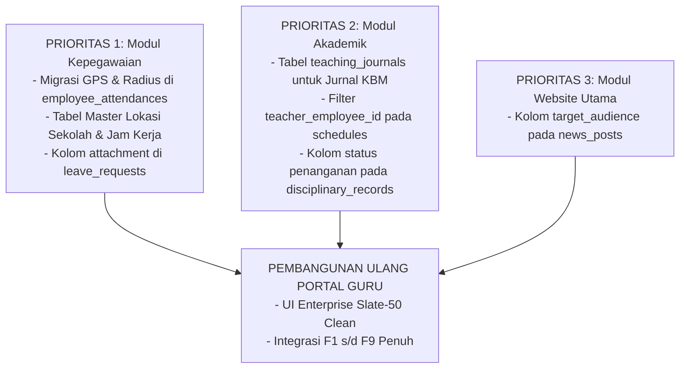

# LAPORAN AUDIT MODUL PORTAL GURU & PEMETAAN KETERKAITAN SISTEM MONOREPO CORE ALDEPOS

**Tanggal Audit:** 2026-10-06  
**Status Modul:** Perlu Pembangunan Ulang Total (*Total Rewrite & Redesign*)  
**Pemeriksa:** Tim Audit Arsitektur Core Aldepos (AI Antigravity)  
**Lingkup Pemeriksaan:** Frontend `apps/core-portal`, Backend `apps/api-backend`, Database 11 Modul MariaDB, API Contracts, Hak Akses RBAC, dan Peta Kebutuhan Fitur Target (F1–F9).

---

## DAFTAR ISI
1. [BAGIAN A. KONDISI PORTAL GURU SAAT INI](#bagian-a-kondisi-portal-guru-saat-ini)
   - 1. Peta Lokasi & Struktur File
   - 2. Halaman & Navigasi
   - 3. Matriks Status Fitur Eksisting
   - 4. Temuan Masalah & Analisis Akar Masalah (Root Cause)
   - 5. Penilaian UI, Styling & Frontend Architecture
   - 6. Kualitas Kode, Kompleksitas & Kepatuhan Standar
   - 7. Autentikasi, Hak Akses & Pembedaan Peran Guru
   - 8. Status Dokumentasi Teknis
2. [BAGIAN B. KETERKAITAN DENGAN MODUL LAIN (PRIORITAS UTAMA)](#bagian-b-keterkaitan-dengan-modul-lain-prioritas-utama)
   - 9. Data Eksisting yang Dibaca/Ditulis Lintas Modul
   - 10. Data Modul Lain yang Tersedia tapi Belum Dimanfaatkan
   - 11. Peta Kebutuhan Fitur Target (F1–F9) ke Sumber Data & Jawaban Khusus
   - 12. Urutan Prioritas Ketergantungan Modul (*Dependency Roadmap*)
3. [BAGIAN C. DATABASE DAN API PORTAL GURU](#bagian-c-database-dan-api-portal-guru)
   - 13. Analisis Tabel & Endpoint API Portal Guru
4. [BAGIAN D. KEPUTUSAN ARSITEKTUR & REKOMENDASI](#bagian-d-keputusan-arsitektur--rekomendasi)
   - 14. Komponen Layak Pakai vs Harus Dibuang (*Keep vs Discard*) & Analisis Risiko
   - 15. Daftar Pertanyaan Terbuka & Keputusan Bisnis

---

# BAGIAN A. KONDISI PORTAL GURU SAAT INI

## 1. Peta Lokasi & Struktur File

Portal Guru saat ini hanya berwujud modul frontend pada portal SPA ([`apps/core-portal`](file:///c:/PROYEK/Core%20Aldepos/apps/core-portal)), sedangkan di backend ([`apps/api-backend`](file:///c:/PROYEK/Core%20Aldepos/apps/api-backend)) **tidak ada folder modul mandiri bernama `guru`**. Seluruh kebutuhan data meminjam endpoint dari modul `kepegawaian`, `akademik`, `core`, dan `website-utama`.

### Pohon Folder Modul Guru (Kedalaman 3 Tingkat)
```text
apps/core-portal/src/apps/guru/
├── components/
│   ├── AndroidAppLauncher.jsx       (268 baris - Modal Launcher Menu ala Android OS)
│   └── GuruLayout.jsx               (355 baris - Shell Layout, Countdown Banner & Bottom Bar)
└── pages/
    ├── AbsensiDiri.jsx              (641 baris - Presensi GPS, Riwayat & Form Izin)
    ├── AbsensiKelas.jsx             (680 baris - Presensi Siswa per Pertemuan & Harian)
    ├── Dashboard.jsx                (486 baris - Beranda Guru & Jam Digital)
    ├── InformasiSiswa.jsx           (309 baris - Direktori & Kontak Siswa)
    ├── InputNilai.jsx               (650 baris - Form Input Nilai Sesi, TP & Sikap)
    ├── JadwalMengajar.jsx           (224 baris - Kalender Jadwal Mengajar)
    ├── Login.jsx                    (167 baris - Halaman Login Khusus Guru)
    ├── Pengumuman.jsx               (236 baris - Papan Pengumuman & Berita)
    ├── ProfilSaya.jsx               (546 baris - Profil Mandiri & Ganti Password)
    └── TujuanPembelajaran.jsx       (383 baris - Master Tujuan Pembelajaran / TP)
```

### Ringkasan Ukuran Kode
- **Jumlah File Frontend:** 12 file (`.jsx`)
- **Total Baris Kode Frontend:** 4.945 baris
- **Backend Khusus Guru:** 0 file (tidak ada modul backend mandiri)
- **Tabel Database Khusus Guru:** 0 tabel (menumpang di DB Kepegawaian, Akademik, Core, Website Utama)
- **File Test:** 0 file (belum ada unit test maupun integration test)

---

## 2. Halaman dan Navigasi

Navigasi Portal Guru didaftarkan pada router utama di [`apps/core-portal/src/router.jsx:L1106-L1177`](file:///c:/PROYEK/Core%20Aldepos/apps/core-portal/src/router.jsx#L1106-L1177) dan didukung drawer launcher di [`Launcher.jsx:L251-L263`](file:///c:/PROYEK/Core%20Aldepos/apps/core-portal/src/pages/Launcher.jsx#L251-L263).

| URL Path | File Komponen | Posisi di Menu | Status Halaman | Ringkasan Kondisi |
|---|---|---|---|---|
| `/guru/login` | [`Login.jsx`](file:///c:/PROYEK/Core%20Aldepos/apps/core-portal/src/apps/guru/pages/Login.jsx) | Halaman Luar (Public) | **BERFUNGSI PENUH** | Autentikasi SSO via `POST /core/auth/login`. |
| `/guru/dashboard` | [`Dashboard.jsx`](file:///c:/PROYEK/Core%20Aldepos/apps/core-portal/src/apps/guru/pages/Dashboard.jsx) | Menu Utama / Beranda | **SEBAGIAN** | Mengambil jadwal, pengumuman, dan absensi hari ini. Kartu beban ajar dan radar jarak masih hardcode statis. |
| `/guru/jadwal` | [`JadwalMengajar.jsx`](file:///c:/PROYEK/Core%20Aldepos/apps/core-portal/src/apps/guru/pages/JadwalMengajar.jsx) | Menu Akademik / Jadwal | **SEBAGIAN** | Mengambil seluruh jadwal unit sekolah (belum terfilter per ID guru yang login). Fallback mock array jika DB kosong. |
| `/guru/absensi` & `/guru/presensi` | [`AbsensiDiri.jsx`](file:///c:/PROYEK/Core%20Aldepos/apps/core-portal/src/apps/guru/pages/AbsensiDiri.jsx) | Menu Kepegawaian / Presensi | **SEBAGIAN** | Frontend menghitung Haversine GPS. Backend mencatat check-in/out tapi membuang koordinat karena DB belum siap. Form izin berfungsi tanpa upload berkas. |
| `/guru/absensi-kelas` | [`AbsensiKelas.jsx`](file:///c:/PROYEK/Core%20Aldepos/apps/core-portal/src/apps/guru/pages/AbsensiKelas.jsx) | Menu Akademik / Presensi Kelas | **SEBAGIAN** | Dropdown jadwal error 404 (salah endpoint). Presensi jam pelajaran dan harian tersimpan, namun catatan materi/jurnal tidak dikirim ke backend. |
| `/guru/nilai` & `/guru/penilaian` | [`InputNilai.jsx`](file:///c:/PROYEK/Core%20Aldepos/apps/core-portal/src/apps/guru/pages/InputNilai.jsx) | Menu Akademik / Nilai | **RUSAK** | Tab 1 memanggil endpoint legacy yang tidak sinkron dengan sesi penilaian Akademik. Tab TP dan Sikap adalah **DUMMY TOTAL** (hanya `setFeedback` tanpa API). |
| `/guru/tujuan-pembelajaran` & `/guru/tp` | [`TujuanPembelajaran.jsx`](file:///c:/PROYEK/Core%20Aldepos/apps/core-portal/src/apps/guru/pages/TujuanPembelajaran.jsx) | Menu Akademik / TP | **RUSAK** | Read data dari API, namun Tambah/Edit/Hapus **DUMMY TOTAL** (hanya memanipulasi React state, tidak ada API call). |
| `/guru/siswa` | [`InformasiSiswa.jsx`](file:///c:/PROYEK/Core%20Aldepos/apps/core-portal/src/apps/guru/pages/InformasiSiswa.jsx) | Menu Kesiswaan / Siswa | **SEBAGIAN** | Menampilkan daftar siswa per rombel. Belum ada filter tahun ajaran dan belum ada fitur Ekspor Excel. |
| `/guru/pengumuman` | [`Pengumuman.jsx`](file:///c:/PROYEK/Core%20Aldepos/apps/core-portal/src/apps/guru/pages/Pengumuman.jsx) | Menu Komunikasi / Info | **BERFUNGSI PENUH** | Mengambil berita resmi dari `GET /website-utama/public/news`. |
| `/guru/profil` & `/guru/profile` | [`ProfilSaya.jsx`](file:///c:/PROYEK/Core%20Aldepos/apps/core-portal/src/apps/guru/pages/ProfilSaya.jsx) | Menu Akun / Profil | **BERFUNGSI PENUH** | Update profil mandiri guru (`PUT /kepegawaian/employees/me/profile`) dan ganti password (`PUT /core/users/change-password`). |

---

## 3. Fitur yang Ada (Database Connected vs Dummy/Hardcode)

| Fitur | Halaman | Endpoint yang Dipakai | Status Koneksi DB | Keterangan & Catatan Teknis |
|---|---|---|---|---|
| Login Guru SSO | `Login.jsx` | `POST /core/auth/login` | **Database Riil** | Menggunakan kredensial central user di database `core`. |
| Jam & Sapaan Beranda | `Dashboard.jsx` | - | **Lokal** | Jam realtime dari `setInterval` browser. |
| Notifikasi Countdown 15 Menit | `GuruLayout.jsx` | `GET /akademik/curriculum/schedules` | **Hardcode Fallback** | Jika jadwal kosong, disimulasikan jadwal palsu 4 menit lagi yang terus memicu banner peringatan berkedip. |
| Jadwal Mengajar Hari Ini | `Dashboard.jsx` | `GET /akademik/curriculum/schedules` | **Database Riil (Fallback Dummy)** | Mengambil jadwal, fallback ke 3 mock item jika belum ada jadwal di DB. |
| Rekap Beban Ajar Guru | `Dashboard.jsx` | - | **Hardcode Murni** | Teks statis: "24 Jam / Pekan", "6 Kelas", "182 Santri". |
| Presensi Masuk (Check-In) | `AbsensiDiri.jsx` | `POST /kepegawaian/attendance/check-in` | **Database Parsial** | Disimpan ke `employee_attendances`, tetapi koordinat `latitude`, `longitude`, `notes` tidak disimpan ke DB. |
| Presensi Pulang (Check-Out) | `AbsensiDiri.jsx` | `POST /kepegawaian/attendance/:id/check-out` | **Database Riil** | Memperbarui kolom `check_out_time` pada baris presensi hari ini. |
| Geolocation Radius Radar | `AbsensiDiri.jsx` | - | **Hardcode Murni** | Titik pusat koordinat sekolah di-hardcode di frontend dan service backend (`-6.6521, 106.8123`, radius 200m). |
| Riwayat Absensi Bulanan | `AbsensiDiri.jsx` | `GET /kepegawaian/attendance` | **Database Riil** | Membaca riwayat kehadiran pegawai dari database `kepegawaian`. |
| Pengajuan Cuti / Izin | `AbsensiDiri.jsx` | `POST /kepegawaian/attendance/leave-requests` | **Database Riil** | Disimpan ke `employee_leave_requests`, belum ada input lampiran/surat dokter. |
| Presensi Siswa per Jam Pelajaran | `AbsensiKelas.jsx` | `POST /akademik/lesson-attendances/bulk` | **Database Riil** | Tersimpan ke tabel `lesson_attendances`. |
| Presensi Siswa Harian | `AbsensiKelas.jsx` | `POST /akademik/attendances/bulk` | **Database Riil** | Tersimpan ke tabel `student_attendances`. |
| Jurnal & Materi Pembahasan KBM | `AbsensiKelas.jsx` | - | **Dummy / Hilang** | Input teks materi pembelajaran tidak dimasukkan ke payload API saat simpan. |
| Daftar Jadwal Lengkap Guru | `JadwalMengajar.jsx` | `GET /akademik/curriculum/schedules` | **Database Riil (Fallback Dummy)** | Mengambil seluruh jadwal sekolah (belum difilter per guru). |
| Input Nilai Tugas / UH / STS | `InputNilai.jsx` | `POST /akademik/scores/scores/bulk` | **Rusak / Skema Usang** | Memanggil endpoint bulk lama, tidak terhubung dengan tabel `assessment_sessions` di Akademik. |
| Input Nilai TP (Capaian) | `InputNilai.jsx` | - | **DUMMY TOTAL** | Tidak memanggil API `POST /akademik/scores/tp-scores/bulk`. |
| Input Nilai Sikap & Karakter | `InputNilai.jsx` | - | **DUMMY TOTAL** | Tidak memanggil API `POST /akademik/scores/attitude-scores/bulk`. |
| Baca Tujuan Pembelajaran (TP) | `TujuanPembelajaran.jsx` | `GET /akademik/curriculum/learning-objectives` | **Database Riil** | Tersambung ke tabel `learning_objectives`. |
| Tambah / Edit / Hapus TP | `TujuanPembelajaran.jsx` | - | **DUMMY TOTAL** | Form submit hanya mengubah React State di memori browser. |
| Direktori Siswa per Rombel | `InformasiSiswa.jsx` | `GET /akademik/curriculum/class-groups/:id/members` | **Database Riil** | Membaca anggota rombel siswa dari database `akademik`. |
| Papan Pengumuman & Berita | `Pengumuman.jsx` | `GET /website-utama/public/news` | **Database Riil** | Membaca artikel status `published` dari database `website_utama`. |
| Update Profil Mandiri Guru | `ProfilSaya.jsx` | `PUT /kepegawaian/employees/me/profile` | **Database Riil** | Memperbarui biodata guru di database `kepegawaian`. |
| Ganti Password Akun | `ProfilSaya.jsx` | `PUT /core/users/change-password` | **Database Riil** | Memperbarui hash bcrypt password di database `core`. |

---

## 4. Masalah yang Ditemukan & Analisis Akar Masalah

### A. Kategori KRITIS (Blokade Fungsional & Integritas Data)
1. **Mutasi Data TP Palsu (Dummy State Mutation)**  
   - **Lokasi:** [`apps/core-portal/src/apps/guru/pages/TujuanPembelajaran.jsx:L133-L166`](file:///c:/PROYEK/Core%20Aldepos/apps/core-portal/src/apps/guru/pages/TujuanPembelajaran.jsx#L133-L166)  
   - **Deskripsi:** Handler `handleSubmit` dan `handleDelete` hanya mengeksekusi `setLearningObjectives(...)` pada React state lokal. Tidak ada pemanggilan API `POST /akademik/curriculum/learning-objectives`, `PUT`, atau `DELETE`. Data yang diinput guru hilang total saat reload.
2. **Tab Penilaian TP dan Sikap Tidak Tersimpan ke Database (Dummy Feedback)**  
   - **Lokasi:** [`apps/core-portal/src/apps/guru/pages/InputNilai.jsx:L193-L202`](file:///c:/PROYEK/Core%20Aldepos/apps/core-portal/src/apps/guru/pages/InputNilai.jsx#L193-L202)  
   - **Deskripsi:** Pada tab "Nilai TP" dan "Nilai Sikap", tombol simpan hanya memunculkan banner hijau sukses palsu (`setFeedback({ type: 'success', ... })`) tanpa payload HTTP ke backend. Nilai yang dimasukkan guru tidak pernah tersimpan.
3. **Hardcode Koordinat & Hilangnya Metadata Lokasi Presensi Pegawai**  
   - **Lokasi:**  
     - Backend: [`apps/api-backend/src/modules/kepegawaian/attendance/service.js:L91-L125`](file:///c:/PROYEK/Core%20Aldepos/apps/api-backend/src/modules/kepegawaian/attendance/service.js#L91-L125)  
     - Frontend: [`apps/core-portal/src/apps/guru/pages/AbsensiDiri.jsx:L29-L34`](file:///c:/PROYEK/Core%20Aldepos/apps/core-portal/src/apps/guru/pages/AbsensiDiri.jsx#L29-L34)  
     - Skema DB: [`apps/api-backend/db/migrations/kepegawaian/20260817000011_create_employee_attendances_table.js`](file:///c:/PROYEK/Core%20Aldepos/apps/api-backend/db/migrations/kepegawaian/20260817000011_create_employee_attendances_table.js)  
   - **Deskripsi:** Titik koordinat sekolah di-hardcode `-6.6521, 106.8123` radius 200m. Tabel `employee_attendances` di DB **tidak memiliki kolom `latitude`, `longitude`, `distance_meters`, `device_info`, maupun `notes`**. Backend menghitung jarak di memori lalu membuang datanya.
4. **Countdown Banner Palsu Berbunyi Terus-Menerus**  
   - **Lokasi:** [`apps/core-portal/src/apps/guru/components/GuruLayout.jsx:L59-L78`](file:///c:/PROYEK/Core%20Aldepos/apps/core-portal/src/apps/guru/components/GuruLayout.jsx#L59-L78)  
   - **Deskripsi:** Jika guru belum memiliki jadwal pelajaran aktif di database, kode layout mengeksekusi fallback simulasi jadwal yang selalu berjarak 4 menit dari jam saat ini. Akibatnya, banner peringatan kuning `🔔 4 Menit Lagi: Matematika Terapan` selalu muncul berkedip dan mengganggu guru setiap saat.
5. **Endpoint Roster Jadwal 404 Not Found**  
   - **Lokasi:** [`apps/core-portal/src/apps/guru/pages/AbsensiKelas.jsx:L52`](file:///c:/PROYEK/Core%20Aldepos/apps/core-portal/src/apps/guru/pages/AbsensiKelas.jsx#L52)  
   - **Deskripsi:** Memanggil `api.get('/akademik/schedules')` yang menghasilkan error HTTP 404 (route yang terdaftar di backend adalah `/akademik/curriculum/schedules`). Dropdown jadwal di absensi kelas menjadi kosong/tidak berfungsi.

### B. Kategori SEDANG (Celah Validasi & Hilangnya Fungsionalitas)
1. **Bypass Validasi Lokasi via Geolocation Error Fallback**  
   - **Lokasi:** [`apps/core-portal/src/apps/guru/pages/AbsensiDiri.jsx:L114-L125`](file:///c:/PROYEK/Core%20Aldepos/apps/core-portal/src/apps/guru/pages/AbsensiDiri.jsx#L114-L125)  
   - **Deskripsi:** Jika browser memblokir izin GPS atau terjadi error pelacakan, frontend langsung menyuntikkan koordinat palsu sejauh 35 meter dari sekolah dan menyetel `isWithinRadius = true`. Guru dapat melakukan presensi dari mana saja cukup dengan menonaktifkan GPS browser.
2. **Jadwal Mengajar Tidak Difilter Berdasarkan Guru yang Login**  
   - **Lokasi:** [`apps/core-portal/src/apps/guru/pages/JadwalMengajar.jsx:L40-L46`](file:///c:/PROYEK/Core%20Aldepos/apps/core-portal/src/apps/guru/pages/JadwalMengajar.jsx#L40-L46)  
   - **Deskripsi:** Query jadwal hanya mengirimkan parameter `satuan_pendidikan_id` tanpa parameter `teacher_employee_id`. Seluruh jadwal sekolah milik guru lain ikut ditarik ke tampilan jadwal pribadi.
3. **Data Jurnal / Topik Materi Pembahasan Terbuang Saat Simpan Presensi**  
   - **Lokasi:** [`apps/core-portal/src/apps/guru/pages/AbsensiKelas.jsx:L204-L260`](file:///c:/PROYEK/Core%20Aldepos/apps/core-portal/src/apps/guru/pages/AbsensiKelas.jsx#L204-L260)  
   - **Deskripsi:** Field `topicNotes` (topik materi KBM) dan `meetingNumber` (pertemuan ke-N) tersedia di form UI tetapi tidak dimasukkan ke dalam objek payload `POST /akademik/lesson-attendances/bulk`.
4. **Form Pengajuan Izin Guru Tanpa Lampiran Berkas / Surat Sakit**  
   - **Lokasi:** [`apps/api-backend/src/modules/kepegawaian/attendance/service.js:L197-L234`](file:///c:/PROYEK/Core%20Aldepos/apps/api-backend/src/modules/kepegawaian/attendance/service.js#L197-L234)  
   - **Deskripsi:** Tabel `employee_leave_requests` tidak memiliki kolom `attachment_url` / `file_url`, sehingga guru tidak dapat melampirkan surat dokter saat mengajukan izin sakit.
5. **Direktori Siswa Belum Memiliki Fitur Ekspor Excel & Filter Tahun Ajaran**  
   - **Lokasi:** [`apps/core-portal/src/apps/guru/pages/InformasiSiswa.jsx`](file:///c:/PROYEK/Core%20Aldepos/apps/core-portal/src/apps/guru/pages/InformasiSiswa.jsx)  
   - **Deskripsi:** Data siswa hanya difilter berdasarkan rombel aktif tanpa konteks tahun ajaran, dan pustaka `xlsx` belum diimplementasikan untuk ekspor berkas data siswa.

### C. Kategori RINGAN (Konsistensi & Kebersihan Kode)
1. **Sisa `console.error` dan `console.warn` di Setiap File**  
   - Ditemukan di hampir seluruh file halaman guru (`GuruLayout.jsx:L113`, `Dashboard.jsx:L120`, `AbsensiDiri.jsx:L114, L151`, `AbsensiKelas.jsx:L67, L107, L154`, `JadwalMengajar.jsx:L63`, `InputNilai.jsx:L68, L127`, `TujuanPembelajaran.jsx:L100`, `InformasiSiswa.jsx:L56, L139`, `Pengumuman.jsx:L91`, `ProfilSaya.jsx:L106`).
2. **Pilihan Mapel & Jenjang Menggunakan Input Bebas / String Statis**  
   - Pada `TujuanPembelajaran.jsx:L226-L240` dan `InputNilai.jsx:L307`, daftar mata pelajaran tidak mengambil data dari endpoint master mata pelajaran (`/akademik/curriculum/subjects`), melainkan dropdown manual statis atau text input.

### Penyebab Utama Modul "Belum Benar"
Modul Portal Guru saat ini dibangun sebagai **prototipe visual cepat (*mockup UI prototype*)** untuk mengejar tampilan antarmuka ala aplikasi mobile (Android drawer & dark mode), tanpa melakukan sinkronisasi kontrak data dengan endpoint riil yang dibangun di modul Akademik (`apps/api-backend/src/modules/akademik/scores/` dan `curriculum/`) serta modul Kepegawaian.

---

## 5. UI dan Frontend Architecture

### Pustaka & Versi Dependensi (dari [`apps/core-portal/package.json`](file:///c:/PROYEK/Core%20Aldepos/apps/core-portal/package.json))
- **Core Framework:** React v18.3.1, Vite v5.4.14
- **Routing:** react-router-dom v6.28.2
- **Styling:** Tailwind CSS v3.4.17 (dengan PostCSS & Autoprefixer)
- **Ikonografi:** lucide-react v0.395.0
- **HTTP Client:** axios v1.7.2 (dikonfigurasi dengan interceptor JWT di [`api.js`](file:///c:/PROYEK/Core%20Aldepos/apps/core-portal/src/shared/services/api.js))
- **Spreadsheet / Excel:** xlsx v0.18.5
- **Gantt Chart (Modul lain):** @svar-ui/react-gantt v2.7.1
- **Date Utility:** date-fns v3.6.0, react-day-picker v10.0.1
- **State Management:** React Context API (`AuthContext.jsx`) + Local Component State (`useState`, `useMemo`, `useCallback`)

### Penggunaan Komponen Shared vs Komponen Sendiri
- **Komponen Shared yang Dipakai:** [`ProtectedRoute.jsx`](file:///c:/PROYEK/Core%20Aldepos/apps/core-portal/src/shared/components/ProtectedRoute.jsx), [`StatRibbonCard.jsx`](file:///c:/PROYEK/Core%20Aldepos/apps/core-portal/src/shared/components/StatRibbonCard.jsx), [`StatusPill.jsx`](file:///c:/PROYEK/Core%20Aldepos/apps/core-portal/src/shared/components/StatusPill.jsx), [`FlatAlertBanner.jsx`](file:///c:/PROYEK/Core%20Aldepos/apps/core-portal/src/shared/components/FlatAlertBanner.jsx).
- **Komponen Khusus Modul Guru:**
  - [`GuruLayout.jsx`](file:///c:/PROYEK/Core%20Aldepos/apps/core-portal/src/apps/guru/components/GuruLayout.jsx) (Shell layout mandiri berlatar gelap).
  - [`AndroidAppLauncher.jsx`](file:///c:/PROYEK/Core%20Aldepos/apps/core-portal/src/apps/guru/components/AndroidAppLauncher.jsx) (Drawer launcher modal bergaya OS Android).

### Kepatuhan terhadap Design System
- **Dokumen Panduan:** [`docs/PANDUAN-DESAIN-ENTERPRISE-ALDEPOS.md`](file:///c:/PROYEK/Core%20Aldepos/docs/PANDUAN-DESAIN-ENTERPRISE-ALDEPOS.md) menetapkan estetika *Enterprise Corporate* bernuansa terang (`bg-slate-50`, container putih, teks Slate-900, aksen Indigo/Emerald).
- **Kondisi Riil Portal Guru:** Seluruh halaman Portal Guru didesain dengan latar belakang gelap pekat (`bg-slate-950`, container `bg-slate-900`, border `border-slate-800`), terisolasi dari gaya visual modul Core, Kepegawaian, dan Akademik.

### Penilaian Kualitas UI/UX
- **Konsistensi Visual:** Konsisten di internal folder `apps/guru/` (semua bernuansa gelap), tetapi inkonsisten terhadap keseluruhan monorepo Core Aldepos.
- **Responsivitas Mobile:** Baik. Menggunakan bottom bar navigasi di layar kecil (`md:hidden`) dan modal drawer launcher. Pada `AbsensiKelas.jsx` dan `AbsensiDiri.jsx` sudah disiapkan card-stack vertikal dengan touch target 44px untuk mobile.
- **Loading / Empty / Error State:** Kurang memadai. Jika API gagal atau mengembalikan array kosong, aplikasi langsung menyuntikkan *mock data* alih-alih menampilkan *Empty State* atau pesan kesalahan yang komunikatif.
- **Aksesibilitas (a11y):** Kontras teks abu-abu tua (`text-slate-500` di atas `bg-slate-900`) di beberapa sublabel sulit dibaca.

---

## 6. Kualitas Kode & Kepatuhan Standar

1. **Ukuran & Kompleksitas File:**
   - File relatif terkontrol (200 s/d 680 baris), jauh lebih ringkas dibanding halaman Akademik [`InputNilai.jsx`](file:///c:/PROYEK/Core%20Aldepos/apps/core-portal/src/apps/akademik/pages/InputNilai.jsx) yang mencapai 5.164 baris. Namun, keringkasan ini terjadi karena sebagian besar logika bisnis dan mutasi API belum diimplementasikan (hanya mock state).
2. **Duplikasi Kode:**
   - Logika perhitungan jarak Haversine diduplikasi di frontend ([`AbsensiDiri.jsx:L37-L51`](file:///c:/PROYEK/Core%20Aldepos/apps/core-portal/src/apps/guru/pages/AbsensiDiri.jsx#L37-L51)) dan di backend ([`attendance/service.js:L37-L51`](file:///c:/PROYEK/Core%20Aldepos/apps/api-backend/src/modules/kepegawaian/attendance/service.js#L37-L51)).
   - Mock roster siswa diduplikasi di `AbsensiKelas.jsx:L133-L143`, `InputNilai.jsx:L93-L103`, dan `InformasiSiswa.jsx:L75-L136`.
3. **Cakupan Pengujian (Test Coverage):**
   - 0% test coverage (belum ada test runner Vitest/Jest untuk modul guru).

---

## 7. Autentikasi, Hak Akses & Pembedaan Peran Guru

### Cara Login dan Pengelolaan Sesi
1. **Login:** Guru login melalui form [`apps/core-portal/src/apps/guru/pages/Login.jsx`](file:///c:/PROYEK/Core%20Aldepos/apps/core-portal/src/apps/guru/pages/Login.jsx) atau central login [`/login`](file:///c:/PROYEK/Core%20Aldepos/apps/core-portal/src/apps/core/pages/Login.jsx) yang memanggil `POST /core/auth/login`.
2. **JWT Payload:** Backend mengembalikan access token JWT berisi:
   `{ id, username, full_name, account_type, ref_type: 'staff', ref_id: <employee_id>, school_units: [...] }`.
3. **Penyimpanan Sesi:** Token disimpan di `localStorage` melalui [`AuthContext.jsx`](file:///c:/PROYEK/Core%20Aldepos/apps/core-portal/src/shared/store/AuthContext.jsx) dan otomatis disuntikkan ke header `Authorization: Bearer <token>` oleh Axios interceptor.

### Pengecekan Hak Akses (Frontend & Middleware)
- **Frontend Gate:** [`ProtectedRoute.jsx`](file:///c:/PROYEK/Core%20Aldepos/apps/core-portal/src/shared/components/ProtectedRoute.jsx) memeriksa apakah `isAuthenticated === true`. Pemetaan role modul di [`Launcher.jsx:L66`](file:///c:/PROYEK/Core%20Aldepos/apps/core-portal/src/pages/Launcher.jsx#L66) mengizinkan modul `guru` untuk role:
  `['super_admin', 'admin_yayasan', 'guru', 'wali_kelas', 'waka_kurikulum', 'guru_bk', 'pelatih_ekskul', 'guru_tamu']`.
- **Backend Middleware:** [`requirePermission.js`](file:///c:/PROYEK/Core%20Aldepos/apps/api-backend/src/middlewares/requirePermission.js) memeriksa kepemilikan permission di tabel `user_school_roles` -> `role_permissions` -> `permissions`.

### Bagaimana Sistem Membedakan Jabatan & Penugasan Guru
| Tipe Guru | Diidentifikasi Melalui | Lokasi di Database | Implementasi Saat Ini di Portal Guru |
|---|---|---|---|
| **Guru Mata Pelajaran** | Tabel Penugasan Mengajar | `akademik.subject_teacher_assignments` | Belum terintegrasi; portal masih menarik jadwal umum sekolah tanpa filter ID guru. |
| **Wali Kelas** | Kolom Wali Kelas di Rombel | `akademik.class_groups.homeroom_teacher_id` | Belum terintegrasi; portal belum membatasi akses input catatan wali kelas / rekap nilai kelas. |
| **Guru BK (Bimbingan Konseling)** | Role `guru_bk` & Penugasan Konseling | `core.roles` & `akademik.counseling_records.counselor_employee_id` | Belum ada halaman/menu khusus BK di Portal Guru. |
| **Guru dengan Jabatan Tambahan (Waka Kurikulum / Kepala Sekolah)** | Role di Core & Jabatan di Kepegawaian | `core.user_school_roles` & `kepegawaian.employees.current_position_id` | Profil menampilkan nama jabatan secara read-only dari API Kepegawaian. |

---

## 8. Dokumen Teknis Khusus Portal Guru

- **Dokumen Khusus Portal Guru:** **TIDAK DITEMUKAN**. Tidak ada `ai-ref-guru.md`, `api-contract-guru.md`, `erd-guru.md`, maupun `roles-guru.md` di folder [`docs/`](file:///c:/PROYEK/Core%20Aldepos/docs/).
- **Status Dokumen Terkait:** Kebutuhan portal guru tersebar di dokumen modul lain ([`ai-ref-akademik.md`](file:///c:/PROYEK/Core%20Aldepos/docs/ai-ref-akademik.md), [`ai-ref-kepegawaian.md`](file:///c:/PROYEK/Core%20Aldepos/docs/ai-ref-kepegawaian.md), [`api-contract-akademik.md`](file:///c:/PROYEK/Core%20Aldepos/docs/api-contract-akademik.md), [`api-contract-kepegawaian.md`](file:///c:/PROYEK/Core%20Aldepos/docs/api-contract-kepegawaian.md)). Sebagian besar kontrak API di dokumen tersebut belum diimplementasikan di kode Portal Guru saat ini.

---

# BAGIAN B. KETERKAITAN DENGAN MODUL LAIN (PRIORITAS UTAMA)

## 9. Data yang Saat Ini Dipakai Portal Guru dari Modul Lain

```mermaid
graph LR
    subgraph Portal Guru Frontend
        PG[Portal Guru React Apps]
    end

    subgraph Modul Kepegawaian
        EMP[employees]
        ATT[employee_attendances]
        LEV[employee_leave_requests]
    end

    subgraph Modul Akademik
        CG[class_groups & members]
        SCH[subject_schedules]
        LO[learning_objectives]
        LATT[lesson_attendances]
        SATT[student_attendances]
        SCR[student_scores]
    end

    subgraph Modul Website Utama
        NEWS[news_posts]
    end

    subgraph Modul Core
        USR[users & auth]
    end

    PG -->|GET /kepegawaian/employees/:id<br/>PUT /me/profile| EMP
    PG -->|GET/POST /kepegawaian/attendance| ATT
    PG -->|GET/POST /kepegawaian/attendance/leave-requests| LEV

    PG -->|GET /akademik/curriculum/class-groups| CG
    PG -->|GET /akademik/curriculum/schedules| SCH
    PG -->|GET /akademik/curriculum/learning-objectives| LO
    PG -->|POST /akademik/lesson-attendances/bulk| LATT
    PG -->|POST /akademik/attendances/bulk| SATT
    PG -->|POST /akademik/scores/scores/bulk (Legacy)| SCR

    PG -->|GET /website-utama/public/news| NEWS
    PG -->|POST /core/auth/login<br/>PUT /core/users/change-password| USR
```

### Tabel Rincian Akses Data Saat Ini
| Modul Target | Tabel / Kolom yang Diakses | Method & Endpoint | File Pemanggil | Pelanggaran Batas Modul? |
|---|---|---|---|---|
| **Core** | `users` (`username`, `password_hash`, `full_name`) | `POST /core/auth/login` | [`Login.jsx:L33`](file:///c:/PROYEK/Core%20Aldepos/apps/core-portal/src/apps/guru/pages/Login.jsx#L33) | Tidak (Lewat API resmi) |
| **Core** | `users` (`password_hash`) | `PUT /core/users/change-password` | [`ProfilSaya.jsx:L170`](file:///c:/PROYEK/Core%20Aldepos/apps/core-portal/src/apps/guru/pages/ProfilSaya.jsx#L170) | Tidak (Lewat API resmi) |
| **Kepegawaian** | `employees` (biodata, kontak, gelar, NIP) | `GET /kepegawaian/employees/:id` | [`ProfilSaya.jsx:L71`](file:///c:/PROYEK/Core%20Aldepos/apps/core-portal/src/apps/guru/pages/ProfilSaya.jsx#L71) | Tidak (Lewat API resmi) |
| **Kepegawaian** | `employees` (update mandiri) | `PUT /kepegawaian/employees/me/profile` | [`ProfilSaya.jsx:L136`](file:///c:/PROYEK/Core%20Aldepos/apps/core-portal/src/apps/guru/pages/ProfilSaya.jsx#L136) | Tidak (Lewat API resmi) |
| **Kepegawaian** | `employee_attendances` | `GET/POST /kepegawaian/attendance` | [`AbsensiDiri.jsx:L140, L183, L216`](file:///c:/PROYEK/Core%20Aldepos/apps/core-portal/src/apps/guru/pages/AbsensiDiri.jsx#L140) | Tidak (Lewat API resmi) |
| **Kepegawaian** | `employee_leave_requests` | `POST /kepegawaian/attendance/leave-requests` | [`AbsensiDiri.jsx:L240`](file:///c:/PROYEK/Core%20Aldepos/apps/core-portal/src/apps/guru/pages/AbsensiDiri.jsx#L240) | Tidak (Lewat API resmi) |
| **Akademik** | `subject_schedules` | `GET /akademik/curriculum/schedules` | [`JadwalMengajar.jsx:L40`](file:///c:/PROYEK/Core%20Aldepos/apps/core-portal/src/apps/guru/pages/JadwalMengajar.jsx#L40) | Tidak (Lewat API resmi) |
| **Akademik** | `class_groups`, `student_class_enrollments` | `GET /akademik/curriculum/class-groups/:id/members` | [`AbsensiKelas.jsx:L120`](file:///c:/PROYEK/Core%20Aldepos/apps/core-portal/src/apps/guru/pages/AbsensiKelas.jsx#L120) | Tidak (Lewat API resmi) |
| **Akademik** | `lesson_attendances` | `POST /akademik/lesson-attendances/bulk` | [`AbsensiKelas.jsx:L224`](file:///c:/PROYEK/Core%20Aldepos/apps/core-portal/src/apps/guru/pages/AbsensiKelas.jsx#L224) | Tidak (Lewat API resmi) |
| **Akademik** | `student_attendances` | `POST /akademik/attendances/bulk` | [`AbsensiKelas.jsx:L250`](file:///c:/PROYEK/Core%20Aldepos/apps/core-portal/src/apps/guru/pages/AbsensiKelas.jsx#L250) | Tidak (Lewat API resmi) |
| **Akademik** | `learning_objectives` | `GET /akademik/curriculum/learning-objectives` | [`TujuanPembelajaran.jsx:L51`](file:///c:/PROYEK/Core%20Aldepos/apps/core-portal/src/apps/guru/pages/TujuanPembelajaran.jsx#L51) | Tidak (Lewat API resmi) |
| **Website Utama** | `news_posts` | `GET /website-utama/public/news` | [`Pengumuman.jsx:L30`](file:///c:/PROYEK/Core%20Aldepos/apps/core-portal/src/apps/guru/pages/Pengumuman.jsx#L30) | Tidak (Lewat API resmi) |

*Catatan Pelanggaran:* Tidak ditemukan pelanggaran query langsung antar-database MariaDB (Direct Cross-DB Join) di layer frontend karena seluruh akses lewat HTTP API Express. Namun, skema data di backend Kepegawaian dan Akademik belum menampung seluruh payload yang dikirim frontend.

---

## 10. Data di Modul Lain yang Terkait tetapi Belum Digunakan

### 1. Modul Akademik
- **Tahun Ajaran & Semester Aktif:** Tabel `academic_years` dan `semesters` (`GET /akademik/curriculum/academic-years`, `GET /akademik/curriculum/semesters`). Portal Guru belum memiliki context selector Tahun Ajaran & Semester global.
- **Penugasan Mengajar Guru:** Tabel `subject_teacher_assignments` (`GET /akademik/curriculum/teaching-duties`). Dapat dipakai memvalidasi mapel dan rombel apa saja yang berhak diampu oleh guru yang sedang login.
- **Manajemen Nilai Terpadu & Sesi Ujian:** Tabel `assessment_types`, `assessment_sessions`, `student_scores`, `subject_grade_kkms`, dan `report_card_subject_scores` (`/akademik/scores/*`). Ini adalah inti sinkronisasi nilai yang belum dipakai oleh Portal Guru.
- **Rapor & Deskripsi Capaian:** Tabel `report_cards` dan `report_score_input_history`. Rujukan deskripsi nilai otomatis berdasarkan ketercapaian TP.
- **Data Kesiswaan / BK / Kedisiplinan:** Tabel `student_disciplinary_records` (pelanggaran/poin), `student_achievements` (prestasi), dan `counseling_records` (konseling santri). Fitur ini sudah ada di backend Akademik (`/akademik/student-affairs/*`) tetapi belum dibuatkan antarmukanya di Portal Guru.
- **Kalender Pendidikan:** Tabel `academic_calendar_events` (`GET /akademik/student-affairs/calendar-events`). Jadwal libur, pekan ujian, dan agenda KBM.

### 2. Modul Kepegawaian
- **Master Status Kepegawaian:** Tabel `employment_statuses` (`GET /kepegawaian/employment-statuses`).
- **Penilaian Kinerja Guru (PK Guru / Supervisi):** Tabel `performance_reviews` (`GET /kepegawaian/performance-reviews`).
- **Riwayat Penugasan Sekolah:** Tabel `employee_school_assignments`.

### 3. Modul Core
- **Master Satuan Pendidikan:** Tabel `school_units`. Belum ada kolom koordinat GPS (`latitude`, `longitude`, `radius_meters`) di DB Core.
- **Sistem Notifikasi In-App:** Tabel `activity_logs` dan `webhook_events`.

### 4. Modul Tahfidz & Al-Quran
- **Hafalan & Setoran Santri:** Tabel `hafalan_records`, `hafalan_targets`, dan `munaqasyah_exams`. Berguna bagi guru pembimbing halaqah tahfidz / ustadz asrama.

### 5. Modul Pengelolaan (Manajemen)
- **Supervisi Akademik Guru:** Tabel `supervision_schedules` dan `supervision_results` (`apps/api-backend/src/modules/manajemen/supervisions`). Evaluasi KBM guru oleh Kepala Sekolah / Pengawas.
- **Tugas & Kepanitiaan Guru:** Tabel `projects`, `project_members`, dan `tasks` (`apps/api-backend/src/modules/manajemen/tasks`).

### 6. Modul Sarpras & Perpustakaan
- **Peminjaman Ruangan / Lab:** Tabel `facility_bookings` (`apps/api-backend/src/modules/sarpras/bookings`).
- **Peminjaman Buku Pegangan Guru:** Tabel `book_loans` dan `book_reservations` (`apps/api-backend/src/modules/perpustakaan/loans`).

### 7. Modul Komunikasi, Ujian/CBE, dan Portal Orangtua
- **Komunikasi & Notifikasi:** Kode modul **belum ada**.
- **CBE / Ujian Daring:** Kode modul **belum ada**.
- **Portal Orangtua:** Baru sebagian berupa pengecekan tagihan santri ([`ParentBills.jsx`](file:///c:/PROYEK/Core%20Aldepos/apps/core-portal/src/apps/keuangan/pages/StudentBills.jsx)).

---

## 11. Peta Kebutuhan Fitur Target (F1–F9) ke Sumber Data

| Fitur Target | Kebutuhan Data Spesifik | Lokasi Eksisting di Monorepo | Status Kesiapan Data | Yang Perlu Ditambah / Diubah di Modul Lain | Risiko Teknis |
|---|---|---|---|---|---|
| **F1. Absensi Kehadiran Guru (Masuk & Pulang GPS Radius + Pengingat)** | - Koordinat & radius sekolah.<br/>- Jam masuk/pulang/toleransi.<br/>- Log absensi masuk/pulang, GPS, jarak, catatan.<br/>- Status belum absen pagi/sore. | - Backend: [`kepegawaian/attendance/service.js`](file:///c:/PROYEK/Core%20Aldepos/apps/api-backend/src/modules/kepegawaian/attendance/service.js)<br/>- DB: `employee_attendances` | **SEBAGIAN** | 1. Tambah kolom `latitude`, `longitude`, `distance_meters`, `device_info`, `notes` pada `employee_attendances`.<br/>2. Buat tabel master lokasi/radius sekolah (di Kepegawaian/Core) dan master jam kerja/shift pegawai.<br/>3. Buat endpoint HRD untuk kelola koordinat & radius. | Fake GPS di browser klien; kegagalan izin lokasi perangkat mobile. |
| **F2. Pengajuan Izin Guru (Sakit & Keperluan Lain)** | - Jenis izin/cuti.<br/>- Tanggal mulai & selesai.<br/>- Alasan & lampiran (surat dokter/dinas).<br/>- Alur persetujuan HRD/Kepsek. | - Backend: [`kepegawaian/attendance/service.js:L197`](file:///c:/PROYEK/Core%20Aldepos/apps/api-backend/src/modules/kepegawaian/attendance/service.js#L197)<br/>- DB: `employee_leave_requests` | **SEBAGIAN** | 1. Tambah kolom `attachment_url` / `file_url` pada `employee_leave_requests`.<br/>2. Siapkan upload handler multer untuk berkas surat izin/dokter. | Delegasi jam mengajar saat guru izin belum otomatis terhubung ke jadwal piket. |
| **F3. Pengingat Jadwal Mengajar Guru** | - Jadwal mengajar per guru (`day_of_week`, `start_time`, `end_time`, `room`, `class_group`).<br/>- Jam pelajaran riil hasil generate otomatis.<br/>- Notifikasi in-app / banner countdown. | - Backend: [`akademik/timetable/`](file:///c:/PROYEK/Core%20Aldepos/apps/api-backend/src/modules/akademik/timetable/) & [`curriculum/`](file:///c:/PROYEK/Core%20Aldepos/apps/api-backend/src/modules/akademik/curriculum/)<br/>- DB: `subject_schedules`, `subject_schedule_class_groups` | **SUDAH ADA** (Tabel & Service Jadwal Lengkap) | Tambahkan filter `teacher_employee_id` pada query `GET /akademik/curriculum/schedules` agar hanya mengembalikan jadwal milik guru yang sedang login. | Inkonsistensi format jam jika jadwal di-generate ulang oleh waka kurikulum. |
| **F4. Input Perencanaan Pembelajaran / Silabus & Materi Pelajaran** | - Capaian Pembelajaran (CP), Tujuan Pembelajaran (TP), Lingkup Materi.<br/>- Silabus / Alur Tujuan Pembelajaran (ATP).<br/>- Rujukan ke e-Rapor. | - Backend: [`akademik/curriculum/service.js:L1700+`](file:///c:/PROYEK/Core%20Aldepos/apps/api-backend/src/modules/akademik/curriculum/service.js)<br/>- DB: `learning_objectives`, `student_tp_scores` | **SEBAGIAN** | 1. Hubungkan controller `POST`, `PUT`, `DELETE /akademik/curriculum/learning-objectives` ke frontend Portal Guru.<br/>2. Tambahkan kolom silabus / modul ajar jika diperlukan lampiran RPP. | Format deskripsi rapor Kurikulum Merdeka menuntut relasi ketat antara TP dan nilai tertinggi/terendah siswa. |
| **F5. Absensi Mengajar & Jurnal Materi Siswa Massal** | - Selector Unit, Tahun Ajaran, Semester.<br/>- Sesi jam pelajaran sesuai jadwal.<br/>- Roster siswa per rombel.<br/>- Presensi massal (Hadir/Izin/Sakit/Alpa).<br/>- Materi KBM & catatan khusus santri. | - Backend: [`akademik/attendance/`](file:///c:/PROYEK/Core%20Aldepos/apps/api-backend/src/modules/akademik/attendance/) & [`curriculum/`](file:///c:/PROYEK/Core%20Aldepos/apps/api-backend/src/modules/akademik/curriculum/)<br/>- DB: `lesson_attendances`, `student_attendances` | **SEBAGIAN** | 1. Tambah tabel/kolom `teaching_journals` (jurnal KBM harian guru) yang mencatat `schedule_id`, `date`, `topic_material`, `tp_id`, `notes`.<br/>2. Sambungkan form presensi massal ke jurnal tersebut. | Duplikasi pencatatan antara presensi harian rombel (wali kelas) vs presensi per jam pelajaran (guru mapel). |
| **F6. Input Nilai Siswa (Sinkron dengan /akademik/scores)** | - Master jenis pengujian & bobot rapor (`assessment_types`).<br/>- Sesi penilaian (`assessment_sessions`).<br/>- Nilai siswa skala 0-100 & feedback.<br/>- Nilai TP & Nilai Karakter.<br/>- KKM/KKTP per mapel. | - Backend: [`akademik/scores/`](file:///c:/PROYEK/Core%20Aldepos/apps/api-backend/src/modules/akademik/scores/)<br/>- DB: `assessment_types`, `assessment_sessions`, `student_scores`, `student_tp_scores`, `subject_grade_kkms` | **SUDAH ADA** (Backend Akademik Sangat Lengkap) | Portal Guru harus memakai endpoint yang sama dengan [`/akademik/scores`](file:///c:/PROYEK/Core%20Aldepos/apps/core-portal/src/apps/akademik/pages/InputNilai.jsx) (`/akademik/scores/assessment-sessions`, `tp-scores/bulk`, `attitude-scores/bulk`) tanpa membuat skema API baru. | Kunci nilai rapor (*lock score*): guru tidak boleh mengedit nilai jika sesi penilaian sudah dikunci oleh waka kurikulum. |
| **F7. Informasi Siswa & Ekspor Excel** | - NIPD, NISN, nama lengkap, panggilan, kontak ortu/wali, TTL, rombel.<br/>- Filter Unit & Tahun Ajaran.<br/>- Generator berkas Excel (.xlsx). | - Backend: [`akademik/students/`](file:///c:/PROYEK/Core%20Aldepos/apps/api-backend/src/modules/akademik/students/) & [`curriculum/`](file:///c:/PROYEK/Core%20Aldepos/apps/api-backend/src/modules/akademik/curriculum/)<br/>- DB: `students`, `guardians`, `student_guardians`, `class_groups` | **SUDAH ADA** (Data Master Lengkap di DB) | 1. Pastikan query member rombel melakukan join ke `students` dan `guardians` untuk mengambil `nickname`, `birth_place`, `birth_date`, `guardian_phone`.<br/>2. Tambahkan fitur ekspor menggunakan pustaka `xlsx`. | Data kontak orangtua bersifat sensitif (privasi santri). |
| **F8. Pengumuman dan Berita** | - Judul, ringkasan, isi pengumuman, tanggal terbit, penerbit.<br/>- Target audiens (guru/semua). | - Backend: [`website-utama/news/`](file:///c:/PROYEK/Core%20Aldepos/apps/api-backend/src/modules/website-utama/news/)<br/>- DB: `news_posts` | **SEBAGIAN** | Tambahkan kolom `target_audience` (`'all'`, `'teachers'`, `'students'`, `'public'`) pada tabel `news_posts` di database `website_utama` agar pengumuman internal guru tidak tampil di portal publik santri/wali. | Pengumuman internal yayasan bocor ke website publik jika filter target audiens tidak dipisah. |
| **F9. Pencatatan Kejadian & Penanganan Siswa (Kesiswaan/BK)** | - Kategori (Pelanggaran/Prestasi/Konseling).<br/>- Poin disiplin.<br/>- Tanggal kejadian.<br/>- Tindakan penanganan & status penanganan.<br/>- Petugas penangan (guru/BK/Wali Kelas). | - Backend: [`akademik/student-affairs/`](file:///c:/PROYEK/Core%20Aldepos/apps/api-backend/src/modules/akademik/student-affairs/)<br/>- DB: `student_disciplinary_records`, `student_achievements`, `counseling_records` | **SUDAH ADA** (Backend & DB Tersedia) | 1. Tambah kolom `handling_status` (`'open'`, `'in_progress'`, `'resolved'`) dan `handling_action` pada tabel `student_disciplinary_records`.<br/>2. Bangun halaman UI khusus di Portal Guru. | Pelanggaran sensitif santri harus memiliki level visibilitas (*visibility_level*) agar tidak sembarang guru dapat membaca catatan konseling privat. |

---

### Jawaban Mendalam atas 9 Pertanyaan Spesifik

#### 1. F1 (Absensi Kehadiran Guru & Radius Lokasi)
- **Pengaturan Koordinat & Radius di Kepegawaian:** **BELUM ADA**. Saat ini koordinat sekolah di-hardcode di file service ([`attendance/service.js:L91-L93`](file:///c:/PROYEK/Core%20Aldepos/apps/api-backend/src/modules/kepegawaian/attendance/service.js#L91-L93)). Belum ada tabel database master lokasi sekolah di Kepegawaian maupun di Core, dan belum ada antarmuka HRD untuk mengatur titik GPS & radius per unit sekolah.
- **Tabel, Endpoint & Validasi Lokasi:** Endpoint `POST /kepegawaian/attendance/check-in` sudah ada, namun tabel `employee_attendances` **tidak memiliki kolom koordinat**. Validasi lokasi di backend hanya menghitung jarak Haversine di memori tanpa menyimpan posisi riil guru ke database.
- **Pengaturan Jam Masuk & Pulang:** **BELUM ADA**. Tidak ditemukan tabel shift atau jam kerja pegawai di Kepegawaian.

#### 2. F2 (Pengajuan Izin Guru)
- **Tabel & Alur Persetujuan:** **SUDAH ADA**. Menggunakan tabel `employee_leave_requests` dengan alur status `pending` $\rightarrow$ `approved` / `rejected` melalui endpoint `POST /kepegawaian/attendance/leave-requests/:id/approve`.
- **Jenis Izin & Lampiran:** Jenis izin disimpan dalam kolom `leave_type` (string bebas/enum). Kolom lampiran dokumen/surat sakit **BELUM ADA** di skema database.

#### 3. F3 (Jadwal Mengajar & Notifikasi)
- **Data Jadwal dari Akademik:** **SUDAH ADA**. Data jadwal tatap muka hasil pembagian kurikulum dan generate otomatis tersimpan di tabel `subject_schedules` dan `subject_schedule_class_groups` pada database `akademik`. Rentang jam pelajaran, hari, rombel, dan ruangan tersedia lengkap.
- **Mekanisme Pengingat / Notifikasi:** Modul Komunikasi terpusat **BELUM ADA**. Pengingat saat ini dihandle di layer frontend React menggunakan `setInterval` polling di [`GuruLayout.jsx`](file:///c:/PROYEK/Core%20Aldepos/apps/core-portal/src/apps/guru/components/GuruLayout.jsx).

#### 4. F4 (Perencanaan Pembelajaran, Silabus & TP)
- **Tabel Silabus / TP di Akademik:** **SUDAH ADA**. Tabel `learning_objectives` (`code`, `description`, `scope_material`, `subject_id`, `grade_level_id`, `semester_id`, `satuan_pendidikan_id`) dan `student_tp_scores` sudah tersedia di migrasi [`20260819085958_create_learning_objectives_and_tp_scores.js`](file:///c:/PROYEK/Core%20Aldepos/apps/api-backend/db/migrations/akademik/20260819085958_create_learning_objectives_and_tp_scores.js).
- **Relasi ke Penilaian & Rapor:** Struktur `learning_objectives` terhubung langsung dengan pengolahan nilai akhir e-Rapor pada service `report-cards` untuk menghasilkan deskripsi capaian tertinggi dan terendah secara otomatis.

#### 5. F5 (Struktur Presensi Siswa & Jurnal Mengajar)
- **Struktur Presensi Siswa:** Tersedia dua tingkatan di DB Akademik:
  1. Presensi Harian Rombel: tabel `student_attendances` (dicatat per hari oleh wali kelas/guru piket).
  2. Presensi per Jam Pelajaran: tabel `lesson_attendances` (dicatat per sesi mapel oleh guru pengampu).
- **Jurnal Mengajar / Materi per Pertemuan:** **BELUM ADA** tabel khusus `teaching_journals`. Saat ini baru ada kolom `notes` pada `lesson_attendances`. Diperlukan tabel jurnal agar guru dapat mencatat judul materi, nomor pertemuan, dan refleksi KBM.

#### 6. F6 (Sinkronisasi dengan Halaman `/akademik/scores`)
- **Cara Kerja `/akademik/scores`:** Halaman ini bekerja secara modular berbasis:
  1. Master jenis asesmen (`GET /akademik/scores/assessment-types`).
  2. Sesi penilaian per rombel/mapel (`GET/POST /akademik/scores/assessment-sessions`).
  3. Input nilai siswa per sesi (`POST /akademik/scores/assessment-sessions/:id/scores`).
  4. Input nilai TP massal (`POST /akademik/scores/tp-scores/bulk`).
  5. Input nilai dimensi sikap (`POST /akademik/scores/attitude-scores/bulk`).
  6. Pengolahan nilai rapor akhir (`POST /akademik/scores/scores/process-report`).
- **Strategi Pemakaian Ulang:** Portal Guru versi baru **wajib menggunakan endpoint yang sama persis** dengan `/akademik/scores` agar guru dan staf kurikulum melihat data nilai yang identik secara *real-time*.

#### 7. F7 (Kolom Data Siswa & Pola Ekspor Excel)
- **Kelengkapan Kolom Siswa:** **SUDAH LENGKAP**. Kolom `nipd`, `nisn`, `full_name`, `nickname` (panggilan), `birth_place`, `birth_date` ada di tabel `students`, kolom kontak ortu `phone_number` ada di tabel `guardians`, dan rombel ada di tabel `class_groups`.
- **Pola Ekspor Excel Eksisting:** Pustaka `xlsx` sudah terpasang. Pola ekspor terbaik dapat meniru implementasi di modul Manajemen ([`LongTermPlanning.jsx:L718-L785`](file:///c:/PROYEK/Core%20Aldepos/apps/core-portal/src/apps/manajemen/pages/LongTermPlanning.jsx#L718-L785)) dan modul Keuangan ([`Bookkeeping.jsx:L418-L425`](file:///c:/PROYEK/Core%20Aldepos/apps/core-portal/src/apps/keuangan/pages/Bookkeeping.jsx#L418-L425)) yang menggunakan `XLSX.utils.json_to_sheet` dan `XLSX.writeFile`.

#### 8. F8 (Penyimpanan Pengumuman & Target Audiens)
- **Penyimpanan:** Pengumuman disimpan di tabel `news_posts` pada database `website_utama` ([`20260817100005_create_news_posts_table.js`](file:///c:/PROYEK/Core%20Aldepos/apps/api-backend/db/migrations/website-utama/20260817100005_create_news_posts_table.js)).
- **Pembuat:** Dibuat oleh Humas / Admin Web melalui CMS Website Utama.
- **Target Audiens:** Saat ini **belum ada kolom target audiens**. Berita bersifat publik untuk semua pembaca portal web.

#### 9. F9 (Pencatatan Kejadian, Pelanggaran & Prestasi Siswa)
- **Ketersediaan Tabel:** **SUDAH ADA** di database `akademik`:
  1. Pelanggaran & Disiplin: tabel `student_disciplinary_records` (`violation_type`, `points`, `incident_date`, `handled_by_employee_id`, `notes`).
  2. Prestasi Santri: tabel `student_achievements` (`achievement_type`, `level`, `achieved_at`, `notes`).
  3. Bimbingan Konseling: tabel `counseling_records` (`session_date`, `service_type`, `notes`, `visibility_level`, `counselor_employee_id`).
- **Kekurangan Data:** Perlu penambahan kolom status penyelesaian kasus (`handling_status`) dan rincian sanksi/pembinaan (`action_taken`).

---

## 12. Daftar Ketergantungan Modul & Urutan Prioritas

Sebelum Portal Guru dapat dibangun ulang secara sempurna, terdapat beberapa migrasi skema dan penyesuaian endpoint di modul backend yang harus dikerjakan terlebih dahulu:



1. **Prioritas 1 (Kritis - Modul Kepegawaian):**
   - Buat migrasi penambahan kolom `latitude`, `longitude`, `distance_meters`, `device_info`, `notes` pada tabel `employee_attendances`.
   - Buat tabel master koordinat & radius lokasi sekolah serta endpoint pengaturannya oleh HRD.
   - Tambahkan kolom `attachment_url` pada tabel `employee_leave_requests`.
2. **Prioritas 2 (Kritis - Modul Akademik):**
   - Tambahkan filter `teacher_employee_id` pada endpoint `GET /akademik/curriculum/schedules`.
   - Buat tabel `teaching_journals` (Jurnal Mengajar Guru) yang menampung materi per pertemuan, TP rujukan, dan catatan siswa.
   - Tambahkan kolom status penanganan (`handling_status`, `action_taken`) pada tabel `student_disciplinary_records`.
3. **Prioritas 3 (Sedang - Modul Website Utama):**
   - Tambahkan kolom `target_audience` pada tabel `news_posts` agar pengumuman kedinasan guru terpisah dari berita umum santri.

---

# BAGIAN C. DATABASE DAN API PORTAL GURU

## 13. Analisis Tabel & Endpoint API Portal Guru

### Kepemilikan Tabel Database
Portal Guru **TIDAK MEMILIKI DATABASE ATAU TABEL SENDIRI**. Sesuai arsitektur modular monolith Core Aldepos, Portal Guru adalah *BFF (Backend-For-Frontend) Client Layer* yang mengonsumsi layanan dari 4 database modul utama:

```text
[Portal Guru Frontend]
       │
       ├──► Database `core`          (users, user_school_roles, roles, permissions)
       ├──► Database `kepegawaian`  (employees, employee_attendances, employee_leave_requests)
       ├──► Database `akademik`     (students, class_groups, schedules, scores, learning_objectives, ...)
       └──► Database `website_utama` (news_posts)
```

### Matriks Endpoint API yang Dipanggil Frontend vs Ketersediaan di Backend

| HTTP Method & Path | Controller / Service di Backend | Tabel Terkait di DB | Ketersediaan Backend | Status Keselarasan Kontrak |
|---|---|---|---|---|
| `POST /core/auth/login` | `core/auth/controller.js` | `core.users` | **ADA** | **Valid & Sesuai** |
| `PUT /core/users/change-password` | `core/users/controller.js` | `core.users` | **ADA** | **Valid & Sesuai** |
| `GET /kepegawaian/employees/:id` | `kepegawaian/employees/controller.js` | `kepegawaian.employees` | **ADA** | **Valid & Sesuai** |
| `PUT /kepegawaian/employees/me/profile` | `kepegawaian/employees/controller.js` | `kepegawaian.employees` | **ADA** | **Valid & Sesuai** |
| `GET /kepegawaian/attendance` | `kepegawaian/attendance/controller.js` | `kepegawaian.employee_attendances` | **ADA** | **Valid & Sesuai** |
| `POST /kepegawaian/attendance/check-in` | `kepegawaian/attendance/controller.js` | `kepegawaian.employee_attendances` | **ADA** | **Incomplete DB Columns** (koordinat dibuang) |
| `POST /kepegawaian/attendance/:id/check-out` | `kepegawaian/attendance/controller.js` | `kepegawaian.employee_attendances` | **ADA** | **Valid & Sesuai** |
| `GET /kepegawaian/attendance/leave-requests` | `kepegawaian/attendance/controller.js` | `kepegawaian.employee_leave_requests` | **ADA** | **Valid & Sesuai** |
| `POST /kepegawaian/attendance/leave-requests` | `kepegawaian/attendance/controller.js` | `kepegawaian.employee_leave_requests` | **ADA** | **Valid & Sesuai** |
| `GET /akademik/curriculum/schedules` | `akademik/curriculum/controller.js` | `akademik.subject_schedules` | **ADA** | **Kurang Filter Guru** |
| `GET /akademik/schedules` (dipanggil di `AbsensiKelas.jsx:L52`) | - | - | **TIDAK ADA (404)** | **Dead Endpoint** (salah path) |
| `GET /akademik/curriculum/class-groups` | `akademik/curriculum/controller.js` | `akademik.class_groups` | **ADA** | **Valid & Sesuai** |
| `GET /akademik/curriculum/class-groups/:id/members` | `akademik/curriculum/controller.js` | `akademik.student_class_enrollments` | **ADA** | **Valid & Sesuai** |
| `POST /akademik/lesson-attendances/bulk` | `akademik/attendance/controller.js` | `akademik.lesson_attendances` | **ADA** | **Valid & Sesuai** |
| `POST /akademik/attendances/bulk` | `akademik/attendance/controller.js` | `akademik.student_attendances` | **ADA** | **Valid & Sesuai** |
| `GET /akademik/curriculum/learning-objectives` | `akademik/curriculum/controller.js` | `akademik.learning_objectives` | **ADA** | **Valid & Sesuai** |
| `POST /akademik/curriculum/learning-objectives` | `akademik/curriculum/controller.js` | `akademik.learning_objectives` | **ADA** | **Belum Dipanggil Frontend** (frontend masih dummy) |
| `POST /akademik/scores/scores/bulk` | `akademik/scores/controller.js` | `akademik.student_scores` | **ADA** | **Outdated Schema** (harus beralih ke assessment-sessions) |
| `GET /website-utama/public/news` | `website-utama/news/controller.js` | `website_utama.news_posts` | **ADA** | **Valid & Sesuai** |

---

# BAGIAN D. KEPUTUSAN ARSITEKTUR & REKOMENDASI

## 14. Bisa Dipakai Ulang vs Harus Dibuang (Keep vs Discard)

```text
+-----------------------------------------------------------------------------------+
|                        KEPUTUSAN KOMPONEN PORTAL GURU                             |
+-----------------------------------------------------------------------------------+
| [X] DIBUANG TOTAL (DISCARD & REWRITE)                                             |
|   1. Seluruh kode InputNilai.jsx (skema dummy & tidak sinkron dengan Akademik)   |
|   2. Seluruh kode TujuanPembelajaran.jsx (mutasi lokal tanpa API)                 |
|   3. Shell GuruLayout.jsx & tema dark-mode serba hitam (inkonsisten dgn panduan)  |
|   4. Hardcode mock fallback di Dashboard.jsx & AbsensiDiri.jsx                     |
|   5. Komponen AndroidAppLauncher.jsx (diganti menu drawer standar enterprise)     |
+-----------------------------------------------------------------------------------+
| [V] DIPERTAHANKAN & DIADAPTASI (KEEP & ADAPT)                                     |
|   1. Flow Autentikasi Login.jsx & SSO AuthContext                                 |
|   2. Form ProfilSaya.jsx (update profil mandiri & ganti sandi)                    |
|   3. Komponen Card-Stack Presensi Mobile (Touch target 44px di AbsensiKelas)      |
|   4. Algoritma Haversine formula di AbsensiDiri (setelah koordinat masuk DB)      |
|   5. Integrasi Pengumuman.jsx ke endpoint website-utama                           |
+-----------------------------------------------------------------------------------+
```

### Analisis Risiko Pembangunan Ulang dari Nol (*Rebuild Risk Analysis*)
1. **Risiko Data Loss:** **NOL (0%)**. Karena Portal Guru tidak memiliki tabel database tersendiri dan tidak ada data transaksional krusial yang tersimpan eksklusif di modul guru saat ini.
2. **Risiko Ketergantungan Modul Lain:** **NOL (0%)**. Tidak ada modul lain (seperti Keuangan atau Sarpras) yang memanggil route `/guru/*`.
3. **Risiko Integritas RBAC:** **RENDAH**. Token JWT dan RBAC sudah tersentralisasi di modul Core. Pembangunan ulang hanya perlu memanfaatkan permissions yang sudah ada (`akademik.scores.*`, `akademik.attendance.*`, `kepegawaian.attendance.*`).

---

## 15. Daftar Pertanyaan Terbuka & Keputusan Bisnis

Berikut adalah hal-hal penting yang membutuhkan keputusan dari Product Owner / Manajemen Yayasan sebelum proses *coding rebuild* dimulai:

1. **Desain Visual & Tema Portal Guru:**  
   *Pertanyaan:* Apakah Portal Guru akan diseragamkan dengan tema terang (*Enterprise Corporate Slate-50*) sesuai [`docs/PANDUAN-DESAIN-ENTERPRISE-ALDEPOS.md`](file:///c:/PROYEK/Core%20Aldepos/docs/PANDUAN-DESAIN-ENTERPRISE-ALDEPOS.md), ataukah tetap mempertahankan mode gelap (*Dark Mode*) khusus untuk guru?  
   *(Rekomendasi Arsitek: Gunakan tema terang standar enterprise yayasan dengan dukungan toggle dark-mode opsional).*

2. **Fleksibilitas Input Nilai Siswa (Guru Mapel vs Wali Kelas):**  
   *Pertanyaan:* Apakah guru diizinkan menginput nilai langsung ke sesi ujian STS/SAS secara mandiri, ataukah sesi ujian harus dibuat dan dijadwalkan terlebih dahulu oleh Waka Kurikulum di modul Akademik?

3. **Master Lokasi & Radius Absensi GPS:**  
   *Pertanyaan:* Apakah titik koordinat dan radius toleransi cukup diatur per Satuan Pendidikan (misal: Kampus SMP, Kampus SMA), ataukah perlu mendukung multi-titik koordinat (misal: Asrama Santri, Gedung Olahraga, Aula Pusat)?

4. **Validasi Keterlambatan Jam Kerja Guru:**  
   *Pertanyaan:* Berapa batas jam masuk pagi (misal: pukul 07:00 WIB) dan jam pulang sore (misal: pukul 16:00 WIB) untuk menentukan status kehadiran "Tepat Waktu", "Terlambat", atau "Pulang Cepat"?

5. **Hak Akses Pencatatan Pelanggaran & Poin Santri (F9):**  
   *Pertanyaan:* Apakah semua guru berhak memberikan poin pelanggaran dan mencatat kejadian siswa secara langsung, ataukah guru hanya mencatat kejadian lalu verifikasi poin dilakukan oleh Tim Kesiswaan / Guru BK?

---

*Laporan ini disusun secara objektif berdasarkan pembacaan menyeluruh terhadap seluruh baris kode, migrasi database, dan konfigurasi API monorepo Core Aldepos.*
