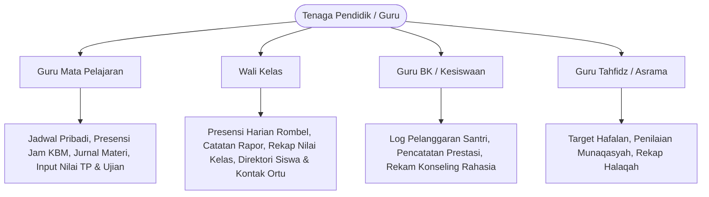
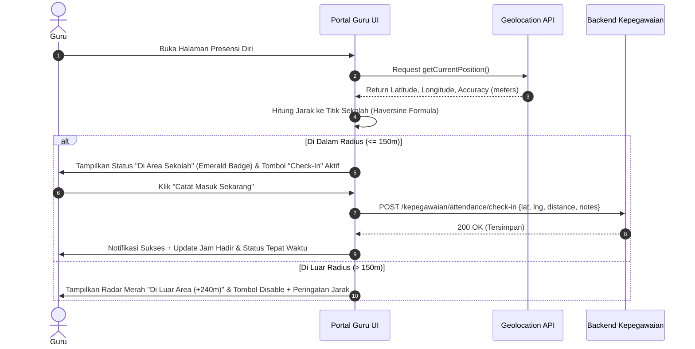
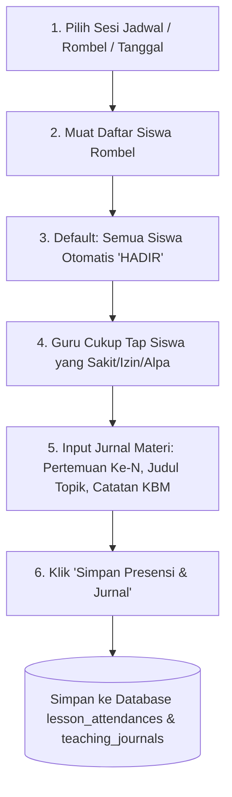

# PRODUCT REQUIREMENTS DOCUMENT (PRD) — UI/UX DESIGN
# MODUL PORTAL GURU (CORE ALDEPOS)

**Versi:** 1.0  
**Tanggal:** 2026-10-06  
**Status:** Siap untuk Desain UI/UX (*Ready for Design*)  
**Target Audiens:** UI/UX Designer, Frontend Engineer, Product Owner, QA Team  
**Design Standard:** [PANDUAN-DESAIN-ENTERPRISE-ALDEPOS.md](file:///c:/PROYEK/Core%20Aldepos/docs/PANDUAN-DESAIN-ENTERPRISE-ALDEPOS.md)  
**Dokumen Referensi:** [AUDIT-PORTAL-GURU.md](file:///c:/PROYEK/Core%20Aldepos/docs/AUDIT-PORTAL-GURU.md)

---

## DAFTAR ISI
1. [Visi Produk & Filosofi Desain](#1-visi-produk--filosofi-desain)
2. [Profil Pengguna (User Personas) & Matriks Hak Akses](#2-profil-pengguna-user-personas--matriks-hak-akses)
3. [Arsitektur Informasi & Peta Navigasi (Sitemap)](#3-arsitektur-informasi--peta-navigasi-sitemap)
4. [Design System & UI Tokens](#4-design-system--ui-tokens)
5. [Spesifikasi Rinci Halaman & Wireframe Logic (F1–F9)](#5-spesifikasi-rinci-halaman--wireframe-logic-f1f9)
6. [Panduan Tata Letak Responsif (Mobile-First vs Desktop)](#6-panduan-tata-letak-responsif-mobile-first-vs-desktop)
7. [Penanganan State (Loading, Empty, Error, Offline)](#7-penanganan-state-loading-empty-error-offline)
8. [Checklist Serah Terima Desain (Deliverables & Acceptance Criteria)](#8-checklist-serah-terima-desain-deliverables--acceptance-criteria)

---

## 1. Visi Produk & Filosofi Desain

### 1.1 Visi Produk
**Portal Guru Aldepos** adalah ruang kerja digital terpadu (*one-stop operational workspace*) bagi tenaga pendidik (guru kelas, guru mata pelajaran, wali kelas, ustadz tahfidz, dan guru BK) di seluruh unit pendidikan Yayasan Aldepos. Portal ini dirancang untuk mempermudah kegiatan operasional harian guru: dari presensi berbasis radius GPS, pemantauan jadwal mengajar, pengisian presensi siswa per jam pelajaran beserta jurnal materi, manajemen Tujuan Pembelajaran (TP), penginputan nilai rapor terpadu, hingga pencatatan pembinaan dan prestasi santri.

### 1.2 Filosofi Desain UI/UX
1. **Mobile-First untuk Operasional Lapangan:** Presensi guru masuk/pulang, presensi kelas harian, dan pencatatan insiden santri sering dilakukan menggunakan *smartphone* di kelas atau area sekolah. Komponen interaktif harus memiliki *touch target* minimal **44x44 px** dengan alur kerja sekali sentuh (*single-tap interactions*).
2. **Desktop Ergonomics untuk Pengolahan Data Berat:** Penginputan nilai massal, penyusunan silabus/Tujuan Pembelajaran, dan rekapitulasi data santri dilakukan melalui laptop/desktop dengan tabel berdensitas tinggi (*comfortable density*, 40px row height) dan dukungan navigasi keyboard (Enter/Tab antar-sel nilai).
3. **Enterprise Clean & High Information Density:** Mengadopsi standar **Clean Enterprise Slate-50** (latar belakang `bg-slate-50`, kartu putih berbingkai `border-slate-200`, teks kontras tinggi Slate-900). **Dilarang keras menggunakan tema gelap terisolasi (*dark mode exclusive*), gradasi dekoratif, bento grid, maupun efek neumorphism.**
4. **Kejelasan Status Semantik 4-Warna:** Warna antarmuka hanya mengikuti status data:
   - **Emerald (`success`):** Hadir, Tepat Waktu, Nilai Tuntas, Disetujui.
   - **Rose (`danger`):** Alpa/Tanpa Keterangan, Terlambat, Nilai Di Bawah KKM, Pelanggaran/Disiplin.
   - **Amber (`warning`):** Izin, Menunggu Persetujuan/Pending, Draft Nilai.
   - **Indigo (`info`):** Sakit (konotasi medis), Catatan Konseling, Info Penting.
   - **Slate (`neutral`):** Hari Libur, Non-aktif, Jam Istirahat.

---

## 2. Profil Pengguna (User Personas) & Matriks Hak Akses



### 2.1 Persona Pengguna

| Persona | Peran Utama | Kebutuhan UX Utama | Perangkat Dominan |
|---|---|---|---|
| **Ustadz / Ibu Guru (Guru Mapel)** | Mengajar 4–6 kelas per pekan, mengelola nilai & materi. | - Countdown banner sesi mengajar berikutnya.<br/>- Form presensi siswa cepat (bulk set "Hadir Semua" + ubah yang absen).<br/>- Form input jurnal mengajar singkat.<br/>- Lembar input nilai responsif. | Mobile (60%), Laptop (40%) |
| **Wali Kelas** | Bertanggung jawab atas 1 rombel tertentu & komunikasi wali murid. | - Rekapitulasi absensi harian kelas.<br/>- Cetak/ekspor daftar kontak wali santri.<br/>- Catatan perkembangan karakter santri untuk buku rapor. | Laptop (70%), Tablet/Mobile (30%) |
| **Guru BK / Tim Disiplin** | Menangani pembinaan karakter, konseling, dan insiden santri. | - Form rekam pelanggaran berskor/poin disiplin.<br/>- Status penanganan kasus (*Open, In-Progress, Resolved*).<br/>- Tingkat kerahasiaan catatan (*Private BK vs Public Wali Kelas*). | Mobile (50%), Laptop (50%) |
| **Guru Tahfidz / Al-Qur'an** | Membimbing halaqah hafalan Al-Qur'an santri. | - Input setoran juz/surat/ayat santri harian.<br/>- Status kelancaran munaqasyah. | Mobile/Tablet (80%) |

---

## 3. Arsitektur Informasi & Peta Navigasi (Sitemap)

### 3.1 Struktur Navigasi Global

```text
[TOP APP BAR (HEADER)]
  ├── Logo Yayasan & Label Unit Sekolah Aktif (SMP / SMA / Pesantren)
  ├── Selector Tahun Ajaran & Semester Aktif (misal: 2026/2027 - Ganjil)
  ├── Live Countdown Banner (Misal: "🔔 10 Menit Lagi: Matematika Kelas 8-A di R.201")
  └── User Avatar Pill (Foto Profil, Nama Guru, NIP, Quick Logout)

[PORTAL GURU NAVIGATION]
  ├── 1. Beranda (Dashboard)                --> /guru/dashboard
  ├── 2. Presensi Mandiri (Absensi Saya)    --> /guru/absensi-diri
  ├── 3. Jadwal Mengajar                    --> /guru/jadwal
  ├── 4. Presensi KBM & Jurnal              --> /guru/absensi-kelas
  ├── 5. Perencanaan & TP (Silabus)         --> /guru/tujuan-pembelajaran
  ├── 6. Penilaian Siswa (e-Nilai)          --> /guru/penilaian
  ├── 7. Data Siswa & Kelas                 --> /guru/siswa
  ├── 8. Kejadian & Konseling Siswa (BK)    --> /guru/kejadian-siswa
  ├── 9. Pengumuman & Berita                --> /guru/pengumuman
  └── 10. Profil & Pengaturan Akun          --> /guru/profil
```

---

## 4. Design System & UI Tokens

Sesuai ketentuan baku [PANDUAN-DESAIN-ENTERPRISE-ALDEPOS.md](file:///c:/PROYEK/Core%20Aldepos/docs/PANDUAN-DESAIN-ENTERPRISE-ALDEPOS.md):

### 4.1 Skema Warna & Semantik
```css
/* Background & Layout */
--bg-app:        #F8FAFC; /* slate-50 */
--bg-card:       #FFFFFF; /* white */
--border-subtle: #E2E8F0; /* slate-200 */
--border-strong: #CBD5E1; /* slate-300 */
--text-main:     #0F172A; /* slate-900 */
--text-muted:    #64748B; /* slate-500 */

/* Status Semantik */
--status-success-bg:   #ECFDF5; /* emerald-50 */
--status-success-text: #047857; /* emerald-700 */
--status-danger-bg:    #FFF1F2; /* rose-50 */
--status-danger-text:  #BE123C; /* rose-700 */
--status-warning-bg:   #FFFBEB; /* amber-50 */
--status-warning-text: #B45309; /* amber-700 */
--status-info-bg:      #EEF2FF; /* indigo-50 */
--status-info-text:    #4338CA; /* indigo-700 */
```

### 4.2 Radius, Bayangan, & Font
- **Corner Radius:**
  - `rounded-lg` (8px): Untuk button, input text, card data, dropdown, badge status.
  - `rounded-xl` (12px): Untuk container modal, filter bar drawer, panel section utama.
  - *(Dilarang menggunakan `rounded-2xl`, `rounded-3xl`)*.
- **Shadow:**
  - Default elemen: `border border-slate-200` (tanpa shadow tebal).
  - Dropdown/Popover: `shadow-sm`.
  - Modal Dialog: `shadow-lg`.
  - Action Bottom Drawer: `shadow-xl`.
- **Typography:**
  - Font Family: **Inter, sans-serif**.
  - Angka, Nilai, Persentase, dan Jam: Wajib menggunakan class `.tnum` / `.num-cell` (`font-variant-numeric: tabular-nums`).

### 4.3 Komponen Wajib Pakai (Shared Library)
1. **`StatRibbonCard`**: Untuk ringkasan statistik (Jam Ajar Pekan Ini, Total Santri Diampu, Persentase Kehadiran).
2. **`StatusPill`**: Untuk badge status kehadiran siswa (Hadir, Sakit, Izin, Alpa) dan status pengajuan cuti.
3. **`FlatAlertBanner`**: Untuk notifikasi pengingat sesi mengajar atau peringatan nilai belum lengkap.
4. **`DatePickerField`**: Untuk selector tanggal presensi & batas waktu tugas.
5. **`SearchableSelect`**: Untuk pemilihan Rombel, Mata Pelajaran, dan Jenis Penilaian.

---

## 5. Spesifikasi Rinci Halaman & Wireframe Logic (F1–F9)

---

### F1. Presensi Mandiri Guru (Check-In / Check-Out GPS & Radius Radar)
*Route: `/guru/absensi-diri`*

#### A. Tujuan & Alur UX:
Memungkinkan guru mencatat waktu hadir (datang) dan waktu pulang harian menggunakan koordinat GPS perangkat yang divalidasi terhadap radius titik lokasi sekolah (misal: radius 150 meter dari gerbang kampus).



#### B. Elemen Antarmuka (UI Components):
1. **Interactive Geofence Radar Card:**
   - Visualisasi pin lokasi sekolah dan pin lokasi guru saat ini.
   - Status badge: `"Dalam Radius Sekolah (42 m)"` (Emerald) vs `"Di Luar Radius (320 m dari Kampus SMP)"` (Rose).
   - Indikator akurasi GPS perangkat (contoh: `Akurasi GPS: ±5m (Sangat Baik)`).
2. **Action Clock-In / Clock-Out Container:**
   - Jam digital besar realtime (`07:14:22 WIB`) dengan tanggal hijriyah & masehi.
   - Tombol utama masif (tinggi 52px):
     - Keadaan 1 (Pagi): `"Catat Kehadiran Masuk"` (Hijau Emerald).
     - Keadaan 2 (Sudah Masuk, Menunggu Jam Pulang): Label `"Tercatat Masuk: 06:58 WIB"` + Countdown menuju jam pulang resmi (misal: 15:30).
     - Keadaan 3 (Sore): `"Catat Kehadiran Pulang"` (Biru Slate / Indigo).
3. **Riwayat Presensi Bulan Ini (Calendar & Tabular View):**
   - Mini kalender dengan dot warna (Hijau = Hadir Tepat Waktu, Kuning = Izin/Cuti, Merah = Alpa, Jingga = Terlambat).
   - Tabel ringkas: Tanggal, Jam Masuk, Jam Pulang, Lokasi, Catatan, Status.

---

### F2. Pengajuan Izin & Cuti Guru (Dengan Upload Berkas/Surat Dokter)
*Route: `/guru/absensi-diri` (Tab: "Pengajuan Cuti / Izin")*

#### A. Tujuan & Alur UX:
Guru yang berhalangan hadir dapat mengajukan izin, cuti sakit, atau tugas dinas luar secara mandiri disertai unggah dokumen bukti (PDF/Foto Surat Dokter).

#### B. Elemen Antarmuka:
1. **Formulir Pengajuan Izin (Clean Drawer / Modal XL):**
   - Dropdown Tipe: `Sakit (Surat Dokter)`, `Izin Keperluan Keluarga`, `Dinas Luar Yayasan`, `Cuti Melahirkan`, `Cuti Tahunan`.
   - Date Range Picker: Tanggal Mulai s/d Tanggal Selesai (otomatis menampilkan kalkulasi: `Durasi: 2 Hari Kerja`).
   - Textarea Alasan: Deskripsi singkat keperluan.
   - Drag-and-Drop File Upload Area: Mendukung `.pdf`, `.jpg`, `.png` (Maks 5 MB) dengan tombol pratinjau (*preview*) thumbnail.
2. **Tabel Status Pengajuan:**
   - Kolom: No Pengajuan, Jenis Izin, Rentang Tanggal, Berkas Lampiran (Link View), Status Approval (`Menunggu HRD`, `Disetujui Kepsek`, `Ditolak` + Catatan Alasan).

---

### F3. Jadwal Mengajar & Notifikasi Live Sesi KBM
*Route: `/guru/jadwal` & Widget di `/guru/dashboard`*

#### A. Tujuan & Alur UX:
Menampilkan jadwal mengajar riil milik guru yang login, dipetakan per hari (Senin s/d Sabtu) dan jam pelajaran aktif, bebas dari data sekolah guru lain.

#### B. Elemen Antarmuka:
1. **Live Next-Class Banner (Header Sticky Banner):**
   - Ditampilkan jika guru memiliki jadwal dalam rentang 30 menit ke depan atau sedang berlangsung.
   - Contoh UI: `🔔 Sesi Sedang Berlangsung: IPA Terpadu (Kelas 9-B) • R. Lab Sains • Berakhir dlm 25 mnt` + CTA `"Buka Presensi Kelas"`.
2. **Weekly Timetable Grid & Agenda List Switcher:**
   - **Mode Grid (Desktop):** Matriks Hari (kolom) vs Jam Ke- (baris). Setiap kotak mata pelajaran menampilkan Nama Mapel, Kelas, Ruang, dan Durasi Jam.
   - **Mode Agenda Card-Stack (Mobile):** Pemilih hari horizontal (Senin - Sabtu) dengan kartu urutan jam pelajaran yang jelas dan nomor urut pertemuan.
3. **Statistik Beban Mengajar Guru (Kalkulasi Otomatis dari Database):**
   - Total Jam Mengajar per Pekan (misal: `24 JP`).
   - Jumlah Rombel Diampu (misal: `4 Rombel`).
   - Total Santri Aktif (misal: `128 Santri`).

---

### F4. Perencanaan Pembelajaran & Tujuan Pembelajaran (TP)
*Route: `/guru/tujuan-pembelajaran`*

#### A. Tujuan & Alur UX:
Guru menyusun master Tujuan Pembelajaran (TP) dan lingkup materi Kurikulum Merdeka per mata pelajaran dan tingkat kelas sebagai rujukan pengolahan deskripsi rapor otomatis.

#### B. Elemen Antarmuka:
1. **Selector Konteks Ajar:**
   - Dropdown Jenjang / Satuan Pendidikan (misal: `SMP Aldepos`).
   - Dropdown Mata Pelajaran (hanya mapel yang diampu oleh guru).
   - Dropdown Tingkat / Fase (misal: `Fase D - Kelas 7`).
   - Dropdown Semester (`Ganjil` / `Genap`).
2. **Daftar Tujuan Pembelajaran (Interactive List / Table):**
   - Kode TP (misal: `TP-7.1.1`, `TP-7.1.2`).
   - Deskripsi Capaian Kompetensi (misal: *"Memahami konsep bilangan bulat dan operasinya dalam kehidupan sehari-hari"*).
   - Lingkup Materi (misal: *"Bilangan Bulat"*).
   - Status Penggunaan: Badge yang menandakan apakah TP sudah dipakai di sesi penilaian rapor.
3. **Form Tambah / Edit TP (Modal / Slide-over Drawer):**
   - Validasi ketat: Deskripsi TP tidak boleh kosong, kode TP unik per mapel-semester.
   - Tombol Aksi: `Simpan TP`, `Batal`, `Hapus` (dengan konfirmasi jika belum ada nilai terhubung).

---

### F5. Presensi Siswa per Jam KBM & Jurnal Mengajar Massal
*Route: `/guru/absensi-kelas`*

#### A. Tujuan & Alur UX:
Guru mencatat kehadiran santri di kelas pada jam pelajarannya sekaligus menginput jurnal materi pembelajaran yang dibahas pada pertemuan tersebut.



#### B. Elemen Antarmuka:
1. **Session & Class Header Selector:**
   - Pemilih Jadwal Aktif Hari Ini (Otomatis memilih jadwal pada jam saat ini).
   - Detail Kelas: `Kelas 8-A • Matematika • Pertemuan Ke-12 • 08:00 - 09:20 WIB`.
2. **Jurnal Materi & Refleksi Pembelajaran (Collapsible Card):**
   - Input `Pertemuan Ke-` (angka otomatis bertambah, misal: 12).
   - Dropdown `Rujukan TP` (Pilih TP yang diajarkan hari ini).
   - Input `Topik / Materi Bahasan` (misal: *"Teorema Pythagoras dan Pembuktian Segitiga Siku-Siku"*).
   - Textarea `Catatan / Kejadian di Kelas` (misal: *"KBM kondusif, 3 siswa butuh bimbingan remedial latihan no. 4"*).
3. **Roster Presensi Siswa (Mobile Card-Stack & Desktop Table):**
   - Header Aksi Massal: Tombol cepat `"Setel Semua Hadir"`.
   - Tiap baris siswa menampilkan:
     - Nomor Absen, Foto Avatar Santri, Nama Lengkap, NISN.
     - **Quick-Select Chips (Touch Targets 44px):**
       - `[H] Hadir` (Emerald saat aktif)
       - `[S] Sakit` (Indigo saat aktif)
       - `[I] Izin` (Amber saat aktif)
       - `[A] Alpa` (Rose saat aktif)
     - Input Teks Mini: Catatan personal siswa (opsional).
4. **Ringkasan Kehadiran Sesi (Live Counter Bar):**
   - `Hadir: 28` | `Sakit: 1` | `Izin: 1` | `Alpa: 0` | `Total: 30 Siswa`.
   - Tombol Sticky di Bawah: `"Simpan Presensi & Jurnal Mengajar"` (Tinggi 48px).

---

### F6. Penginputan Nilai Siswa (Terhubung Terpadu ke Modul Akademik)
*Route: `/guru/penilaian`*

#### A. Tujuan & Alur UX:
Penginputan nilai harian (Formatif/Tugas), Nilai TP, Sumatif Tengah Semester (STS), Sumatif Akhir Semester (SAS), dan Sikap yang tersinkronisasi langsung dengan engine e-Rapor modul Akademik (`/akademik/scores`).

#### B. Elemen Antarmuka:
1. **Context Filter Bar (Satu Baris Ringkas):**
   - `[Unit Sekolah ▼]` `[Tahun Ajaran/Semester ▼]` `[Mata Pelajaran ▼]` `[Rombel/Kelas ▼]` `[Jenis Asesmen ▼]`.
2. **Sub-Tab Tipe Penilaian:**
   - **Tab 1: Nilai Sesi / Asesmen (Tugas, Kuis, STS, SAS):**
     - Sesi Ujian aktif beserta bobot persentase rapor.
     - KKM/KKTP Mata Pelajaran ditampilkan jelas di header (misal: `KKTP: 75`).
   - **Tab 2: Nilai Capaian TP (Tujuan Pembelajaran):**
     - Matriks Nilai per TP (TP 1, TP 2, TP 3, ...).
     - Otomatis menghitung deskripsi: "Mencapai kompetensi dengan sangat baik pada TP-1, perlu pendampingan pada TP-3".
   - **Tab 3: Nilai Sikap & Karakter Profil Pelajar:**
     - Penilaian dimensi Beriman, Mandiri, Gotong Royong, Bernalar Kritis, Kreatif.
3. **Spreadsheet-Like Grading Grid (Desktop) & Card Input (Mobile):**
   - Navigasi Keyboard: Menekan tombol `Enter` atau `Panah Bawah` langsung memindahkan fokus ke input nilai siswa berikutnya.
   - Peringatan Otomatis Out-of-Range: Input nilai `< 0` atau `> 100` langsung memunculkan border merah & toast validasi.
   - Indikator Warna Nilai:
     - Nilai $\ge KKTP$ (misal $\ge 75$): Teks netral gelap dengan badge halus hijau.
     - Nilai $< KKTP$: Teks Rose tebal dengan penanda `Remedial`.
4. **Action Bar & Status Penguncian Nilai (Lock Score):**
   - Tombol `"Simpan Draft"` (Kuning Amber) & `"Submit Nilai Final ke Kurikulum"` (Emerald).
   - Status Kunci: Jika sesi penilaian sudah dikunci (*Locked*) oleh Waka Kurikulum, seluruh input otomatis menjadi *read-only* dengan banner keterangan gembok.

---

### F7. Direktori Siswa & Kontak Wali Santri (Ekspor Excel)
*Route: `/guru/siswa`*

#### A. Tujuan & Alur UX:
Guru dan wali kelas dapat melihat profil ringkas santri di kelas yang diampu, mencari nomor kontak darurat orangtua/wali santri untuk komunikasi, serta mengekspor data ke format `.xlsx`.

#### B. Elemen Antarmuka:
1. **Search & Filter Header:**
   - Search bar cepat (filter instan berdasarkan nama santri atau NISN).
   - Filter dropdown Rombel / Kelas.
   - Tombol Utama: `"Ekspor Excel (.xlsx)"` (ikon spreadsheet hijau).
2. **Student Directory Cards (Grid 3 Kolom di Desktop / List di Mobile):**
   - Foto Santri, Nama Lengkap, Nama Panggilan (*Nickname*), NISN/NIPD.
   - Info Rombel & Tempat Tanggal Lahir.
   - Bagian Kontak Wali: Nama Ayah/Ibu/Wali, Tombol Cepat `"Hubungi via WhatsApp"` (membuka `wa.me/62...`) dan `"Panggil Telepon"`.
   - Status Asrama: Badge `Santri Mukim (Asrama Umar bin Khattab)` vs `Non-Mukim / Reguler`.

---

### F8. Papan Berita & Pengumuman Khusus Guru
*Route: `/guru/pengumuman` & Widget Dashboard*

#### A. Tujuan & Alur UX:
Menyampaikan pengumuman kedinasan yayasan, agenda rapat guru, kalender pendidikan, dan berita resmi internal yang relevan bagi guru.

#### B. Elemen Antarmuka:
1. **Pengumuman Tersemat (Pinned / Priority Alert):**
   - Kartu pengumuman penting bertanda pin emas (misal: Surat Edaran Rapat Kerja Semester atau Jadwal Input Nilai Rapor).
2. **Daftar Berita & Agenda (Card Feed Layout):**
   - Thumbnail gambar berita, Tag Kategori (`Kedinasan`, `Kurikulum`, `Kegiatan Yayasan`), Tanggal Publikasi, Penerbit (misal: *Humas Yayasan Aldepos*).
   - Cuplikan teks berita (2 baris) + tombol `"Baca Selengkapnya"`.
3. **Modal Baca Detail Pengumuman:**
   - Tampilan pembaca bersih (*clean reading mode*) dengan dukungan lampiran dokumen (PDF Surat Keputusan) yang dapat diunduh langsung.

---

### F9. Pencatatan Kejadian, Pelanggaran & Prestasi Santri (Kesiswaan/BK)
*Route: `/guru/kejadian-siswa`*

#### A. Tujuan & Alur UX:
Memfasilitasi guru dalam mencatat kejadian luar biasa siswa—baik prestasi membanggakan maupun pelanggaran tata tertib—serta memungkinkan Guru BK mengelola tindak lanjut pembinaan secara terukur.

#### B. Elemen Antarmuka:
1. **Sub-Tab Kategori Kejadian:**
   - **Tab 1: Pelanggaran & Kedisiplinan Santri** (Poin Minus / Pembinaan).
   - **Tab 2: Prestasi & Penghargaan Santri** (Poin Plus / Apresiasi).
   - **Tab 3: Rekam Konseling Privat BK** (Hanya terbuka untuk Guru BK & Kepala Sekolah).
2. **Form Input Kejadian Santri (Modal Drawer):**
   - Searchable Select: Nama Santri & Rombel.
   - Tanggal & Waktu Kejadian.
   - Jenis Pelanggaran / Prestasi (misal: *"Terlambat Masuk Halaqah Pagi"* / *"Juara 1 MHQ Tingkat Kabupaten"*).
   - Poin Skor (misal: `+20 Poin` untuk Prestasi, `-5 Poin` untuk Pelanggaran).
   - Deskripsi Kronologi Kejadian.
   - Tindakan Penanganan Langsung (*Immediate Action Taken*).
   - Tingkat Visibilitas Catatan:
     - `Publik Guru & Wali Kelas` (Bisa dibaca guru pengampu & wali kelas).
     - `Rahasia BK & Manajemen` (Hanya terbaca tim BK dan Kepala Sekolah).
3. **Tabel Log Kejadian dengan Status Penanganan:**
   - Kolom: Tanggal, Nama Siswa, Rombel, Jenis Kejadian, Poin, Guru Pelapor, **Status Kasus**, Aksi.
   - Badge Status Kasus:
     - `Open / Baru Dicatat` (Rose Badge)
     - `In Progress / Dalam Pembinaan BK` (Amber Badge)
     - `Resolved / Kasus Selesai` (Emerald Badge)

---

## 6. Panduan Tata Letak Responsif (Mobile-First vs Desktop)

| Komponen UI | Tampilan Mobile (< 768px) | Tampilan Desktop (>= 1024px) |
|---|---|---|
| **Navigasi Utama** | **Bottom Navigation Bar** (5 Ikon Cepat: Beranda, Absen, Jadwal, Nilai, Profil) + Drawer Menu. | **Collapsible Sidebar Kiri** permanen dengan hirarki menu lengkap. |
| **Presensi Kelas (F5)** | **Card-Stack Vertikal**: Tiap siswa menjadi 1 kartu dengan tombol status sentuh besar (H/S/I/A). | **Tabel Berdensitas Comfortable (40px)** dengan kolom horizontal dan shortcut keyboard. |
| **Input Nilai (F6)** | **Modal Lembar Siswa Per Baris** dengan keypad angka besar. | **Spreadsheet Grid Interaktif** dengan dukungan copy-paste dan navigasi tombol panah/enter. |
| **Filter & Pencarian** | Tombol `[Filter]` yang membuka **Bottom Action Drawer** penuh. | **FilterBar Satu Baris Sticky** di atas tabel data. |
| **Radar GPS Presensi (F1)** | **Kartu Layar Penuh Fokus** dengan tombol sentuh masif di ibu jari (*thumb zone*). | **Dua Kolom**: Kolom kiri radar peta & jam, kolom kanan riwayat bulanan. |

---

## 7. Penanganan State (Loading, Empty, Error, Offline)

Setiap layar yang dirancang oleh UI/UX Designer **wajib memiliki 4 state visual lengkap**:

```text
+-----------------------------------------------------------------------------------+
| 1. SKELETON LOADING STATE                                                         |
|    - Gunakan skeleton card/table beranimasi shimmer abu-abu halus (Slate-100/200).|
|    - JANGAN gunakan spinner putar di tengah layar kosong.                         |
+-----------------------------------------------------------------------------------+
| 2. CONTEXTUAL EMPTY STATE                                                         |
|    - Ilustrasi/ikon relevan berukuran sedang + judul ramah + deskripsi tindakan.  |
|    - Contoh di Jadwal: "Tidak ada jadwal mengajar hari ini. Selamat beristirahat!"|
|    - Contoh di Nilai: "Belum ada sesi penilaian dibuat. [Buat Sesi Baru]"         |
+-----------------------------------------------------------------------------------+
| 3. INFORMATIVE ERROR STATE                                                        |
|    - FlatAlertBanner berwarna Rose dengan teks solusi konkret + Tombol "Coba Lagi"|
|    - Dilarang membiarkan layar putih polos (blank screen) jika terjadi 500/404.   |
+-----------------------------------------------------------------------------------+
| 4. OFFLINE / LOW GPS ACCURACY STATE                                               |
|    - Banner peringatan di atas layar: "Sinyal GPS lemah (±80m). Harap mendekat ke |
|      area terbuka untuk akurasi presensi yang valid."                             |
+-----------------------------------------------------------------------------------+
```

---

## 8. Checklist Serah Terima Desain (Deliverables & Acceptance Criteria)

Sebelum diserahkan ke tim Frontend Engineer untuk diimplementasikan, berkas desain UI/UX (Figma / Penpot) harus memenuhi kriteria berikut:

- [ ] **Kepatuhan Token:** Menggunakan palet Slate-50, Slate-900, serta 4 warna semantik (Emerald, Rose, Amber, Indigo). Tidak ada warna liar/dekoratif tak terstandar.
- [ ] **Desain Lengkap 9 Fitur Utama (F1–F9):**
  - [ ] Halaman 1: Dashboard Beranda Guru (Countdown Sesi, Jadwal Hari Ini, KPI Beban Ajar).
  - [ ] Halaman 2: Presensi Diri GPS, Radar Jarak & Pengajuan Izin/Sakit + Upload Lampiran.
  - [ ] Halaman 3: Roster Jadwal Mengajar (Mode Grid Desktop & Mode Agenda Mobile).
  - [ ] Halaman 4: Master Tujuan Pembelajaran (TP) & Silabus Materi.
  - [ ] Halaman 5: Presensi Kelas Massal (Set Hadir Semua + Toggle H/S/I/A) & Input Jurnal KBM.
  - [ ] Halaman 6: Lembar Penilaian Siswa (Asesmen Harian, TP, Karakter, Kunci Nilai).
  - [ ] Halaman 7: Direktori Siswa, Kontak Wali, WhatsApp Quick Link & Ekspor Excel.
  - [ ] Halaman 8: Papan Pengumuman & Berita Kedinasan Internal.
  - [ ] Halaman 9: Pencatatan Kejadian Siswa, Pelanggaran, Prestasi, dan Konseling BK.
  - [ ] Halaman 10: Profil Guru Mandiri & Form Ganti Sandi.
- [ ] **Frame Lengkap 3 Resolusi:**
  - Mobile Frame: 390px (iPhone / Android standar).
  - Tablet Frame: 768px (iPad / Android Tablet).
  - Desktop Frame: 1280px / 1440px.
- [ ] **State Lengkap Setiap Layar:** Default State, Hover/Active State, Loading Skeleton, Empty State, Error State.
- [ ] **Aksesibilitas & Ergonomi:** Touch target minimal 44x44px pada seluruh kontrol mobile; rasio kontras teks memenuhi standar WCAG AA.
