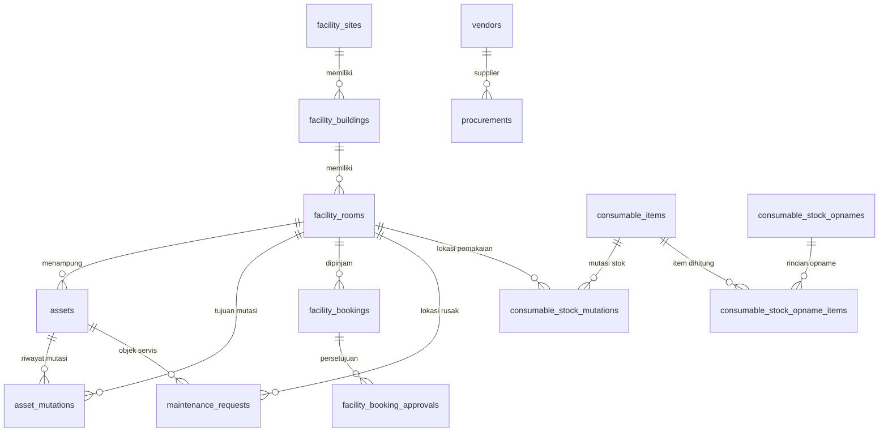

# Audit & Inventarisasi Modul Sarana & Prasarana (Sarpras)
**Tujuan Dokumen:** Acuan komprehensif untuk perancangan ulang antarmuka (UI/UX) desktop & mobile modul Sarpras di Google Stitch.  
**Peran Auditor:** Analis Sistem & UI/UX Specialist  
**Tanggal Audit:** 2026-10-07  
**Status Modul:** `jalan-produksi` (Backend & Portal Aktif)  

---

## Ringkasan Eksekutif & Bukti Penelusuran

Audit ini dilakukan secara menyeluruh terhadap dokumen perancangan, skema database, API backend, dan antarmuka frontend portal internal. Seluruh temuan dalam dokumen ini didasarkan pada berkas fisik kode dan dokumentasi aktual:

1. **Dokumen Sumber:**
   - [`AI-CONTEXT.md`](file:///c:/PROYEK/Core%20Aldepos/docs/AI-CONTEXT.md) & [`AGENTS.md`](file:///c:/PROYEK/Core%20Aldepos/AGENTS.md)
   - [`rancangan-sarpras.md`](file:///c:/PROYEK/Core%20Aldepos/docs/rancangan-sarpras.md)
   - [`erd-sarpras.md`](file:///c:/PROYEK/Core%20Aldepos/docs/erd-sarpras.md)
   - [`api-contract-sarpras.md`](file:///c:/PROYEK/Core%20Aldepos/docs/api-contract-sarpras.md)
   - [`roles-sarpras.md`](file:///c:/PROYEK/Core%20Aldepos/docs/roles-sarpras.md)
   - [`ai-ref-sarpras.md`](file:///c:/PROYEK/Core%20Aldepos/docs/ai-ref-sarpras.md)
   - [`PANDUAN-DESAIN-ENTERPRISE-ALDEPOS.md`](file:///c:/PROYEK/Core%20Aldepos/docs/PANDUAN-DESAIN-ENTERPRISE-ALDEPOS.md) & [`PANDUAN-DESAIN-UI.md`](file:///c:/PROYEK/Core%20Aldepos/apps/core-portal/PANDUAN-DESAIN-UI.md)
2. **Kode Backend (`apps/api-backend/`):**
   - 14 File Migrasi DB: [`db/migrations/sarpras/`](file:///c:/PROYEK/Core%20Aldepos/apps/api-backend/db/migrations/sarpras/)
   - Modul Backend: [`src/modules/sarpras/`](file:///c:/PROYEK/Core%20Aldepos/apps/api-backend/src/modules/sarpras/) (`facility`, `assets`, `bookings`, `maintenance`, `procurement`, `consumables`, `reports`, `utils`)
   - Seed Database: [`db/seeds/sarpras/001_initial_seed.js`](file:///c:/PROYEK/Core%20Aldepos/apps/api-backend/db/seeds/sarpras/001_initial_seed.js)
3. **Kode Portal Frontend (`apps/core-portal/`):**
   - Routing: [`src/router.jsx`](file:///c:/PROYEK/Core%20Aldepos/apps/core-portal/src/router.jsx#L800-L879)
   - Layout & Navigasi: [`src/apps/sarpras/components/SarprasLayout.jsx`](file:///c:/PROYEK/Core%20Aldepos/apps/core-portal/src/apps/sarpras/components/SarprasLayout.jsx)
   - 8 Halaman Kerja: [`src/apps/sarpras/pages/`](file:///c:/PROYEK/Core%20Aldepos/apps/core-portal/src/apps/sarpras/pages/)

---

## BAGIAN A — INVENTARISASI FITUR

### 1. Daftar Semua Fitur per Submodul

| Submodul | Nama Fitur | Status | Bukti File Path | Keterangan Teknis |
|---|---|---|---|---|
| **Lokasi Fisik (Dapodik Style)** | Master Lahan / Kampus (`facility_sites`) | `[ADA]` | [`facility/service.js:L11`](file:///c:/PROYEK/Core%20Aldepos/apps/api-backend/src/modules/sarpras/facility/service.js#L11), [`LokasiFisik.jsx:L388`](file:///c:/PROYEK/Core%20Aldepos/apps/core-portal/src/apps/sarpras/pages/LokasiFisik.jsx#L388) | CRUD Lahan, luas tanah, status kepemilikan, sertifikat |
| | Master Bangunan / Gedung (`facility_buildings`) | `[ADA]` | [`facility/service.js:L70`](file:///c:/PROYEK/Core%20Aldepos/apps/api-backend/src/modules/sarpras/facility/service.js#L70), [`LokasiFisik.jsx:L435`](file:///c:/PROYEK/Core%20Aldepos/apps/core-portal/src/apps/sarpras/pages/LokasiFisik.jsx#L435) | CRUD Bangunan di bawah lahan, jumlah lantai, fungsi gedung |
| | Master Ruangan & Fasilitas (`facility_rooms`) | `[ADA]` | [`facility/service.js:L128`](file:///c:/PROYEK/Core%20Aldepos/apps/api-backend/src/modules/sarpras/facility/service.js#L128), [`LokasiFisik.jsx:L446`](file:///c:/PROYEK/Core%20Aldepos/apps/core-portal/src/apps/sarpras/pages/LokasiFisik.jsx#L446) | CRUD Ruang kelas, lab, aula, kapasitas, tipe ruangan |
| | Endpoint Konsumsi Akademik | `[ADA]` | [`facility/routes.js:L11`](file:///c:/PROYEK/Core%20Aldepos/apps/api-backend/src/modules/sarpras/facility/routes.js#L11) | `GET /internal/rooms` via `X-API-Key` |
| **Inventaris Aset** | Katalog & Master Aset Tetap (`assets`) | `[ADA]` | [`assets/service.js:L9`](file:///c:/PROYEK/Core%20Aldepos/apps/api-backend/src/modules/sarpras/assets/service.js#L9), [`InventarisAset.jsx:L248`](file:///c:/PROYEK/Core%20Aldepos/apps/core-portal/src/apps/sarpras/pages/InventarisAset.jsx#L248) | Pencatatan aset, nilai perolehan, tanggal beli, kondisi fisik |
| | Mutasi Lokasi Penempatan (`asset_mutations`) | `[ADA]` | [`assets/service.js:L113`](file:///c:/PROYEK/Core%20Aldepos/apps/api-backend/src/modules/sarpras/assets/service.js#L113), [`InventarisAset.jsx:L522`](file:///c:/PROYEK/Core%20Aldepos/apps/core-portal/src/apps/sarpras/pages/InventarisAset.jsx#L522) | Log perpindahan ruangan (append-only), update lokasi aset |
| | Riwayat Log Mutasi per Aset | `[ADA]` | [`assets/service.js:L158`](file:///c:/PROYEK/Core%20Aldepos/apps/api-backend/src/modules/sarpras/assets/service.js#L158), [`InventarisAset.jsx:L577`](file:///c:/PROYEK/Core%20Aldepos/apps/core-portal/src/apps/sarpras/pages/InventarisAset.jsx#L577) | Modal history mutasi ruang asal & tujuan |
| | QR Code Generator & Label Print | `[ADA]` | [`assets/service.js:L172`](file:///c:/PROYEK/Core%20Aldepos/apps/api-backend/src/modules/sarpras/assets/service.js#L172), [`InventarisAset.jsx:L613`](file:///c:/PROYEK/Core%20Aldepos/apps/core-portal/src/apps/sarpras/pages/InventarisAset.jsx#L613) | String QR generator & cetak label cetak browser |
| | Lookup Aset via Scan QR/Barcode | `[ADA]` | [`assets/service.js:L192`](file:///c:/PROYEK/Core%20Aldepos/apps/api-backend/src/modules/sarpras/assets/service.js#L192), [`InventarisAset.jsx:L650`](file:///c:/PROYEK/Core%20Aldepos/apps/core-portal/src/apps/sarpras/pages/InventarisAset.jsx#L650) | Modal pencarian cepat kode aset / scan string input |
| **Peminjaman Fasilitas** | Pengajuan Peminjaman (`facility_bookings`) | `[ADA]` | [`bookings/service.js:L67`](file:///c:/PROYEK/Core%20Aldepos/apps/api-backend/src/modules/sarpras/bookings/service.js#L67), [`PeminjamanFasilitas.jsx:L343`](file:///c:/PROYEK/Core%20Aldepos/apps/core-portal/src/apps/sarpras/pages/PeminjamanFasilitas.jsx#L343) | Booking ruangan/fasilitas terbuka + validasi anti-bentrok jadwal |
| | Kalender Ketersediaan / Jadwal Pemakaian | `[ADA]` | [`bookings/service.js:L195`](file:///c:/PROYEK/Core%20Aldepos/apps/api-backend/src/modules/sarpras/bookings/service.js#L195), [`PeminjamanFasilitas.jsx:L301`](file:///c:/PROYEK/Core%20Aldepos/apps/core-portal/src/apps/sarpras/pages/PeminjamanFasilitas.jsx#L301) | Query ketersediaan ruangan per tanggal |
| | Approval Peminjaman Berjenjang | `[ADA]` | [`bookings/service.js:L130`](file:///c:/PROYEK/Core%20Aldepos/apps/api-backend/src/modules/sarpras/bookings/service.js#L130), [`facility_booking_approvals`](file:///c:/PROYEK/Core%20Aldepos/apps/api-backend/db/migrations/sarpras/20260818100007_create_facility_booking_approvals_table.js) | Persetujuan/penolakan peminjaman + log approver |
| **Pemeliharaan / Maintenance** | Laporan Kerusakan Fasilitas/Aset | `[ADA]` | [`maintenance/service.js:L63`](file:///c:/PROYEK/Core%20Aldepos/apps/api-backend/src/modules/sarpras/maintenance/service.js#L63), [`Pemeliharaan.jsx:L275`](file:///c:/PROYEK/Core%20Aldepos/apps/core-portal/src/apps/sarpras/pages/Pemeliharaan.jsx#L275) | Tiket kerusakan objek barang/ruangan oleh pegawai |
| | Tindak Lanjut & Pencatatan Biaya Servis | `[ADA]` | [`maintenance/service.js:L98`](file:///c:/PROYEK/Core%20Aldepos/apps/api-backend/src/modules/sarpras/maintenance/service.js#L98), [`Pemeliharaan.jsx:L343`](file:///c:/PROYEK/Core%20Aldepos/apps/core-portal/src/apps/sarpras/pages/Pemeliharaan.jsx#L343) | Update status teknisi (`diproses`, `selesai`, `ditutup`) + input `cost` |
| **Pengadaan & Vendor** | Master Supplier / Vendor Rekanan | `[ADA]` | [`procurement/service.js:L12`](file:///c:/PROYEK/Core%20Aldepos/apps/api-backend/src/modules/sarpras/procurement/service.js#L12), [`Pengadaan.jsx:L352`](file:///c:/PROYEK/Core%20Aldepos/apps/core-portal/src/apps/sarpras/pages/Pengadaan.jsx#L352) | CRUD Vendor, kontak PIC, kategori pasokan |
| | Pengajuan & Persetujuan Pengadaan Barang | `[ADA]` | [`procurement/service.js:L113`](file:///c:/PROYEK/Core%20Aldepos/apps/api-backend/src/modules/sarpras/procurement/service.js#L113), [`Pengadaan.jsx:L342`](file:///c:/PROYEK/Core%20Aldepos/apps/core-portal/src/apps/sarpras/pages/Pengadaan.jsx#L342) | Alur pengajuan draf barang (`diajukan` $\rightarrow$ `disetujui`) |
| | Penerimaan Fisik Barang Pengadaan | `[ADA]` | [`procurement/service.js:L160`](file:///c:/PROYEK/Core%20Aldepos/apps/api-backend/src/modules/sarpras/procurement/service.js#L160), [`Pengadaan.jsx:L202`](file:///c:/PROYEK/Core%20Aldepos/apps/core-portal/src/apps/sarpras/pages/Pengadaan.jsx#L202) | Konfirmasi fisik barang tiba (`diterima` + `received_at`) |
| | Integrasi Transaksi Keuangan | `[ADA]` | [`procurement/service.js:L178`](file:///c:/PROYEK/Core%20Aldepos/apps/api-backend/src/modules/sarpras/procurement/service.js#L178) | Endpoint internal `PATCH /procurements/:id/finance-reference` via `X-API-Key` |
| **Bahan Habis Pakai (BHP)** | Master Barang Habis Pakai / ATK | `[ADA]` | [`consumables/service.js:L12`](file:///c:/PROYEK/Core%20Aldepos/apps/api-backend/src/modules/sarpras/consumables/service.js#L12), [`BahanHabisPakai.jsx:L457`](file:///c:/PROYEK/Core%20Aldepos/apps/core-portal/src/apps/sarpras/pages/BahanHabisPakai.jsx#L457) | Item code, nama, satuan, stok minimum, stok berjalan |
| | Mutasi Stok Masuk / Keluar | `[ADA]` | [`consumables/service.js:L97`](file:///c:/PROYEK/Core%20Aldepos/apps/api-backend/src/modules/sarpras/consumables/service.js#L97), [`BahanHabisPakai.jsx:L555`](file:///c:/PROYEK/Core%20Aldepos/apps/core-portal/src/apps/sarpras/pages/BahanHabisPakai.jsx#L555) | Pencatatan stok masuk (pembelian) & stok keluar (pemakaian ruangan) |
| | Alert Stok Menipis (`low-stock`) | `[ADA]` | [`consumables/service.js:L26`](file:///c:/PROYEK/Core%20Aldepos/apps/api-backend/src/modules/sarpras/consumables/service.js#L26), [`Dashboard.jsx:L125`](file:///c:/PROYEK/Core%20Aldepos/apps/core-portal/src/apps/sarpras/pages/Dashboard.jsx#L125) | Trigger bila `current_stock <= minimum_stock` |
| | Sesi Stock Opname & Hitung Fisik | `[ADA]` | [`consumables/service.js:L176`](file:///c:/PROYEK/Core%20Aldepos/apps/api-backend/src/modules/sarpras/consumables/service.js#L176), [`BahanHabisPakai.jsx:L615`](file:///c:/PROYEK/Core%20Aldepos/apps/core-portal/src/apps/sarpras/pages/BahanHabisPakai.jsx#L615) | Sesi opname, snapshot `system_stock`, input `physical_stock` |
| | Rekonsiliasi & Finalisasi Opname | `[ADA]` | [`consumables/service.js:L306`](file:///c:/PROYEK/Core%20Aldepos/apps/api-backend/src/modules/sarpras/consumables/service.js#L306) | Auto kalkulasi selisih (`difference`), generate mutasi penyesuaian |
| **Laporan & Analisis** | Laporan Rekapitulasi Kondisi Fisik | `[ADA]` | [`reports/service.js:L8`](file:///c:/PROYEK/Core%20Aldepos/apps/api-backend/src/modules/sarpras/reports/service.js#L8), [`Laporan.jsx:L220`](file:///c:/PROYEK/Core%20Aldepos/apps/core-portal/src/apps/sarpras/pages/Laporan.jsx#L220) | Breakdown aset baik, rusak ringan, rusak berat |
| | Perhitungan Depresiasi Aset (Garis Lurus) | `[ADA]` | [`reports/service.js:L43`](file:///c:/PROYEK/Core%20Aldepos/apps/api-backend/src/modules/sarpras/reports/service.js#L43), [`Laporan.jsx:L270`](file:///c:/PROYEK/Core%20Aldepos/apps/core-portal/src/apps/sarpras/pages/Laporan.jsx#L270) | Kalkulasi umur bulan, akumulasi susut, dan sisa nilai buku on-the-fly |

---

### 2. Perbandingan Fitur Draf Awal vs Kondisi Aktual (Analisis Gap)

Dalam dokumen draf awal [`rancangan-sarpras.md:L65-L88`](file:///c:/PROYEK/Core%20Aldepos/docs/rancangan-sarpras.md#L65-L88), terdapat 9 fitur asli ditambah 4 fitur tambahan (total 13 fitur). Berikut perbandingannya dengan implementasi nyata:

| No | Fitur Draf Awal / Tambahan | Status di Kode | Gap / Temuan Nyata |
|:---:|---|:---:|---|
| 1 | Manajemen Lokasi Fisik (Lahan $\rightarrow$ Bangunan $\rightarrow$ Ruangan) | `[ADA]` | **Sesuai Penuh.** 3 tabel berjenjang (`facility_sites`, `facility_buildings`, `facility_rooms`) sudah dibuat dan beroperasi di [`LokasiFisik.jsx`](file:///c:/PROYEK/Core%20Aldepos/apps/core-portal/src/apps/sarpras/pages/LokasiFisik.jsx). |
| 2 | Inventaris Aset/Barang | `[ADA]` | **Sesuai Penuh.** CRUD aset, pencatatan ruangan, nilai perolehan, tanggal perolehan di [`InventarisAset.jsx`](file:///c:/PROYEK/Core%20Aldepos/apps/core-portal/src/apps/sarpras/pages/InventarisAset.jsx). |
| 3 | QR Code / Barcode Aset | `[ADA]` | **Sebagian.** Generate string kode (`QR-AST-xxxx`) dan cetak modal label sudah ada, namun pemindai kamera langsung via webcam/PWA mobile belum dibuat (masih input text di [`InventarisAset.jsx:L672`](file:///c:/PROYEK/Core%20Aldepos/apps/core-portal/src/apps/sarpras/pages/InventarisAset.jsx#L672)). |
| 4 | Peminjaman Ruang / Fasilitas | `[ADA]` | **Sesuai Penuh.** Form booking + validasi konflik tabrakan jam (`bookings/service.js:L73`). |
| 5 | Jadwal Pemakaian Fasilitas (Kalender) | `[ADA]` | **Sebagian.** View jadwal ketersediaan harian sudah ada, tetapi belum berbentuk kalender visual interaktif (grid mingguan/bulanan). |
| 6 | Approval Peminjaman Berjenjang | `[ADA]` | **Draf Dasar.** Tabel `facility_booking_approvals` sudah ada, tapi approval di frontend masih 1 level langsung via `POST /bookings/:id/approve` tanpa workflow multi-tier otomatis dari struktur jabatan Kepegawaian. |
| 7 | Permintaan & Perbaikan (Maintenance) | `[ADA]` | **Sesuai Penuh.** Tiket perbaikan, progres status perbaikan, dan input realisasi biaya (`cost`) selesai. |
| 8 | Manajemen Supplier / Vendor | `[ADA]` | **Sesuai Penuh.** Master data vendor lokal & yayasan-wide di [`Pengadaan.jsx`](file:///c:/PROYEK/Core%20Aldepos/apps/core-portal/src/apps/sarpras/pages/Pengadaan.jsx). |
| 9 | Pengadaan Barang | `[ADA]` | **Sesuai Penuh.** Siklus status `diajukan` $\rightarrow$ `disetujui` $\rightarrow$ `diterima` + slot ID Keuangan (`finance_reference_id`). |
| 10 | Master Bahan Habis Pakai (BHP) | `[ADA]` | **Sesuai Penuh.** Master katalog persediaan ATK dan batas minimum stok. |
| 11 | Mutasi Stok Masuk / Keluar | `[ADA]` | **Sesuai Penuh.** Kartu mutasi stok in/out + pencatatan ruangan pemakai. |
| 12 | Stock Opname BHP | `[ADA]` | **Sesuai Penuh.** Header opname, item fisik vs sistem, kalkulasi selisih, dan auto penyesuaian stok saat finalisasi. |
| 13 | Laporan Kondisi & Penyusutan Aset | `[ADA]` | **Sesuai.** Dihitung on-the-fly (garis lurus) dengan pilihan masa manfaat 3–10 tahun di [`Laporan.jsx`](file:///c:/PROYEK/Core%20Aldepos/apps/core-portal/src/apps/sarpras/pages/Laporan.jsx). |

---

### 3. Fitur Lazim Sarpras Sekolah (USULAN Penambahan)

Berdasarkan praktik operasional sarana & prasarana sekolah modern (khususnya standar akreditasi dan Dapodik), berikut adalah fitur yang **sangat disarankan** untuk diakomodasi dalam perancangan antarmuka Stitch:

1. `[USULAN]` **Mobile Scanner Terintegrasi (Kamera HP):** Antarmuka pemindai QR/Barcode langsung menggunakan stream kamera smartphone untuk petugas lapangan saat sensus atau inspeksi fisik.
2. `[USULAN]` **Lampiran Foto Bukti Kerusakan & Perbaikan:** Upload foto kondisi fisik barang saat lapor kerusakan (Before) dan bukti fisik setelah teknisi menyelesaikan servis (After).
3. `[USULAN]` **Jadwal Pemeliharaan Preventif (Servis Berkala):** Kalender & notifikasi jatuh tempo servis rutin mesin/AC/kendaraan sekolah (mis. servis AC tiap 3 bulan, ganti oli bus sekolah tiap 5.000 km) sebelum terjadi kerusakan.
4. `[USULAN]` **Sensus / Stock Opname Aset Tetap:** Modul opname fisik tahunan untuk mencocokkan keberadaan aset tetap di setiap ruangan dengan data sistem (verifikasi label QR).
5. `[USULAN]` **Form Penyerahan / Berita Acara Penerimaan (BAST):** Cetak dokumen Berita Acara Serah Terima Aset dari pengadaan ke penanggung jawab ruangan (dilengkapi tanda tangan digital).
6. `[USULAN]` **Katalog Peminjaman Mandiri oleh Guru (Self-Service Booking):** Antarmuka ringkas di Portal Guru untuk meminjam proyektor mobile, aula, atau kendaraan tanpa harus membuka dashboard admin sarpras.
7. `[USULAN]` **Tingkat Utilisasi Ruangan (Room Utilization Metric):** Metrik efektivitas pemakaian ruangan kelas, lab komputer, dan aula per minggu untuk analisis kapasitas sekolah.

---

## BAGIAN B — HALAMAN & NAVIGASI YANG ADA

### 4. Struktur Menu Navigasi & Rute Halaman

Sesuai berkas [`SarprasLayout.jsx:L25-L49`](file:///c:/PROYEK/Core%20Aldepos/apps/core-portal/src/apps/sarpras/components/SarprasLayout.jsx#L25-L49) dan [`router.jsx:L806-L878`](file:///c:/PROYEK/Core%20Aldepos/apps/core-portal/src/router.jsx#L806-L878), struktur menu sidebar Sarpras terbagi dalam 3 grup:

```
├── NAVIGASI UTAMA
│   ├── [LayoutDashboard] Dashboard          → /sarpras/dashboard
│   └── [Building2]       Lokasi & Denah     → /sarpras/locations (alias: /sarpras/lokasi)
├── INVENTARIS & FASILITAS
│   ├── [Boxes]           Inventaris Aset    → /sarpras/assets (alias: /sarpras/aset)
│   ├── [CalendarClock]   Peminjaman Ruang   → /sarpras/bookings (alias: /sarpras/peminjaman)
│   └── [Wrench]          Pemeliharaan       → /sarpras/maintenance (alias: /sarpras/pemeliharaan)
└── LOGISTIK & PENGADAAN
    ├── [Truck]           Pengadaan & Vendor → /sarpras/procurement (alias: /sarpras/pengadaan)
    ├── [Archive]         Bahan Habis Pakai  → /sarpras/consumables (alias: /sarpras/bhp)
    └── [BarChart3]       Laporan & Susut    → /sarpras/reports (alias: /sarpras/laporan)
```

---

### 5. Detail Elemen UI per Halaman Saat Ini

#### Halaman 1: Dashboard (`/sarpras/dashboard`)
- **File Komponen:** [`apps/core-portal/src/apps/sarpras/pages/Dashboard.jsx`](file:///c:/PROYEK/Core%20Aldepos/apps/core-portal/src/apps/sarpras/pages/Dashboard.jsx)
- **Tujuan:** Pusat pantauan agregat operasional sarana dan logistik fisik sekolah.
- **Elemen UI:**
  - **KPI Ribbon (4 Kartu `StatRibbonCard`):**
    1. *Lahan & Bangunan* (Indigo): Total site, gedung, dan ruangan.
    2. *Inventaris Aset Aktif* (Emerald): Total unit aset termonitor.
    3. *Pengajuan Peminjaman* (Amber): Jumlah booking berstatus `pending`.
    4. *Tiket Perbaikan Aktif* (Rose): Jumlah tiket `dilaporkan`/`diproses`.
  - **Banner Peringatan:** `FlatAlertBanner` varian `amber` yang muncul jika ada item BHP dengan `current_stock <= minimum_stock`.
  - **Grid 2 Kolom:**
    - Widget *Peminjaman Fasilitas Terbaru* (5 baris terakhir + `StatusPill`).
    - Widget *Laporan Pemeliharaan & Kerusakan* (5 baris tiket terakhir + `StatusPill`).
  - **Tombol Aksi Cepat:** Tombol "Segarkan Data" dan Tombol "+ Ajukan Pinjam Ruang".
  - **Empty & Loading State:** `LoadingSkeleton` untuk KPI, `EmptyState` pada widget daftar kosong.

#### Halaman 2: Lokasi Fisik & Denah (`/sarpras/locations` / `/sarpras/lokasi`)
- **File Komponen:** [`apps/core-portal/src/apps/sarpras/pages/LokasiFisik.jsx`](file:///c:/PROYEK/Core%20Aldepos/apps/core-portal/src/apps/sarpras/pages/LokasiFisik.jsx)
- **Tujuan:** Manajemen 3 level hierarki spasial sekolah (Lahan $\rightarrow$ Gedung $\rightarrow$ Ruangan).
- **Elemen UI:**
  - **Tab Navigasi (3 Tab):** `Lahan / Kampus`, `Bangunan / Gedung`, `Ruangan & Fasilitas`.
  - **Tab Lahan:** Grid kartu lahan (Nama, Alamat, Luas $m^2$, No Sertifikat, Status Kepemilikan via `StatusPill`, tombol Edit/Hapus).
  - **Tab Bangunan:** `DataTable` (Kolom: Nama Gedung, Lokasi Lahan, Fungsi Bangunan, Jumlah Lantai, Luas Bangunan, Kondisi Fisik, Aksi).
  - **Tab Ruangan:** `DataTable` (Kolom: Kode Ruangan, Nama Ruang, Jenis Ruang, Gedung, Posisi Lantai, Kapasitas Siswa, Kondisi, Aksi).
  - **Modal Form (3 Mode):** Form input/edit Lahan, Bangunan, dan Ruangan.
  - **Tombol Aksi Header:** Menyesuaikan tab aktif ("+ Tambah Lahan", "+ Tambah Bangunan", "+ Tambah Ruangan").

#### Halaman 3: Inventaris Aset (`/sarpras/assets` / `/sarpras/aset`)
- **File Komponen:** [`apps/core-portal/src/apps/sarpras/pages/InventarisAset.jsx`](file:///c:/PROYEK/Core%20Aldepos/apps/core-portal/src/apps/sarpras/pages/InventarisAset.jsx)
- **Tujuan:** Pendataan aset tetap, tracking ruangan, mutasi, label QR, dan pencarian cepat.
- **Elemen UI:**
  - **FilterBar:** Search query (kode/nama), Dropdown Kategori (Furnitur, Elektronik, Peralatan, Kendaraan), Dropdown Kondisi (Baik, Rusak Ringan, Rusak Berat), Dropdown Ruangan.
  - **DataTable Aset:** Kolom Kode Aset (font mono tebal), Nama Barang & Kategori, Ruangan Terkini, Nilai Perolehan (Rupiah), Status Kondisi (`StatusPill`), Ikon QR Code, Tombol Aksi (Mutasi Ruangan, Riwayat Mutasi, Edit).
  - **Modals (4 Modal):**
    1. *Modal Form Aset:* Kode aset, nama, kategori, ruangan penempatan, nilai perolehan, tgl beli, kondisi.
    2. *Modal Mutasi Lokasi:* Pilih ruangan tujuan baru + alasan perpindahan.
    3. *Modal Riwayat Mutasi:* Timeline mutasi lokasi terdahulu beserta timestamp & keterangan.
    4. *Modal QR Code:* Tampilan preview QR code label + tombol "Cetak Label".
    5. *Modal Scan / Cari Cepat:* Input kode QR / barcode untuk lookup instan detail aset & ruangannya.

#### Halaman 4: Peminjaman Fasilitas (`/sarpras/bookings` / `/sarpras/peminjaman`)
- **File Komponen:** [`apps/core-portal/src/apps/sarpras/pages/PeminjamanFasilitas.jsx`](file:///c:/PROYEK/Core%20Aldepos/apps/core-portal/src/apps/sarpras/pages/PeminjamanFasilitas.jsx)
- **Tujuan:** Pengajuan peminjaman ruangan/fasilitas terbuka, validasi jadwal, dan persetujuan.
- **Elemen UI:**
  - **Tab Navigasi (2 Tab):** `Daftar Pengajuan` dan `Kalender / Jadwal Pemakaian`.
  - **Tab Pengajuan (DataTable):** Kolom Fasilitas/Ruang, Keperluan/Acara, Tanggal, Jam (Mulai - Selesai), Status Booking (`StatusPill`), Tombol Aksi (Setujui, Tolak, Batalkan).
  - **Tab Jadwal Pemakaian:** Date picker pemilih tanggal + Grid kartu jadwal pemakaian fasilitas pada hari tersebut.
  - **Modal Form Pengajuan:** Pilih ruangan atau isi nama fasilitas luar, tujuan acara, tanggal, jam mulai, jam selesai.
  - **Modal Approval/Reject:** Form catatan persetujuan / alasan penolakan.

#### Halaman 5: Pemeliharaan & Perbaikan (`/sarpras/maintenance` / `/sarpras/pemeliharaan`)
- **File Komponen:** [`apps/core-portal/src/apps/sarpras/pages/Pemeliharaan.jsx`](file:///c:/PROYEK/Core%20Aldepos/apps/core-portal/src/apps/sarpras/pages/Pemeliharaan.jsx)
- **Tujuan:** Penanganan tiket keluhan kerusakan barang/ruangan dan rekap biaya perbaikan.
- **Elemen UI:**
  - **FilterBar:** Search input + Dropdown filter status tiket (`dilaporkan`, `diproses`, `selesai`, `ditutup`).
  - **DataTable Tiket:** Objek/Aset Rusak (Nama + Kode), Deskripsi Kerusakan, Biaya Servis (Rupiah), Status Penanganan (`StatusPill`), Waktu Lapor, Tombol Update Status.
  - **Modal Lapor Kerusakan:** Pilih aset inventaris ATAU pilih ruangan fasilitas, deskripsi gejala kerusakan.
  - **Modal Update Tindak Lanjut:** Ubah status perbaikan teknisi + input realisasi nominal biaya perbaikan (`cost`).

#### Halaman 6: Pengadaan & Vendor (`/sarpras/procurement` / `/sarpras/pengadaan`)
- **File Komponen:** [`apps/core-portal/src/apps/sarpras/pages/Pengadaan.jsx`](file:///c:/PROYEK/Core%20Aldepos/apps/core-portal/src/apps/sarpras/pages/Pengadaan.jsx)
- **Tujuan:** Manajemen draf usulan pengadaan sarpras dan rekanan supplier.
- **Elemen UI:**
  - **Tab Navigasi (2 Tab):** `Pengadaan Barang` dan `Master Vendor`.
  - **Tab Pengadaan (DataTable):** Nama Barang, Rekomendasi Vendor, Jumlah & Satuan, Status Pengadaan (`StatusPill`), ID Referensi Keuangan (`finance_reference_id`), Tombol Aksi ("Setujui", "Tandai Terima Fisik").
  - **Tab Master Vendor (DataTable):** Nama Vendor / Toko, Kategori Pasokan, Kontak PIC / Telepon, Tombol Edit/Hapus.
  - **Modal Pengadaan:** Input nama barang, jumlah, satuan, pilih vendor rekanan.
  - **Modal Vendor:** Nama vendor, kontak/telepon, kategori pasokan.

#### Halaman 7: Bahan Habis Pakai & Stock Opname (`/sarpras/consumables` / `/sarpras/bhp`)
- **File Komponen:** [`apps/core-portal/src/apps/sarpras/pages/BahanHabisPakai.jsx`](file:///c:/PROYEK/Core%20Aldepos/apps/core-portal/src/apps/sarpras/pages/BahanHabisPakai.jsx)
- **Tujuan:** Manajemen stok persediaan ATK, catat mutasi keluar/masuk, dan stock opname.
- **Elemen UI:**
  - **Tab Navigasi (2 Tab):** `Master Persediaan Barang` dan `Sesi Stock Opname`.
  - **Tab Master Persediaan:**
    - FilterBar (Search + Kategori).
    - `DataTable`: Kode Barang, Nama Barang & Kategori, Batas Stok Minimal, Stok Saat Ini (berwarna merah jika $\le$ minimum), Status Stok (`aman`/`menipis`), Tombol Mutasi Cepat ("+ Masuk", "- Keluar").
  - **Tab Sesi Stock Opname:**
    - `DataTable`: ID Sesi, Tanggal Opname, Keterangan, Status (`draft`/`final`), Tombol "Input Fisik" / "Lihat Rekap".
  - **Modals (3 Modal):**
    1. *Modal Tambah Item BHP:* Kode barang, nama, satuan, kategori, stok minimal, stok awal.
    2. *Modal Mutasi Cepat:* Input jumlah barang masuk/keluar + keterangan tujuan/pemakaian.
    3. *Modal Detail & Rekonsiliasi Opname:* Tabel daftar seluruh item, kolom stok sistem, input hitung fisik, selisih otomatis (+/-), tombol Simpan Draf & tombol "Finalisasi Sesi".

#### Halaman 8: Laporan & Penyusutan (`/sarpras/reports` / `/sarpras/laporan`)
- **File Komponen:** [`apps/core-portal/src/apps/sarpras/pages/Laporan.jsx`](file:///c:/PROYEK/Core%20Aldepos/apps/core-portal/src/apps/sarpras/pages/Laporan.jsx)
- **Tujuan:** Rekapitulasi kondisi fisik seluruh aset dan kalkulasi nilai buku/depresiasi.
- **Elemen UI:**
  - **Tab Navigasi (2 Tab):** `Laporan Kondisi Fisik` dan `Penyusutan Nilai Buku (Depresiasi)`.
  - **Tab Kondisi Fisik:**
    - 4 Kartu KPI `StatRibbonCard`: Total Aset, Kondisi Baik (Emerald), Rusak Ringan (Amber), Rusak Berat (Rose).
    - `DataTable`: Kode Aset, Nama Barang, Kategori, Nilai Perolehan, Tanggal Pembelian, Status Kondisi.
  - **Tab Depresiasi:**
    - Bar Kontrol: Dropdown Masa Manfaat Rata-rata (3, 4, 5, 8, 10 Tahun) + Ringkasan Total Nilai Perolehan, Total Akumulasi Penyusutan, Total Nilai Buku Terkini.
    - `DataTable`: Kode Aset, Nama Barang, Usia (Bulan), Nilai Perolehan, Beban Susut/Tahun, Akumulasi Susut (Rose), Nilai Buku Saat Ini (Emerald).
  - **Tombol Header:** Tombol "Cetak Dokumen" (trigger browser print).

---

### 6. Halaman yang SEHARUSNYA Ada (USULAN Arsitektur UI Baru)

1. `[USULAN]` **Detail Aset & Timeline Histori (`/sarpras/assets/:id`):** Halaman komprehensif profil satu aset, menampilkan spesifikasi teknis, riwayat seluruh mutasi ruangan, histori perbaikan/servis, dan nilai buku depresiasi terkini (menggantikan modal-modal kecil yang terpisah).
2. `[USULAN]` **Detail Ruangan & Denah Fasilitas (`/sarpras/locations/rooms/:id`):** Halaman inventaris per ruangan, menampilkan daftar seluruh aset yang terpasang di ruangan tersebut, jadwal rombel pemakai (dari modul Akademik), dan log peminjaman ruangan.
3. `[USULAN]` **Mobile Field Audit & Scanner View (`/sarpras/mobile/scanner`):** Tampilan khusus layar smartphone untuk staf sarpras saat berkeliling memeriksa fisik barang (scan barcode $\rightarrow$ verifikasi kondisi $\rightarrow$ lapor kendala dalam 1 tap).
4. `[USULAN]` **Portal Peminjaman Staf/Guru (`/guru/sarpras/pinjam`):** Halaman ringkas di Portal Guru untuk cek jadwal kosong aula/lab dan mengajukan permohonan pinjam tanpa menu admin sarpras yang padat.

---

## BAGIAN C — DATA & ATURAN BISNIS

### 7. Entitas Utama, Atribut, dan Relasi (14 Tabel Aktual)

Berdasarkan 14 berkas migrasi database MariaDB ([`db/migrations/sarpras/`](file:///c:/PROYEK/Core%20Aldepos/apps/api-backend/db/migrations/sarpras/)):



#### Ringkasan Skema Entitas Utama:

1. **`facility_sites` (Lahan):**
   - Field: `id (PK)`, `school_unit_id`, `name (VARCHAR 150)`, `address (TEXT)`, `land_area_m2 (DECIMAL 10,2)`, `ownership_status (ENUM)`, `certificate_number (VARCHAR 100)`, `notes (TEXT)`.
2. **`facility_buildings` (Bangunan):**
   - Field: `id (PK)`, `facility_site_id (FK)`, `school_unit_id`, `name (VARCHAR 150)`, `building_function (VARCHAR 100)`, `floor_count (SMALLINT)`, `building_area_m2 (DECIMAL 10,2)`, `construction_year (YEAR)`, `condition (ENUM)`.
3. **`facility_rooms` (Ruangan):**
   - Field: `id (PK)`, `facility_building_id (FK)`, `school_unit_id`, `room_code (VARCHAR 50)`, `room_name (VARCHAR 150)`, `room_type (ENUM)`, `floor_number (SMALLINT)`, `area_m2 (DECIMAL 10,2)`, `capacity (SMALLINT)`, `condition (ENUM)`, `is_active (BOOLEAN)`.
   - *Constraint:* `UNIQUE (facility_building_id, room_code)`.
4. **`assets` (Aset Tetap):**
   - Field: `id (PK)`, `school_unit_id`, `facility_room_id (FK NULL)`, `asset_code (VARCHAR 50 UNIQUE)`, `name (VARCHAR 150)`, `category (VARCHAR 100)`, `acquisition_value (DECIMAL 15,2)`, `acquisition_date (DATE)`, `condition (ENUM)`, `qr_code (VARCHAR 255 UNIQUE)`, `status (ENUM)`.
5. **`asset_mutations` (Append-Only Log Mutasi):**
   - Field: `id (PK)`, `asset_id (FK)`, `from_room_id (FK NULL)`, `to_room_id (FK)`, `mutated_by (BIGINT ref users.id)`, `reason (VARCHAR 255)`, `mutated_at (TIMESTAMP)`.
6. **`facility_bookings` (Peminjaman Ruang):**
   - Field: `id (PK)`, `school_unit_id`, `facility_room_id (FK NULL)`, `other_facility_name (VARCHAR 150 NULL)`, `employee_id (BIGINT ref employees.id)`, `purpose (VARCHAR 255)`, `booking_date (DATE)`, `start_time (TIME)`, `end_time (TIME)`, `status (ENUM)`.
   - *Index:* `idx_fb_room_date (facility_room_id, booking_date)`.
7. **`facility_booking_approvals` (Log Approval Peminjaman):**
   - Field: `id (PK)`, `facility_booking_id (FK)`, `approver_user_id (BIGINT ref users.id)`, `approval_level (SMALLINT)`, `status (ENUM)`, `notes (TEXT)`, `approved_at (TIMESTAMP)`.
8. **`maintenance_requests` (Tiket Perbaikan):**
   - Field: `id (PK)`, `school_unit_id`, `asset_id (FK NULL)`, `facility_room_id (FK NULL)`, `reported_by (BIGINT ref employees.id)`, `damage_report (TEXT)`, `repair_status (ENUM)`, `cost (DECIMAL 15,2)`, `closed_at (TIMESTAMP)`.
9. **`vendors` (Supplier):**
   - Field: `id (PK)`, `school_unit_id (NULLABLE = yayasan)`, `name (VARCHAR 150)`, `contact (VARCHAR 150)`, `category (VARCHAR 100)`.
10. **`procurements` (Pengadaan):**
    - Field: `id (PK)`, `school_unit_id`, `vendor_id (FK NULL)`, `item_name (VARCHAR 150)`, `quantity (DECIMAL 10,2)`, `unit (VARCHAR 30)`, `status (ENUM)`, `requested_by (BIGINT ref users.id)`, `approved_by (BIGINT ref users.id NULL)`, `finance_reference_id (BIGINT NULL)`, `received_at (TIMESTAMP)`.
11. **`consumable_items` (Master BHP):**
    - Field: `id (PK)`, `school_unit_id`, `item_code (VARCHAR 50)`, `name (VARCHAR 150)`, `unit (VARCHAR 30)`, `category (VARCHAR 100)`, `minimum_stock (DECIMAL 10,2)`, `current_stock (DECIMAL 10,2)`.
    - *Constraint:* `UNIQUE (school_unit_id, item_code)`.
12. **`consumable_stock_mutations` (Append-Only Log Stok BHP):**
    - Field: `id (PK)`, `consumable_item_id (FK)`, `school_unit_id`, `mutation_type (ENUM 'in','out')`, `quantity (DECIMAL 10,2)`, `reference_type (ENUM 'procurement','usage','adjustment','opname')`, `reference_id (BIGINT NULL)`, `facility_room_id (FK NULL)`, `mutated_by (BIGINT ref users.id)`, `notes (VARCHAR 255)`, `occurred_at (TIMESTAMP)`.
13. **`consumable_stock_opnames` (Header Opname):**
    - Field: `id (PK)`, `school_unit_id`, `opname_date (DATE)`, `conducted_by (BIGINT ref users.id)`, `status (ENUM 'draft','final')`, `notes (TEXT)`.
14. **`consumable_stock_opname_items` (Rincian Fisik Opname):**
    - Field: `id (PK)`, `stock_opname_id (FK)`, `consumable_item_id (FK)`, `system_stock (DECIMAL 10,2)`, `physical_stock (DECIMAL 10,2)`, `difference (DECIMAL 10,2)`, `notes (VARCHAR 255)`.
    - *Constraint:* `UNIQUE (stock_opname_id, consumable_item_id)`.

---

### 8. Definisi Seluruh Enum, Status, dan Mapping Warna `StatusPill`

Setiap status pada sistem dipetakan secara disiplin ke dalam 4 token semantik resmi Aldepos (`success`, `danger`, `warning`, `info`, plus `neutral`):

| Entitas / Kolom | Nilai Enum Pasti | Makna Bisnis | Token Semantik | Warna Visual Badge |
|---|---|---|:---:|:---:|
| **Kondisi Bangunan / Ruangan / Aset** (`condition`) | `'baik'` | Kondisi prima, siap pakai | `success` | Emerald (Green) |
| | `'rusak_ringan'` | Masih berfungsi, butuh servis kecil | `warning` | Amber (Yellow) |
| | `'rusak_sedang'` | Fungsi terganggu | `warning` | Amber (Yellow) |
| | `'rusak_berat'` | Rusak total, tidak dapat dipakai | `danger` | Rose (Red) |
| **Status Operasional Aset** (`status`) | `'active'` | Aset aktif terdata di sekolah | `success` | Emerald |
| | `'disposed'` | Aset telah dihapusbukukan / dijual / dibuang | `neutral` | Slate (Gray) |
| **Status Kepemilikan Lahan** (`ownership_status`) | `'milik_sendiri'` | Sertifikat hak milik yayasan | `success` | Emerald |
| | `'sewa'` | Lahan berstatus sewa berkala | `info` | Indigo (Blue) |
| | `'pinjam'` / `'hibah'` | Pinjam pakai atau hibah wakaf | `neutral` | Slate |
| **Status Peminjaman Fasilitas** (`facility_bookings.status`) | `'pending'` | Menunggu verifikasi / persetujuan | `warning` | Amber |
| | `'approved'` | Disetujui, jadwal terkunci | `success` | Emerald |
| | `'rejected'` | Ditolak oleh pimpinan/sarpras | `danger` | Rose |
| | `'cancelled'` | Dibatalkan oleh pemohon | `neutral` | Slate |
| **Status Tiket Kerusakan** (`maintenance_requests.repair_status`) | `'dilaporkan'` | Tiket baru masuk, antre inspeksi | `warning` | Amber |
| | `'diproses'` | Sedang dikerjakan teknisi / dikirim servis | `info` | Indigo |
| | `'selesai'` | Pekerjaan fisik selesai, menunggu verifikasi | `success` | Emerald |
| | `'ditutup'` | Tiket ditutup permanen (final) | `neutral` | Slate |
| **Status Pengadaan** (`procurements.status`) | `'diajukan'` | Usulan draf kebutuhan barang | `warning` | Amber |
| | `'disetujui'` | Disetujui sarpras, masuk anggaran keuangan | `info` | Indigo |
| | `'diterima'` | Barang fisik telah tiba dan diperiksa | `success` | Emerald |
| | `'ditolak'` | Usulan pengadaan ditolak | `danger` | Rose |
| **Status Sesi Stock Opname** (`consumable_stock_opnames.status`) | `'draft'` | Penginputan hitungan fisik sedang berjalan | `warning` | Amber |
| | `'final'` | Sesi terkunci, stok sistem disesuaikan | `success` | Emerald |
| **Status Persediaan BHP** (Dihitung) | `'aman'` (`current > min`) | Stok di atas batas aman | `success` | Emerald |
| | `'menipis'` (`current <= min`) | Stok kritis, harus segera dibeli | `danger` | Rose |

---

### 9. Alur Kerja (Workflow State Machines) & Validasi Penting

1. **Alur Peminjaman Fasilitas & Anti-Bentrok Jadwal:**
   $$\text{Draft/Pengajuan} \xrightarrow{\text{Cek Konflik Jadwal}} \text{Status 'pending'} \xrightarrow[\text{Tolak/Catatan}]{\text{Setujui Sarpras}} \begin{cases} \text{'approved'} & (\text{Jadwal Terkunci}) \\ \text{'rejected'} & (\text{Slot Tetap Bebas}) \end{cases}$$
   - *Validasi Backend:* Query mengecek apakah pada `facility_room_id` dan `booking_date` yang sama terdapat booking berstatus `pending`/`approved` dengan rentang jam yang beririsan (`bookings/service.js:L73-L94`).
2. **Alur Tiket Kerusakan & Pemeliharaan:**
   $$\text{Pegawai Lapor} \rightarrow \text{'dilaporkan'} \rightarrow \text{Teknisi Menangani} \rightarrow \text{'diproses'} \rightarrow \text{Input Biaya Servis} \rightarrow \text{'selesai'} \rightarrow \text{Verifikasi Sarpras} \rightarrow \text{'ditutup'}$$
   - *Aturan Bisnis:* Nominal biaya perbaikan (`cost`) bersifat opsional saat proses pengerjaan, namun dianjurkan dicatat sebelum tiket ditutup (`closed_at` tercatat otomatis).
3. **Alur Pengadaan & Hubungan Modul Keuangan:**
   $$\text{Draf Kebutuhan} \xrightarrow{\text{Sarpras}} \text{'diajukan'} \xrightarrow{\text{Approval}} \text{'disetujui'} \xrightarrow[\text{X-API-Key}]{\text{Modul Keuangan}} \text{Isi finance\_reference\_id} \xrightarrow{\text{Barang Tiba}} \text{'diterima'}$$
   - *Aturan Bisnis:* Barang hanya dapat ditandai `diterima` jika statusnya telah `disetujui` (`procurement/service.js:L162`).
4. **Alur Stock Opname BHP:**
   $$\text{Mulai Sesi} \rightarrow \text{Snapshot System Stock} \rightarrow \text{Input Hitung Fisik} \rightarrow \text{Hitung Selisih (Diff)} \rightarrow \text{Finalisasi Sesi}$$
   - *Aturan Bisnis:* Saat sesi di-*finalize*, setiap item dengan $\text{selisih} \neq 0$ secara otomatis membuat 1 baris mutasi baru di `consumable_stock_mutations` dengan `reference_type = 'opname'` dan meng-update `current_stock` pada master barang.

---

### 10. Konsumsi Data Lintas Modul (In-Process Service-Layer)

Mengikuti arsitektur monorepo Core Aldepos, tidak ada JOIN SQL lintas database. Komunikasi dilakukan lewat service layer / helper in-process:

1. **Data yang DIKONSUMSI oleh Sarpras:**
   - **Core Service (`aldepos_core`):**
     - Autentikasi JWT user & penugasan unit sekolah (`school_unit_id`).
     - Validasi User ID eksekutor (`mutated_by`, `requested_by`, `approved_by`, `conducted_by`) via [`crossModuleHelper.js:validateUser`](file:///c:/PROYEK/Core%20Aldepos/apps/api-backend/src/modules/sarpras/utils/crossModuleHelper.js#L61).
   - **Kepegawaian (`aldepos_kepegawaian`):**
     - Validasi ID Pegawai pemohon fasilitas (`employee_id`) dan pelapor kerusakan (`reported_by`) via [`crossModuleHelper.js:validateEmployee`](file:///c:/PROYEK/Core%20Aldepos/apps/api-backend/src/modules/sarpras/utils/crossModuleHelper.js#L29).
   - **Keuangan (`aldepos_keuangan`):**
     - Menerima update `finance_reference_id` dari modul Keuangan ketika transaksi pengadaan telah dicairkan lewat endpoint internal `PATCH /api/v1/sarpras/procurements/:id/finance-reference` ([`procurement/routes.js:L25`](file:///c:/PROYEK/Core%20Aldepos/apps/api-backend/src/modules/sarpras/procurement/routes.js#L25)).
2. **Data Sarpras yang DIKONSUMSI Modul Lain:**
   - **Akademik (`aldepos_akademik`):**
     - Membaca daftar ruangan kelas/lab aktif melalui endpoint internal `GET /api/v1/sarpras/internal/rooms?school_unit_id=&room_type=ruang_kelas` dengan autentikasi `X-API-Key` ([`facility/routes.js:L11`](file:///c:/PROYEK/Core%20Aldepos/apps/api-backend/src/modules/sarpras/facility/routes.js#L11)) untuk penempatan rombel siswa dan jadwal pelajaran.
   - **Manajemen / Dashboard Eksekutif (`aldepos_manajemen`):**
     - Mengonsumsi ringkasan nilai aset dan statistik fasilitas untuk indikator kinerja yayasan.

---

### 11. Perkiraan Volume Data Realistis

Berdasarkan struktur satuan pendidikan Aldepos IBS (TK, SD, SMP, SMA, Asrama Boarding) dan seed data [`001_initial_seed.js`](file:///c:/PROYEK/Core%20Aldepos/apps/api-backend/db/seeds/sarpras/001_initial_seed.js):

| Entitas | Estimasi Jumlah / Volume | Karakteristik Perubahan |
|---|---|---|
| **Lahan / Kampus (`facility_sites`)** | 1 – 3 Lahan per Yayasan | Sangat jarang berubah (Master statis) |
| **Bangunan / Gedung (`facility_buildings`)** | 5 – 20 Gedung | Statis |
| **Ruangan & Fasilitas (`facility_rooms`)** | 50 – 150 Ruangan per Satuan | Ditambah/diupdate saat tahun ajaran baru |
| **Aset Tetap (`assets`)** | 1.000 – 5.000 Unit Aset | Bertambah berkala per tahun ajaran |
| **Mutasi Aset (`asset_mutations`)** | 50 – 200 Transaksi / Tahun | Log bertambah saat rolling kelas |
| **Peminjaman Fasilitas (`facility_bookings`)** | 200 – 600 Booking / Tahun | Musiman (padat saat ujian, rapat, ekskul) |
| **Tiket Pemeliharaan (`maintenance_requests`)** | 100 – 300 Tiket / Tahun | Dinamis harian |
| **Master BHP (`consumable_items`)** | 100 – 300 Jenis Barang ATK/Kebersihan | Statis |
| **Mutasi Stok BHP (`consumable_stock_mutations`)**| 1.000 – 3.000 Mutasi / Tahun | Harian frekuensi tinggi |
| **Stock Opname (`consumable_stock_opnames`)** | 2 – 4 Sesi Opname / Tahun | Semesteran / Triwulanan |

---

## BAGIAN D — PERAN & HAK AKSES (RBAC)

### 12. Matriks Hak Akses per Peran

Berdasarkan berkas izin resmi [`roles-sarpras.md`](file:///c:/PROYEK/Core%20Aldepos/docs/roles-sarpras.md) dan middleware backend:

| Fitur & Aksi Sarpras | Kode Izin Resmi (`permissions.code`) | `super_admin` | `admin_sarpras` | `atasan_sarpras` | `pegawai` (Guru/Staf) | `internal_service` (Akademik/Keuangan) |
|---|---|:---:|:---:|:---:|:---:|:---:|
| Kelola Lahan (Sites) | `sarpras.facility.sites.manage` | Penuh | Satuan | ❌ | ❌ | ❌ |
| Kelola Bangunan (Buildings) | `sarpras.facility.buildings.manage` | Penuh | Satuan | ❌ | ❌ | ❌ |
| Kelola Ruangan (Rooms) | `sarpras.facility.rooms.manage` | Penuh | Satuan | ❌ | ❌ | ❌ |
| Baca Ruangan Internal | `sarpras.facility.rooms.view` | Penuh | Satuan | ❌ | ❌ | `X-API-Key` |
| Kelola Aset & QR Code | `sarpras.assets.manage` | Penuh | Satuan | ❌ | ❌ | ❌ |
| Catat Mutasi Lokasi Aset | `sarpras.assets.mutate` | Penuh | Satuan | ❌ | ❌ | ❌ |
| Ajukan Peminjaman Fasilitas | `sarpras.bookings.create` | Penuh | Satuan | Milik Sendiri | Milik Sendiri | ❌ |
| Lihat Jadwal Pemakaian | `sarpras.bookings.view_schedule` | Penuh | Satuan | Satuan | Satuan | ❌ |
| Approval Peminjaman Fasilitas | `sarpras.bookings.approve` | Penuh | Satuan | Satuan | ❌ | ❌ |
| Lapor Kerusakan Fasilitas | `sarpras.maintenance.report` | Penuh | Satuan | ❌ | Milik Sendiri | ❌ |
| Tindak Lanjut & Tutup Tiket | `sarpras.maintenance.manage` | Penuh | Satuan | ❌ | ❌ | ❌ |
| Kelola Master Vendor | `sarpras.procurement.vendors.manage` | Penuh | Satuan | ❌ | ❌ | ❌ |
| Kelola Pengadaan Barang | `sarpras.procurement.manage` | Penuh | Satuan | ❌ | ❌ | ❌ |
| Update Ref Transaksi Keuangan | `sarpras.procurement.finance_reference.update` | Penuh | ❌ | ❌ | ❌ | `X-API-Key` |
| Kelola Master & Mutasi BHP | `sarpras.consumables.manage` | Penuh | Satuan | ❌ | ❌ | ❌ |
| Kelola Sesi Stock Opname | `sarpras.consumables.opname` | Penuh | Satuan | ❌ | ❌ | ❌ |
| Lihat Laporan & Depresiasi | `sarpras.reports.view` | Penuh | Satuan | ❌ | ❌ | ❌ |

---

### 13. Pemisahan Penggunaan: Desktop Back-Office vs Mobile / Lapangan

`[ANALISIS]` Berdasarkan sifat operasional dan alur kerja di lapangan sekolah:

```
┌────────────────────────────────────────────────────────┐
│               PORTAL SARPRAS (DESKTOP)                 │
│  - Master Data Lahan, Gedung, Ruangan (Setup Dapodik)  │
│  - Master Katalog Aset & Cetak Lembar Label QR Massal  │
│  - Monitoring Dashboard, Filter Komprehensif & Export  │
│  - Rekapitulasi Depresiasi Aset & Buku Besar Inventaris│
│  - Kelola Pengadaan, Vendor Rekanan & Integrasi RAPBS  │
└───────────────────────────┬────────────────────────────┘
                            │ Sinkronisasi Real-Time
┌───────────────────────────┴────────────────────────────┐
│          PORTAL PETUGAS & GURU (MOBILE / PWA)          │
│  - Scan Kamera QR Label Aset (Cek Lokasi & Kondisi)    │
│  - Quick Reporting Kerusakan (Ambil Foto Kamera HP)    │
│  - Teknisi Lapangan: Update Progres Servis & Selesai   │
│  - Staf Gudang: Input Hitung Fisik Stock Opname Cepat  │
│  - Guru / Pegawai: Form Cepat Pinjam Ruang & Jadwal    │
└────────────────────────────────────────────────────────┘
```

- **Khas Desktop (Back-Office):** Form tabular kompleks, manajemen master data lokasi/vendor, pencetakan stiker label QR, analisa laporan penyusutan nilai aset, rekonsiliasi stock opname final.
- **Khas Mobile (Teknisi / Petugas Gudang / Guru):**
  - **Petugas Sarpras:** Membawa HP ke ruang kelas, men-scan stiker QR meja/komputer, verifikasi kesesuaian ruangan, mengubah status kondisi barang.
  - **Guru/Staf:** Memfoto kerusakan proyektor langsung di kelas dan submit tiket laporan dalam waktu kurang dari 1 menit.
  - **Petugas Gudang ATK:** Menghitung tumpukan rim kertas di rak gudang sambil langsung mengetik angka fisik di layar HP.

---

## BAGIAN E — KONVENSI DESAIN YANG WAJIB DIPATUHI

### 14. Ringkasan Aturan Desain Enterprise Aldepos

Sesuai dokumen [`PANDUAN-DESAIN-ENTERPRISE-ALDEPOS.md`](file:///c:/PROYEK/Core%20Aldepos/docs/PANDUAN-DESAIN-ENTERPRISE-ALDEPOS.md) dan [`PANDUAN-DESAIN-UI.md`](file:///c:/PROYEK/Core%20Aldepos/apps/core-portal/PANDUAN-DESAIN-UI.md):

1. **Filosofi:** *"Alat kerja data-padat, bukan landing page dekoratif."* Maksimalkan densitas informasi tanpa visual clutter.
2. **Larangan Mutlak:**
   - ❌ Dilarang gradient dekoratif (`bg-gradient-to-*`) pada kartu/banner.
   - ❌ Dilarang efek kaca/blur (glassmorphism), neumorphism, atau bento grid.
   - ❌ Dilarang kotak ikon besar warna-warni pada kartu KPI (angka dan label harus jadi fokus utama).
   - ❌ Dilarang warna status di luar 4 status semantik resmi.
   - ❌ Dilarang radius seragam `rounded-2xl` di seluruh elemen kerja.
3. **4 Warna Status Semantik Resmi + Netral:**
   - **`success` (Emerald):** Selesai, Disetujui, Kondisi Baik, Stok Aman.
   - **`danger` (Rose):** Rusak Berat, Ditolak, Biaya Servis, Stok Menipis/Kritis.
   - **`warning` (Amber):** Pending Approval, Rusak Ringan, Draft Sesi, Tiket Baru.
   - **`info` (Indigo):** Lahan Sewa, Tiket Diproses Teknisi, Netral-Penting.
   - **`neutral` (Slate):** Non-aktif, Arsip, Tiket Ditutup.
4. **Tipografi & Angka Tabular:**
   - Font Family: **Inter** (Weight 400, 500, 600, 700).
   - Seluruh angka numerik besar (KPI) WAJIB menggunakan class `.tnum`.
   - Seluruh sel angka tabel dan nilai mata uang (Rupiah) WAJIB menggunakan class `.num-cell` (rata kanan + tabular digits).
5. **Spacing & Radius:**
   - Kartu data & baris tabel: `rounded-lg`, padding `p-3` sampai `p-3.5`.
   - Modal wrapper, drawer, section wrapper: `rounded-xl`.
   - Standar border: `border border-slate-200/80`.
6. **Komponen Bersama Wajib:**
   - `StatRibbonCard`: Kartu KPI dengan border aksen kiri 3px solid, tanpa kotak ikon raksasa.
   - `StatusPill`: Badge status kecil 5 token semantik.
   - `FlatAlertBanner`: Banner pengumuman dengan background solid tint dan aksen garis kiri 4px.
   - `DataTable`: Wrapper tabel data terstandarisasi dengan header sticky dan handling empty/loading state.
   - `FilterBar`: Bar filter 1 baris tinggi maksimum 56px.
   - `formatters.js`: `formatCurrency`, `formatNumber`, `formatDate`.

---

### 15. Evaluasi UI Sarpras Saat Ini & Kelemahan UX

Dari inspeksi mendalam terhadap kode halaman Sarpras di `apps/core-portal/src/apps/sarpras/pages/`:

| Halaman | Aspek Positif | Kelemahan & Catatan UX |
|---|---|---|
| **Dashboard** | Menggunakan `StatRibbonCard` & `FlatAlertBanner` | Grid 2 kolom di bawah KPI terasa kosong jika data peminjaman/tiket sedikit; belum ada grafik pemakaian atau utilisasi ruangan. |
| **Lokasi Fisik** | Pembagian 3 tab (Lahan, Gedung, Ruang) jelas | Tab Lahan menggunakan grid kartu bebas tanpa pencarian/filter; belum ada visualisasi pohon/tree hierarki (Lahan $\rightarrow$ Gedung $\rightarrow$ Ruangan). |
| **Inventaris Aset** | Fitur lengkap (FilterBar, Mutasi, QR, Scan Modal) | Terlalu banyak modal pop-up bertumpuk (Modal Tambah, Modal Mutasi, Modal QR, Modal Scan, Modal History); scan QR masih berupa textfield manual, bukan kamera langsung. |
| **Peminjaman** | Ada tab kalender ketersediaan | Tampilan kalender ketersediaan baru berupa input date picker + list kartu sederhana, belum berbentuk interactive timeline/grid jam (Gantt style) yang memudahkan melihat slot kosong. |
| **Pemeliharaan** | Tabel jelas dan fungsional | Form lapor kerusakan tidak memiliki field upload foto bukti fisik kerusakan; update tindak lanjut tidak mencatat rincian part/jasa servis. |
| **Pengadaan** | Tab pengadaan & vendor rapi | Form pengadaan belum ada estimasi total anggaran (harga satuan $\times$ qty) sebelum diteruskan ke Modul Keuangan. |
| **BHP & Opname** | Fitur stock opname sangat fungsional (auto diff) | Tabel input fisik di dalam modal pada layar kecil rawan terpotong jika item mencapai puluhan; belum ada filter kategori di dalam modal opname. |
| **Laporan** | Ada toggle masa manfaat depresiasi interaktif | Tampilan cetak masih mengandalkan `window.print()` browser default tanpa stylesheet print-friendly khusus. |

---

## BAGIAN F — DASHBOARD & LAPORAN

### 16. Isi Dashboard & Laporan Saat Ini

1. **Dashboard Saat Ini (`Dashboard.jsx`):**
   - **4 Metrik Utama:**
     1. Total Lahan & Gedung + Total Ruangan.
     2. Total Aset Aktif Termonitor.
     3. Total Pengajuan Peminjaman Menunggu Approval (`pending`).
     4. Total Tiket Perbaikan Aktif (`dilaporkan` / `diproses`).
   - **Alert Otomatis:** Banner stok BHP menipis (jika ada barang dengan stok $\le$ minimum).
   - **Daftar Ringkas:** 5 transaksi peminjaman terbaru dan 5 tiket perbaikan terkini.
2. **Laporan yang Ada (`Laporan.jsx`):**
   - **Laporan Kondisi Aset:** Rekapitulasi persentase kondisi Baik vs Rusak Ringan vs Rusak Berat.
   - **Laporan Depresiasi (Penyusutan Nilai Buku):**
     - Perhitungan metode Garis Lurus (Straight-Line Depreciation).
     - Kolom: Nilai Perolehan, Usia Pemakaian (Bulan), Beban Susut Per Tahun, Akumulasi Penyusutan, dan Sisa Nilai Buku.
     - Kontrol umur manfaat fleksibel (3, 4, 5, 8, 10 tahun).
     - Fitur cetak via `window.print()`.

---

### 17. Metrik & Peringatan yang SEBAIKNYA Ada (`[USULAN]`)

Untuk meningkatkan nilai analitis modul Sarpras bagi Kepala Sekolah dan Yayasan:

1. `[USULAN]` **Tingkat Utilisasi Fasilitas (% Occupancy Rate):** Rasio jam pemakaian ruangan kelas, lab, dan aula terhadap total jam aktif sekolah.
2. `[USULAN]` **Total Valuasi Nilai Buku Aset Yayasan (Asset Net Worth):** Total nilai kapitalisasi seluruh aset fisik setelah dikurangi akumulasi penyusutan.
3. `[USULAN]` **Peringatan Peminjaman Melewati Batas Waktu (Overdue Bookings):** Alert fasilitas atau barang bergerak yang belum dikembalikan melewati jam selesai.
4. `[USULAN]` **Peringatan Jadwal Servis Rutin (Upcoming Preventive Maintenance):** Pengingat AC atau kendaraan yang mendekati jadwal pemeliharaan berkala.
5. `[USULAN]` **Estimasi Kebutuhan Belanja Logistik (Forecast Restock Cost):** Estimasi anggaran yang dibutuhkan untuk restock seluruh BHP yang berstatus menipis.
6. `[USULAN]` **Export Format Resmi (PDF & Excel/CSV):** Kemampuan export laporan kondisi aset dan stock opname dengan header resmi Yayasan Aldepos.

---

## BAGIAN G — PERTANYAAN TERBUKA (KEPUTUSAN DESAIN)

Berikut adalah daftar 10 poin keputusan penting yang perlu disepakati sebelum pembuatan mockup antarmuka di Google Stitch:

1. **Alur Scan QR di Desktop vs Mobile:**
   - *Pertanyaan:* Apakah tombol "Scan QR" di portal desktop cukup berupa pencarian kode/input barcode reader USB, sedangkan scan via kamera smartphone disediakan di tampilan mobile responsive / PWA khusus lapangan?
2. **Hierarki Lokasi — Tampilan Tree View vs Tab Terpisah:**
   - *Pertanyaan:* Apakah halaman Lokasi Fisik lebih baik dipertahankan sebagai 3 tab terpisah (Lahan, Bangunan, Ruangan) atau diubah menjadi visualisasi Tree View / Denah Spasial interaktif?
3. **Detail Aset: Modal Ringkas vs Halaman Penuh (Full Page):**
   - *Pertanyaan:* Saat ini aset memiliki 4 modal terpisah (Edit, Mutasi, History, QR). Apakah disetujui untuk digabung menjadi satu halaman detail aset (`/sarpras/assets/:id`) yang mencakup seluruh tab informasi, spesifikasi, dan histori?
4. **Visualisasi Kalender Peminjaman Fasilitas:**
   - *Pertanyaan:* Apakah tampilan jadwal pemakaian fasilitas pada tab peminjaman perlu dirancang dengan format visual Kalender Mingguan (Grid Jam x Ruangan ala Google Calendar / Timetable) agar pengguna dapat melihat slot kosong secara visual?
5. **Self-Service Peminjaman Ruang untuk Guru:**
   - *Pertanyaan:* Apakah permohonan pinjam ruangan/alat oleh guru cukup diajukan melalui widget di Portal Guru (`apps/guru`), sedangkan modul Sarpras hanya menjadi dashboard persetujuan (approval)?
6. **Lampiran Foto Bukti pada Laporan Kerusakan:**
   - *Pertanyaan:* Apakah form lapor kerusakan dan form penyelesaian servis wajib memiliki slot upload foto (kondisi sebelum dan sesudah perbaikan)?
7. **Katalog & Form Pengadaan — Estimasi Anggaran:**
   - *Pertanyaan:* Apakah form pengadaan perlu menambahkan field estimasi harga satuan dan total nominal usulan agar data yang dikirim ke modul Keuangan sudah memiliki nilai estimasi biaya?
8. **Pengelolaan Stock Opname — Input Fisik:**
   - *Pertanyaan:* Sesi stock opname saat ini dilakukan di dalam modal pop-up. Mengingat jumlah item BHP bisa mencapai ratusan, apakah tabel hitung fisik stock opname sebaiknya dirancang sebagai halaman penuh (Full Page Drawer / Sheet)?
9. **Kategori Bahan Habis Pakai:**
   - *Pertanyaan:* Apakah kategori BHP tetap menggunakan teks bebas (Free text) atau dibuatkan master kategori baku (mis. ATK, Kebersihan, Komputer & Lab, Olahraga)?
10. **Akses Approval Multi-Tier:**
    - *Pertanyaan:* Apakah level persetujuan peminjaman cukup 1 pintu (Petugas Sarpras) atau memerlukan 2 pintu formal (Petugas Sarpras $\rightarrow$ Kepala Sekolah / Wakil Sarpras)?

---

*Laporan ini disusun secara objektif berdasarkan kondisi berkas kode sumber dan dokumen teknis modul Sarana & Prasarana Yayasan Aldepos.*
