# DOKUMEN RENCANA IMPLEMENTASI (TAHAP 0)
## Halaman: Presensi & Absensi Pegawai (Modul Kepegawaian / HRIS)
**Core Aldepos** | Mode: **DESKTOP-FIRST ENTERPRISE** | Target Pengguna: **HRD, Super Admin, Admin Yayasan**  
Status: **DRAFT RENCANA TEKNIS LENGKAP** | Tanggal: 2026-10-07

---

## 1. RANGKUMAN AUDIT DESAIN (STITCH EXPORT)

### 1.1 Token Desain & Karakter Visual (Berdasarkan `DESIGN.md`)
- **Brand & Theme:** Modern Corporate Enterprise (Clean Islamic Boarding School Governance). Kontras fungsional ganda (*dual-tone*): Sidebar gelap (`#0B1220`), kanvas kerja terang berdensitas tinggi (`#F8F9FB` / `#F6F8FA`).
- **Palet Warna Inti:**
  - **Primary (`#059669` / Emerald Green):** Tombol utama, badge status "Hadir" / "Tepat Waktu", verifikasi berhasil. Hover: `#047857`.
  - **Secondary (`#0284C7` / Ocean Blue):** Informasi penugasan, status dinas luar, badge info SK (`#E0F2FE`).
  - **Warning / Attention (`#D97706` / Amber):** Status izin/cuti, anomali luar radius geofence, antrean klarifikasi (`#FEF3C7`).
  - **Danger / Error (`#DC2626` / Rose):** Status alpa, pelanggaran fake GPS, terlambat berat (`#FEE2E2`).
  - **Neutral & Surface:** Kanvas (`#F6F8FA`), Card Container (`#FFFFFF`), Border Panel (`#E2E8F0` / `#CBD5E1`), Teks Utama (`#0F172A`), Teks Sekunder (`#64748B`).
- **Tipografi:** Keluarga font **Inter**. Ukuran font operasional tabel & badge: `11px` (label-xs), `12px` (label-sm), `13px` (body-sm), `14px` (body-md), `16px` (title-sm), `20px` (headline-md), `24px` (headline-lg). Angka jam & NIP menggunakan `font-mono` / `tabular-nums`.
- **Sudut & Radius:** `rounded-xl` (12px) untuk Card dan Modal, `rounded-lg` (8px) untuk Input dan Tombol, `rounded-full` (pill) untuk Badge Status.
- **Ikonografi:** Seluruh ikon Material Symbols dari Stitch dipetakan 100% ke **Lucide React** (`lucide-react`).

### 1.2 Struktur Komponen Visual Berulang Antar Layar
1. **Header & Context:** Breadcrumb (`Beranda > Kepegawaian > Presensi & Absensi`), Judul Halaman, Deskripsi, Tombol Aksi Cepat (`+ Input Presensi Manual`, `Tutup Periode`, `Reload Data`).
2. **Stat Ribbon Cards (7 Metrik Utama):**
   - Total Pegawai Aktif (e.g. 260)
   - Hadir Hari Ini (e.g. 238)
   - Terlambat (e.g. 14)
   - Izin & Sakit (e.g. 8)
   - Cuti & Dinas Luar (e.g. 4)
   - Alpa / Tanpa Keterangan (e.g. 0)
   - Belum Presensi (e.g. 10 — Highlighted Attention)
3. **Tab Navigation (5 Tab Utama dengan Badge Hitungan):**
   - **Tab 1: Presensi Hari Ini** (Badge total hadir)
   - **Tab 2: Belum Presensi** (Badge jumlah pegawai terlewat jam masuk)
   - **Tab 3: Perlu Ditindaklanjuti** (Badge merah anomali/pelanggaran)
   - **Tab 4: Antrean Koreksi** (Badge kuning permohonan klarifikasi pending)
   - **Tab 5: Rekap Bulanan** (Ikon kalender)
4. **Filter Bar Multifungsi:**
   - Date range selector dengan preset cepat (*Hari Ini, Kemarin, Minggu Ini, Bulan Ini*).
   - Filter Satuan Pendidikan (SMP, SMA, Semua).
   - Filter Kategori / Unit Kerja (Pendidik / Tenaga Kependidikan).
   - Filter Status Kehadiran (Hadir, Terlambat, Izin, Sakit, Cuti, Dinas Luar, Alpa).
   - Toggle Switch: *"Hanya Tampilkan yang Bermasalah / Anomali"*.
   - Live Search (Ketik Nama / NIP).
5. **Drawer Detail Presensi (Slide-over Right Panel):**
   - Profil pegawai & status kehadiran.
   - Peta visual koordinat GPS vs Geofence radius sekolah (Leaflet / visual distance indicator).
   - Telemetri perangkat: Nama device, browser, sistem operasi, IP address, akurasi GPS (±meter).
   - Catatan kehadiran & catatan klarifikasi.
   - Audit trail / timeline riwayat perubahan presensi.
6. **Modal Input Presensi Manual:**
   - Tab "Satu Pegawai": Form input single dengan pencarian pegawai, status, jam masuk/pulang, alasan input manual, dan lampiran bukti.
   - Tab "Massal (Batch)": Form rekonsiliasi banyak pegawai sekaligus (misal Dinas Luar / Rapat Kerja Yayasan / Upacara).
7. **Modal Tutup Periode Presensi (2-Step Wizard):**
   - Step 1: Validasi anomali yang belum diselesaikan & cetak draft laporan audit.
   - Step 2: Konfirmasi penguncian periode bulanan dan serah terima data ke Modul Payroll.

---

## 2. AUDIT KONDISI SAAT INI (EXISTING CODE VS TARGET DESAIN)

| Area Fitur | Kondisi Existing di Codebase | Target Sesuai Desain Stitch | Gap / Kebutuhan yang Harus Dibuat |
|---|---|---|---|
| **Layout Halaman** | Single monolith table di `Presensi.jsx` tanpa tab, stat card sederhana. | App Shell terstruktur dengan 5 tab independen, 7 stat cards, dan drawer interaktif. | Refaktor modular ke struktur komponen multi-tab dan hook terspesialisasi. |
| **Tab Presensi Hari Ini** | Menampilkan tabel presensi datar, belum ada filter jabatan/unit/anomali. | Tabel lengkap dengan durasi kerja, status ketepatan, radius GPS, avatar pegawai, dan drawer detail. | Integrasi filter bar komprehensif, kalkulasi durasi kerja, dan trigger drawer detail. |
| **Tab Belum Presensi** | **Belum ada** (belum ada deteksi pegawai aktif vs jadwal hari ini). | Menampilkan daftar pegawai yang seharusnya masuk tetapi belum check-in setelah toleransi jam masuk. Quick actions: Tandai Izin/Sakit/DL, Ping WhatsApp. | Engine pencocokan jadwal vs absensi harian per satuan pendidikan di backend + UI Tab Belum Presensi. |
| **Tab Perlu Ditindaklanjuti** | Hanya ada filter modal koreksi sederhana. | Deteksi anomali: Di luar radius, lupa check-out, terlambat berulang, device ganti-ganti, konflik cuti. | Anomaly detection service di backend + UI Tab Anomali dengan severity level (High/Medium/Low). |
| **Tab Antrean Koreksi** | Hanya ada modal review klarifikasi single row. | Antrean komparasi visual: Data Lama vs Data Diajukan, alasan, attachment preview, batch approval. | API antrean koreksi terstruktur + UI kartu permohonan koreksi. |
| **Tab Rekap Bulanan** | **Belum ada** di halaman presensi HRD. | 2 Mode Tampilan: (1) Rekap KPI Kehadiran (Efektif, H, T, I, S, C, DL, A, Jam Kerja, Lembur, %) dan (2) Matriks Kalender Harian (1–31). Ekspor Excel/PDF. | Query agregasi bulanan + grid matriks 1–31 di backend + UI switcher tabel/matriks + downloader XLSX. |
| **Modal Input Manual** | Modal form single pegawai basic. | Dual mode modal: (1) Satu Pegawai dan (2) Massal/Batch dengan multi-select pegawai dan alasan audit. | Endpoint batch manual check-in di backend + UI modal dua tab. |
| **Drawer Detail** | **Belum ada** (hanya modal pop-up edit kecil). | Drawer slide-over kanan dengan peta geofence, telemetri HP, dan timeline audit log. | Komponen `DrawerDetailPresensi.jsx` terintegrasi dengan data telemetri. |
| **Tutup Periode** | **Belum ada** di modul presensi (baru ada di payroll). | Wizard 2-tahap tutup periode presensi, validasi pending items, penguncian data (lock). | Migrasi tabel `attendance_period_locks` + API lock period + UI wizard modal. |

---

## 3. PEMETAAN FITUR KE KEBUTUHAN TEKNIS (PER LAYAR)

```mermaid
graph TD
    A[Presensi & Absensi Pegawai HRD] --> B[Tab 1: Presensi Hari Ini]
    A --> C[Tab 2: Belum Presensi]
    A --> D[Tab 3: Perlu Ditindaklanjuti]
    A --> E[Tab 4: Antrean Koreksi]
    A --> F[Tab 5: Rekap Bulanan]
    A --> G[Modals & Drawers]

    B --> B1[Stat Cards 7 Metrik]
    B --> B2[Filter Bar + Anomali Toggle]
    B --> B3[Tabel Presensi Harian]
    B --> B4[Drawer Detail Presensi]

    C --> C1[Deteksi Jadwal vs Kehadiran]
    C --> C2[Quick Action: Tandai Izin/Sakit/DL]
    C --> C3[Kontak Pegawai via WA]

    D --> D1[Luar Radius Geofence]
    D --> D2[Lupa Check-Out > 12 Jam]
    D --> D3[Terlambat Berulang / Anomali]

    E --> E1[Klarifikasi Lupa Absen Guru]
    E --> E2[Perbandingan Jam Lama vs Baru]
    E --> E3[Approve / Reject / Minta Bukti]

    F --> F1[Tampilan Rekap Agregat KPI]
    F --> F2[Tampilan Matriks Kalender 1-31]
    F --> F3[Ekspor File Excel / XLSX]

    G --> G1[Modal Input Manual: Single & Batch]
    G --> G2[Modal Tutup Periode: 2-Step Lock]
```



### 3.1 Tab 1: Presensi Hari Ini
- **Komponen:** `PresensiStatCards`, `PresensiFilterBar`, `TabPresensiHariIni`, `DrawerDetailPresensi`.
- **Endpoint:**
  - `GET /api/kepegawaian/attendances/dashboard-summary` (Mengembalikan 7 angka metrik hari ini).
  - `GET /api/kepegawaian/attendances` (Query: `date_from`, `date_to`, `school_unit_id`, `department_id`, `status`, `entry_type`, `is_anomaly_only`, `search`, `page`, `per_page`).
  - `GET /api/kepegawaian/attendances/:id/detail` (Mengembalikan data lengkap presensi, telemetri, lokasi geofence, riwayat log).
- **Hak Akses & Permission:** `kepegawaian.view` / `kepegawaian.manage`.
- **Ketergantungan:** Master pegawai dan master lokasi/jadwal.

### 3.2 Tab 2: Belum Presensi
- **Komponen:** `TabBelumPresensi`.
- **Endpoint:**
  - `GET /api/kepegawaian/attendances/absent-candidates` (Query: `date`, `school_unit_id`, `department_id`, `search`).
  - `POST /api/kepegawaian/attendances/quick-mark` (Payload: `employee_ids[]`, `attendance_date`, `status` [permitted/sick/duty_travel], `reason`).
- **Logika Backend:**
  - Ambil semua pegawai aktif di satuan pendidikan terkait.
  - Cari jadwal kerja aktif pegawai pada hari tersebut (`_resolveEmployeeSchedule`).
  - Kecualikan pegawai yang sedang cuti disetujui (`employee_leave_requests`) atau sudah memiliki record presensi.
  - Jika waktu sekarang > `clock_in_time + tolerance_minutes`, masukkan ke daftar "Belum Presensi".

### 3.3 Tab 3: Perlu Ditindaklanjuti (Anomali & Pelanggaran)
- **Komponen:** `TabPerluDitindaklanjuti`.
- **Endpoint:**
  - `GET /api/kepegawaian/attendances/anomalies` (Query: `date_from`, `date_to`, `school_unit_id`, `category`, `severity`).
  - `POST /api/kepegawaian/attendances/anomalies/:id/resolve` (Payload: `resolution_action` [accept, force_alpha, request_clarification], `notes`).
- **Kriteria Anomali:**
  1. `outside_radius`: `is_within_radius === 0` atau jarak check-in > radius lokasi geofence.
  2. `missing_checkout`: `check_in_time IS NOT NULL AND check_out_time IS NULL` pada hari yang sudah lewat.
  3. `extreme_late`: `is_late === 1 AND late_minutes >= 60`.
  4. `suspicious_telemetry`: Device fingerprint berganti atau akurasi GPS terlalu rendah (> 500m).

### 3.4 Tab 4: Antrean Koreksi
- **Komponen:** `TabAntreanKoreksi`.
- **Endpoint:**
  - `GET /api/kepegawaian/attendances/clarifications` (Filter: `status=pending`).
  - `PATCH /api/kepegawaian/attendances/clarifications/:id/review` (Payload: `status` [approved/rejected], `review_notes`).
- **Skema DB:** Memanfaatkan kolom yang sudah dibuat di migrasi batch 20 (`clarification_status`, `clarification_reason`, `clarification_reviewed_by`, dsb.).

### 3.5 Tab 5: Rekap Bulanan & Matriks Kalender
- **Komponen:** `TabRekapBulanan`.
- **Endpoint:**
  - `GET /api/kepegawaian/attendances/monthly-summary` (Query: `month`, `year`, `school_unit_id`, `search`).
  - `GET /api/kepegawaian/attendances/monthly-matrix` (Query: `month`, `year`, `school_unit_id`).
  - `GET /api/kepegawaian/attendances/export-excel` (Query: `month`, `year`, `school_unit_id`, format Excel streaming).

### 3.6 Modal Input Presensi Manual (Single & Massal)
- **Komponen:** `ModalInputPresensiManual`.
- **Endpoint:**
  - `POST /api/kepegawaian/attendances/manual-entry` (Single: `employee_id`, `attendance_date`, `status`, `check_in_time`, `check_out_time`, `reason`, `attachment_url`).
  - `POST /api/kepegawaian/attendances/bulk-manual-entry` (Batch: `employee_ids[]`, `attendance_date`, `status`, `check_in_time`, `check_out_time`, `reason`).

### 3.7 Modal Tutup Periode Presensi
- **Komponen:** `ModalTutupPeriode`.
- **Endpoint:**
  - `GET /api/kepegawaian/attendances/period-lock-status` (Query: `month`, `year`, `school_unit_id` -> Mengembalikan status lock & jumlah unverified anomalies).
  - `POST /api/kepegawaian/attendances/lock-period` (Payload: `month`, `year`, `school_unit_id`, `notes` -> Mengunci periode presensi).

---

## 4. ANALISIS ARSITEKTUR & STRATEGI TEKNIS KHUSUS

### 4.1 Harmonisasi Status Kehadiran (`enum employee_attendances.status`)
- **Tantangan:** Enum DB saat ini adalah `enum('present', 'sick', 'permitted', 'absent')`. Namun desain membutuhkan variasi: *Tepat Waktu, Terlambat, Izin, Sakit, Cuti, Dinas Luar, Alpa, Tugas Khusus*.
- **Solusi Paling Aman & Kompatibel (Zero-Regression Strategy):**
  1. Nilai enum dasar di database **tetap dipertahankan** (`present`, `sick`, `permitted`, `absent`) agar modul Portal Guru dan Payroll yang membaca `status === 'absent'` untuk potongan alpa tidak mengalami regresi.
  2. Tambahkan kolom pendukung di DB secara additive: `entry_type` (sudah ada: `realtime_gps`, `manual_hrd`, `duty_travel`, `leave`), `sub_status` VARCHAR(50) NULL (misal `dinas_luar`, `tugas_khusus`, `cuti_tahunan`), dan `anomaly_flags` JSON NULL.
  3. Di backend service layer, sediakan mapper yang menghasilkan properti `display_status`:
     - `status === 'present'` & `is_late === 0` -> `'hadir_tepat_waktu'` (Label: "Tepat Waktu", badge hijau).
     - `status === 'present'` & `is_late === 1` -> `'terlambat'` (Label: "Terlambat Xm", badge oranye).
     - `entry_type === 'duty_travel'` atau `sub_status === 'dinas_luar'` -> `'dinas_luar'` (Label: "Dinas Luar", badge biru).
     - `entry_type === 'leave'` atau `sub_status === 'cuti'` -> `'cuti'` (Label: "Cuti", badge cyan).
     - `status === 'sick'` -> `'sakit'` (Label: "Sakit", badge ungu).
     - `status === 'permitted'` -> `'izin'` (Label: "Izin", badge amber).
     - `status === 'absent'` -> `'alpa'` (Label: "Alpa", badge merah).

### 4.2 Fungsi Terpusat Hari Kerja Efektif & Kalender Libur
- Buat file utilitas terpusat: `apps/api-backend/src/modules/kepegawaian/attendance/calendarService.js`.
- Fungsi: `getEffectiveWorkDays(employeeId, schoolUnitId, startDate, endDate)`
  - **Langkah 1 (Jadwal):** Mengambil hari kerja dari penugasan custom (`employee_work_schedule_assignments`) atau jadwal massal (`attendance_work_schedules`).
  - **Langkah 2 (Cuti Disetujui):** Mengambil data dari `employee_leave_requests` berstatus `approved` pada rentang tanggal tersebut.
  - **Langkah 3 (Hari Libur):** Memeriksa hari libur nasional/sekolah (sementara mengembalikan array kosong `[]`, siap dihubungkan ke modul kalender akademik).
  - **Output:** Peta tanggal kerja efektif dan jam operasional untuk menghitung kehadiran vs alpa secara presisi.

### 4.3 Audit Log & Tabel Kunci Periode Presensi
- **Migrasi Additive Baru:**
  1. `attendance_period_locks`:
     - `id BIGINT UNSIGNED AUTO_INCREMENT PRIMARY KEY`
     - `school_unit_id BIGINT UNSIGNED NULL`
     - `period_month INT UNSIGNED NOT NULL`
     - `period_year INT UNSIGNED NOT NULL`
     - `status ENUM('draft', 'locked') DEFAULT 'draft'`
     - `locked_by BIGINT UNSIGNED NULL`
     - `locked_at TIMESTAMP NULL`
     - `summary_snapshot JSON NULL`
     - `notes TEXT NULL`
     - `created_at`, `updated_at`
  2. `attendance_audit_logs`:
     - `id BIGINT UNSIGNED AUTO_INCREMENT PRIMARY KEY`
     - `attendance_id BIGINT UNSIGNED NOT NULL`
     - `action VARCHAR(50) NOT NULL` (e.g. `MANUAL_ENTRY`, `CORRECTION`, `ANOMALY_RESOLVE`, `STATUS_CHANGE`)
     - `performed_by BIGINT UNSIGNED NULL`
     - `old_values JSON NULL`
     - `new_values JSON NULL`
     - `reason TEXT NOT NULL`
     - `ip_address VARCHAR(45) NULL`
     - `created_at TIMESTAMP DEFAULT CURRENT_TIMESTAMP`

### 4.4 Penegakan Hak Akses & Multi-Satuan Pendidikan di Backend
- Validasi satuan pendidikan ditegakkan di middleware dan service:
  - Role `super_admin` dan `admin_yayasan`: Berhak mengakses seluruh unit atau memfilter per `school_unit_id`.
  - Role `admin_satuan_pendidikan` dan `hrd`: Wajib dibatasi hanya ke `school_unit_id` miliknya yang tervalidasi dari token JWT (`req.user.satuan_pendidikan_id` / `req.user.school_units`). Permintaan lintas unit ditolak dengan HTTP 403.

---

## 5. STRUKTUR KOMPONEN FRONTEND PROPOSED

Pecah file [Presensi.jsx](file:///c:/PROYEK/Core%20Aldepos/apps/core-portal/src/apps/kepegawaian/pages/Presensi.jsx) menjadi struktur folder modular:

```
apps/core-portal/src/apps/kepegawaian/pages/presensi/
├── index.jsx                             # Main Page Container, State Manager, Tab Router
├── components/
│   ├── PresensiHeader.jsx                # Header, Breadcrumbs, Action Buttons, Sync Status
│   ├── PresensiStatCards.jsx             # 7 Metric Cards (Total Aktif, Hadir, Telat, Izin/Sakit, Cuti/DL, Alpa, Belum Presensi)
│   ├── PresensiFilterBar.jsx             # Filter Bar Multifungsi (Date Presets, Unit, Jabatan, Status, Anomali Toggle, Search)
│   ├── PresensiTabNav.jsx                # Tab Bar (5 Tabs) dengan Badge Count Dinamis
│   ├── TabPresensiHariIni.jsx            # Tab 1: Tabel Presensi Hari Ini, Durasi, Lokasi, Quick Action
│   ├── TabBelumPresensi.jsx              # Tab 2: Tabel Pegawai Belum Presensi, WhatsApp Ping, Tandai Izin/DL
│   ├── TabPerluDitindaklanjuti.jsx       # Tab 3: Tabel Anomali & Pelanggaran, Severity Badges, Tindak Lanjut
│   ├── TabAntreanKoreksi.jsx             # Tab 4: Antrean Review Klarifikasi / Koreksi, Sebelum vs Sesudah
│   ├── TabRekapBulanan.jsx               # Tab 5: Rekap Agregat KPI & Grid Matriks Kalender 1-31, Downloader Excel
│   ├── DrawerDetailPresensi.jsx          # Slide-over Drawer: Peta Radius Geofence, Device Telemetry, Timeline Log
│   ├── ModalInputPresensiManual.jsx      # Modal Input Manual 2 Tab (Satu Pegawai vs Batch Massal)
│   └── ModalTutupPeriode.jsx             # Modal Wizard 2 Step (Audit Anomali Pending -> Konfirmasi Penguncian)
├── hooks/
│   ├── usePresensiData.js                # Custom hook untuk fetch list, summary stat, filter, pagination
│   └── usePresensiActions.js             # Custom hook untuk aksi manual check-in, koreksi, review, lock period
└── services/
    └── presensiService.js                # Axios API caller khusus modul presensi HRD
```

### Komponen UI Bersama yang Dipakai Ulang:
- `apps/core-portal/src/shared/components/DataTable.jsx`
- `apps/core-portal/src/shared/components/Modal.jsx`
- `apps/core-portal/src/shared/components/Drawer.jsx`
- `apps/core-portal/src/shared/components/StatusPill.jsx`
- `apps/core-portal/src/shared/components/Toast.jsx`
- `apps/core-portal/src/shared/components/EmptyState.jsx`
- `apps/core-portal/src/shared/components/ErrorState.jsx`
- `apps/core-portal/src/shared/components/DatePickerField.jsx`

---

## 6. URUTAN IMPLEMENTASI & ESTIMASI RISIKO

```mermaid
gantt
    title Roadmap Implementasi Presensi & Absensi Pegawai
    dateFormat  YYYY-MM-DD
    section Backend & DB
    Tahap 1: Migrasi Additive DB (Locks & Audit)    :done, 2026-10-08, 1d
    Tahap 2: Backend API & Business Logic Engine     :active, 2026-10-09, 2d
    section Frontend Core
    Tahap 3: App Shell, Stat Cards & Tab Navigation :2026-10-11, 1d
    Tahap 4: Tab 1 Presensi Hari Ini & Filter Bar   :2026-10-12, 1d
    Tahap 5: Drawer Detail Presensi & Telemetri     :2026-10-13, 1d
    section Advanced Tabs
    Tahap 6: Tab 2 Belum Presensi & Quick Action    :2026-10-14, 1d
    Tahap 7: Tab 3 Perlu Ditindaklanjuti (Anomali)  :2026-10-15, 1d
    Tahap 8: Tab 4 Antrean Koreksi & Review         :2026-10-16, 1d
    Tahap 9: Tab 5 Rekap Bulanan & Matriks 1-31     :2026-10-17, 2d
    section Finalisasi
    Tahap 10: Modal Input Manual, Tutup Periode & E2E :2026-10-19, 2d
```

| Tahap | Lingkup Pekerjaan | Estimasi Risiko | Mitigasi Risiko |
|---|---|---|---|
| **Tahap 1** | Migrasi DB additive: `attendance_period_locks`, `attendance_audit_logs`, kolom `sub_status` & `anomaly_flags`. | **Rendah** | Menggunakan `knex.schema.hasTable` & `hasColumn`, sediakan fungsi rollback `exports.down`. |
| **Tahap 2** | Backend API Presensi HRD (Dashboard Summary, Anomalies, Absent Candidates, Monthly Matrix, Locks, Audit Log). | **Sedang** | Jaga kontrak API `check-in`, `check-out`, dan `today-status` agar Portal Guru tetap berfungsi normal. |
| **Tahap 3** | App Shell Portal HRD, Stat Ribbon Cards (7 Cards), Tab Bar dengan live badge counts. | **Rendah** | Gunakan dummy state handling jika data API belum lengkap, terapkan loading skeleton. |
| **Tahap 4** | Tab 1 (Presensi Hari Ini) + Filter Bar Komprehensif + DataTable dengan kolom Durasi & Ketepatan. | **Rendah** | Gunakan komponen `DataTable.jsx` dan `StatusPill.jsx` yang sudah terstandarisasi. |
| **Tahap 5** | Drawer Detail Presensi (Geolokasi, Geofence Radius, Device Telemetry, Timeline Audit Log). | **Rendah** | Peta koordinat dibuat ringan (visual compass/radius badge) tanpa membebani browser. |
| **Tahap 6** | Tab 2 (Belum Presensi): Deteksi jadwal vs absensi harian + Quick action tandai Izin/Sakit/DL + WhatsApp direct link. | **Sedang** | Optimasi query pencocokan jadwal agar cepat saat dieksekusi untuk ratusan pegawai. |
| **Tahap 7** | Tab 3 (Perlu Ditindaklanjuti): Filter anomali (luar radius, lupa checkout, terlambat berat) & severity actions. | **Sedang** | Pastikan kriteria anomali tidak menimbulkan false positive pada pegawai dinas luar. |
| **Tahap 8** | Tab 4 (Antrean Koreksi): Review pengajuan klarifikasi lupa absen, perbandingan jam lama vs baru, approve/reject. | **Rendah** | Hubungkan dengan kolom `clarification_*` yang sudah ada di DB. |
| **Tahap 9** | Tab 5 (Rekap Bulanan): Switcher Mode Agregat KPI vs Mode Matriks Kalender 1-31 + Ekspor file Excel (.xlsx). | **Sedang** | Gunakan library `xlsx` yang sudah ada di backend & frontend untuk streaming file spreadsheet tanpa lag. |
| **Tahap 10** | Modal Input Presensi Manual (Single & Batch) + Modal Tutup Periode (2-Step Lock Wizard) + Uji E2E & Validasi. | **Rendah** | Pastikan penguncian periode presensi sinkron dengan modul Payroll Kepegawaian. |

---

## 7. DAFTAR "PERLU KEPUTUSAN"

Berikut adalah daftar keputusan bisnis dan teknis yang perlu disepakati:

1. **[PERLU KEPUTUSAN 1 - Integrasi Hari Libur & Kalender Akademik]**  
   *Kondisi:* Modul Kepegawaian saat ini belum memiliki tabel master hari libur nasional/sekolah sendiri.  
   *Opsi Rekomendasi:* Di Tahap 1-2, fungsi kalender kerja menganggap hari Sabtu/Minggu (atau sesuai jadwal pegawai) sebagai hari libur, dan menyediakan hook array libur yang siap membaca tabel kalender akademik saat integrasi lintas modul diaktifkan.

2. **[PERLU KEPUTUSAN 2 - Penanganan Status Cuti & Dinas Luar pada Presensi]**  
   *Kondisi:* Di desain Stitch terdapat status "Cuti" dan "Dinas Luar", sementara di DB status pokok adalah `present`, `sick`, `permitted`, `absent`.  
   *Opsi Rekomendasi:* Nilai enum dasar di DB tetap `present/sick/permitted/absent`, sedangkan Cuti & Dinas Luar dicatat dengan `entry_type = 'duty_travel'` / `'leave'` atau `sub_status = 'dinas_luar'` / `'cuti'`. Service layer mengekspos `display_status` yang kaya untuk UI frontend.

3. **[PERLU KEPUTUSAN 3 - Kebijakan Otomatisasi Alpa saat Tutup Periode]**  
   *Kondisi:* Saat HRD melakukan "Tutup Periode Presensi", pegawai yang pada hari kerja tidak ada catatan presensi dan tidak mengajukan izin/cuti dapat secara otomatis di-generate record `status = 'absent'` (Alpa) agar masuk ke perhitungan potongan Payroll.  
   *Opsi Rekomendasi:* Sediakan tombol opsi di Modal Tutup Periode: *"Otomatis tandai hari kosong tanpa keterangan sebagai Alpa"* sebelum periode dikunci final.

4. **[PERLU KEPUTUSAN 4 - Pengiriman Notifikasi Pengingat Presensi (WhatsApp)]**  
   *Kondisi:* Desain Tab Belum Presensi memuat tombol kirim pengingat ke kontak pegawai.  
   *Opsi Rekomendasi:* Membuka tautan direct `https://wa.me/<nomor_hp>?text=<template_pengingat>` pada tab baru browser pengurus HRD tanpa membutuhkan gateway WhatsApp berbayar pihak ketiga.
