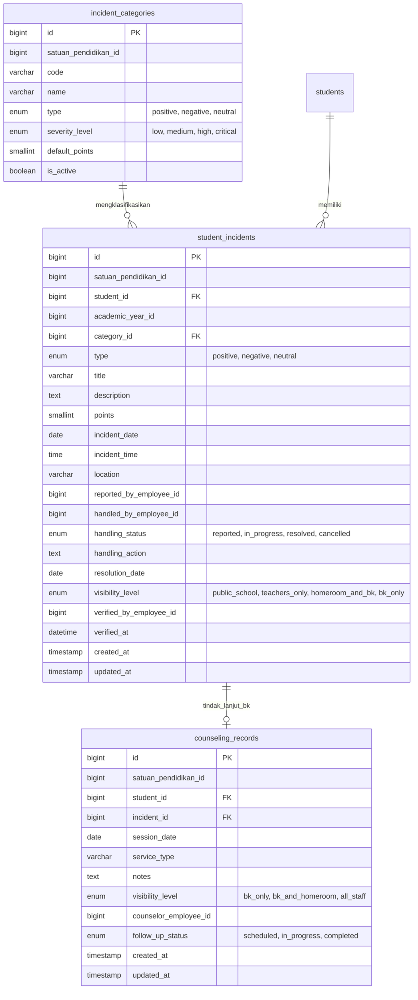

# RANCANGAN SISTEM PENCATATAN KEJADIAN SISWA (POSITIF & NEGATIF)
**Core Aldepos Monorepo — Modul Akademik & Portal Guru**  
**Dokumen:** Analisis & Usulan Desain Teknis (Tahap 11)  
**Status:** Usulan / Draft Menunggu Keputusan Bisnis  
**Rujukan:** `docs/AUDIT-PORTAL-GURU.md` (Bagian B.11 F9), `AGENTS.md`, `docs/portal-guru/ATURAN-KERJA.md`

---

## 1. Analisis Kondisi & Struktur Eksisting

Berdasarkan audit menyeluruh pada database `akademik`, backend Express (`apps/api-backend/src/modules/akademik/student-affairs`), dan antarmuka portal (`apps/core-portal/src/apps/akademik/pages/Kesiswaan.jsx`):

### A. Tabel `student_disciplinary_records`
- **Struktur Saat Ini:**  
  `id`, `student_id`, `violation_type` (VARCHAR 150), `points` (SMALLINT), `incident_date` (DATE), `handled_by_employee_id` (BIGINT), `notes` (TEXT), `created_at`, `updated_at`.
- **Yang Bisa Dipakai Ulang:**  
  Relasi dasar ke tabel `students`, pencatatan poin numerik, tanggal kejadian, dan referensi pegawai penangan (`handled_by_employee_id`).
- **Kekurangan & Kebutuhan:**
  1. **Tidak memiliki `satuan_pendidikan_id`**: Melanggar aturan monorepo Core Aldepos (data spesifik sekolah wajib memiliki unit ID terisolasi).
  2. **Jenis pelanggaran hanya teks bebas (`violation_type`)**: Belum ada master tata tertib, kategori berat/sedang/ringan, atau standarisasi bobot poin.
  3. **Belum ada status alur penanganan (`handling_status`)**: Belum mendukung status `reported` $\rightarrow$ `in_progress` $\rightarrow$ `resolved` $\rightarrow$ `closed`.
  4. **Kolom tindakan terpisah belum ada**: Catatan insiden dan tindakan pembinaan masih dicampur dalam kolom `notes`.
  5. **Tidak ada pencatat/pelapor (`reported_by_employee_id`)**: Jika guru piket melapor dan wali kelas/BK yang menangani, identitas pelapor hilang.
  6. **Tidak ada level visibilitas & verifikasi poin**: Seluruh catatan pelanggaran dapat dilihat sama rata tanpa pemisahan kasus sensitif.

---

### B. Tabel `student_achievements`
- **Struktur Saat Ini:**  
  `id`, `student_id`, `achievement_type` (VARCHAR 150), `level` (ENUM: `sekolah`, `kecamatan`, `kabupaten_kota`, `provinsi`, `nasional`, `internasional`), `achieved_at` (DATE), `notes` (TEXT), `created_at`, `updated_at`.
- **Yang Bisa Dipakai Ulang:**  
  Pencatatan prestasi lomba/akademik berjenjang, relasi `student_id`.
- **Kekurangan & Kebutuhan:**
  1. **Tidak memiliki `satuan_pendidikan_id`**.
  2. **Tidak memiliki poin apresiasi / reward point**: Sekolah modern/pesantren membutuhkan akumulasi poin positif untuk mereduksi poin pelanggaran atau dasar beasiswa/penghargaan santri teladan.
  3. **Tidak ada verifikasi & nomor piagam/sertifikat**: Belum ada status verifikasi validitas sertifikat oleh kesiswaan (`verification_status`).

---

### C. Tabel `counseling_records`
- **Struktur Saat Ini:**  
  `id`, `student_id`, `session_date` (DATE), `service_type` (VARCHAR 100), `notes` (TEXT), `visibility_level` (ENUM: `bk_only`, `bk_and_homeroom`, `all_staff`), `counselor_employee_id` (BIGINT), `created_at`, `updated_at`.
- **Yang Bisa Dipakai Ulang:**  
  Mekanisme `visibility_level` sudah sangat baik dan terbukti aman untuk menjaga kerahasiaan konseling BK psikososial santri.
- **Kekurangan & Kebutuhan:**
  1. **Tidak memiliki `satuan_pendidikan_id`**.
  2. **Terisolasi dari kronologi insiden**: Guru BK kesulitan mereferensikan sesi konseling yang dipicu dari kasus pelanggaran disiplin tertentu.

---

### D. Endpoint & Halaman `student-affairs` Eksisting
- **Endpoint Backend:**
  - `GET`, `POST /akademik/disciplinary-records`
  - `GET`, `POST /akademik/achievements`
  - `GET`, `POST /akademik/counseling-records`
- **Kekurangan Endpoint:**
  - Belum ada operasi `PUT` (update status tindak lanjut/penanganan) dan `DELETE`/`VOID` (pembatalan catatan keliru dengan audit log).
  - Filter pencarian sangat terbatas (hanya `student_id` dan `level`), belum ada filter unit sekolah, tahun ajaran, rentang tanggal, status penanganan, maupun kategori.
  - Halaman `Kesiswaan.jsx` di portal admin saat ini hanya berupa form create sederhana tanpa alur kerja penyelesaian kasus.

---

## 2. Dua Usulan Opsi Desain Data

Berikut adalah 2 opsi perancangan skema database di database `akademik`:

```
+-----------------------------------------------------------------------------------+
| OPSI A: Ekstensi 3 Tabel Terpisah (Disiplin, Prestasi, Konseling)                 |
| - Mempertahankan tabel lama, menambah kolom status, unit, poin reward & tindakan. |
+-----------------------------------------------------------------------------------+
| OPSI B: Sistem Terpadu (Master Kategori + student_incidents + counseling_records) |
| - 1 Master Tata Tertib/Poin, 1 Log Kejadian Terpadu (+/-), BK privat terhubung.   |
+-----------------------------------------------------------------------------------+
```

---

### OPSI A: Memperluas 3 Tabel Terpisah yang Sudah Ada

Mempertahankan entitas terpisah untuk masing-masing tipe data dengan menambahkan kolom pendukung workflow dan kepatuhan multi-unit.

#### Skema Perubahan (Migrasi Modifikasi):
1. **Tabel `student_disciplinary_records`**:
   - Tambah `satuan_pendidikan_id BIGINT UNSIGNED NOT NULL` (FK ke unit sekolah)
   - Tambah `academic_year_id BIGINT UNSIGNED NULL`
   - Tambah `reported_by_employee_id BIGINT UNSIGNED NULL` (guru pelapor insiden)
   - Tambah `handling_action TEXT NULL` (tindakan pembinaan/sanksi)
   - Tambah `handling_status ENUM('reported', 'in_progress', 'resolved', 'cancelled') DEFAULT 'reported'`
   - Tambah `visibility_level ENUM('all_staff', 'homeroom_and_bk', 'bk_only') DEFAULT 'all_staff'`
   - Tambah `verified_by_employee_id BIGINT UNSIGNED NULL` (kesiswaan yang memvalidasi poin)
   - Tambah `verified_at DATETIME NULL`

2. **Tabel `student_achievements`**:
   - Tambah `satuan_pendidikan_id BIGINT UNSIGNED NOT NULL`
   - Tambah `academic_year_id BIGINT UNSIGNED NULL`
   - Tambah `reward_points SMALLINT NOT NULL DEFAULT 0` (poin positif prestasi)
   - Tambah `certificate_number VARCHAR(150) NULL`
   - Tambah `reported_by_employee_id BIGINT UNSIGNED NULL`
   - Tambah `verified_by_employee_id BIGINT UNSIGNED NULL`
   - Tambah `verification_status ENUM('pending', 'verified', 'rejected') DEFAULT 'verified'`

3. **Tabel `counseling_records`**:
   - Tambah `satuan_pendidikan_id BIGINT UNSIGNED NOT NULL`
   - Tambah `academic_year_id BIGINT UNSIGNED NULL`
   - Tambah `disciplinary_record_id BIGINT UNSIGNED NULL` (referensi kasus asal)
   - Tambah `follow_up_status ENUM('scheduled', 'in_progress', 'completed') DEFAULT 'completed'`

#### Dampak pada Fitur Akademik:
- **Positif**: Halaman `Kesiswaan.jsx` dan endpoint lama tetap berjalan tanpa perubahan struktur drastis (*backward compatible*).
- **Negatif**: Rekap komprehensif profil santri (total skor = poin prestasi - poin pelanggaran) harus menggabungkan query `JOIN`/`UNION` dari dua tabel terpisah.

#### Risiko Opsi A:
- Duplikasi kode logika workflow penanganan (status, verifikasi poin, pelapor) pada 2-3 controller/service terpisah.
- Kesulitan saat ingin menambahkan jenis kejadian netral (misal: catatan karakter harian, kebiasaan sholat berjamaah, insiden kehilangan barang).

---

### OPSI B: Satu Tabel Kejadian Terpadu (`student_incidents`) + Master Kategori & Tabel Konseling Terhubung (Direkomendasikan)

Mengadopsi pola enterprise pencatatan perilaku santri (*Student Conduct & Behavioral Ledger*), di mana semua insiden (positif, negatif, netral) mengalir ke satu ledger kejadian terpadu dengan bobot poin dinamis. Catatan konseling BK mendalam tetap berada di tabel privat `counseling_records` yang berelasi ke insiden terkait.

#### Skema Database Lengkap:



#### Skema DDL / Rincian Kolom:
1. **`incident_categories`** (Master Tata Tertib, Pelanggaran & Penghargaan):
   - `id`: BIGINT UNSIGNED PK AUTO_INCREMENT
   - `satuan_pendidikan_id`: BIGINT UNSIGNED NOT NULL (Index)
   - `code`: VARCHAR(50) NOT NULL (e.g. `PEL-01`, `PRES-01`, `ADAB-01`)
   - `name`: VARCHAR(150) NOT NULL (e.g. "Terlambat Masuk Kelas", "Juara Lomba Tahfidz", "Membantu Teman Sakit")
   - `type`: ENUM('positive', 'negative', 'neutral') NOT NULL
   - `severity_level`: ENUM('low', 'medium', 'high', 'critical') DEFAULT 'low'
   - `default_points`: SMALLINT NOT NULL DEFAULT 0 (Pelanggaran: +5 atau +10 poin penalti; Prestasi: +10 reward point)
   - `is_active`: BOOLEAN DEFAULT TRUE

2. **`student_incidents`** (Buku Catatan Kejadian Siswa Terpadu):
   - `id`: BIGINT UNSIGNED PK AUTO_INCREMENT
   - `satuan_pendidikan_id`: BIGINT UNSIGNED NOT NULL (Index)
   - `student_id`: BIGINT UNSIGNED NOT NULL (FK `students.id`, Index)
   - `academic_year_id`: BIGINT UNSIGNED NULL
   - `category_id`: BIGINT UNSIGNED NULL (FK `incident_categories.id`)
   - `type`: ENUM('positive', 'negative', 'neutral') NOT NULL (Index)
   - `title`: VARCHAR(200) NOT NULL
   - `description`: TEXT NOT NULL
   - `points`: SMALLINT NOT NULL DEFAULT 0
   - `incident_date`: DATE NOT NULL (Index)
   - `incident_time`: TIME NULL
   - `location`: VARCHAR(150) NULL (e.g. "Masjid", "Asrama Putra", "Kelas 8B", "Kantin")
   - `reported_by_employee_id`: BIGINT UNSIGNED NOT NULL (Pegawai pelapor, Index)
   - `handled_by_employee_id`: BIGINT UNSIGNED NULL (Pegawai penangan / Wali Kelas / BK)
   - `handling_status`: ENUM('reported', 'in_progress', 'resolved', 'cancelled') NOT NULL DEFAULT 'reported' (Index)
   - `handling_action`: TEXT NULL (Tindakan pembinaan / penghargaan)
   - `resolution_date`: DATE NULL
   - `visibility_level`: ENUM('public_school', 'teachers_only', 'homeroom_and_bk', 'bk_only') NOT NULL DEFAULT 'teachers_only'
   - `verified_by_employee_id`: BIGINT UNSIGNED NULL (Kesiswaan yang memverifikasi poin)
   - `verified_at`: DATETIME NULL
   - `created_at`, `updated_at`: TIMESTAMPS

3. **`counseling_records`** (Catatan Bimbingan Konseling Khusus & Privat):
   - `id`: BIGINT UNSIGNED PK AUTO_INCREMENT
   - `satuan_pendidikan_id`: BIGINT UNSIGNED NOT NULL
   - `student_id`: BIGINT UNSIGNED NOT NULL
   - `incident_id`: BIGINT UNSIGNED NULL (FK `student_incidents.id` jika berasal dari rujukan insiden)
   - `session_date`: DATE NOT NULL
   - `service_type`: VARCHAR(100) NULL (e.g. "Konseling Individu", "Bimbingan Karir", "Mediasi Teman Sebaya")
   - `notes`: TEXT NOT NULL (Detail curhat, asesmen psikologis mendalam)
   - `visibility_level`: ENUM('bk_only', 'bk_and_homeroom', 'all_staff') DEFAULT 'bk_only'
   - `counselor_employee_id`: BIGINT UNSIGNED NULL
   - `follow_up_status`: ENUM('scheduled', 'in_progress', 'completed') DEFAULT 'completed'
   - `created_at`, `updated_at`: TIMESTAMPS

#### Dampak pada Fitur Akademik:
- Menyatukan kalkulasi rekam jejak siswa dalam satu query sederhana:
  $$\text{Skor Disiplin/Karakter} = \sum \text{Poin Prestasi} - \sum \text{Poin Pelanggaran}$$
- Endpoint lama di `student-affairs` (`/akademik/disciplinary-records` dan `/akademik/achievements`) dapat dipertahankan sebagai wrapper/adapter yang mengarah ke tabel `student_incidents`, sehingga tidak merusak fitur eksisting.
- Antarmuka baru di Portal Guru dan Kesiswaan dapat menampilkan *Live Timeline Kronologi Siswa* secara terpadu.

#### Risiko Opsi B & Mitigasi:
- **Risiko**: Perlu migrasi data lama dari `student_disciplinary_records` dan `student_achievements` ke tabel baru `student_incidents`.
- **Mitigasi**: Dibuatkan file migrasi Knex yang otomatis menyalin data lama ke tabel `student_incidents` sebelum tabel lama dinonaktifkan/dijadikan view.

---

## 3. Usulan Matriks Aturan Akses (RBAC & Visibilitas)

Pencatatan kejadian siswa dan bimbingan konseling melibatkan data sensitif, rekam jejak kedisiplinan santri, dan privasi psikologis.

| Peran Pengguna | Melihat Kejadian Siswa | Membuat Laporan Kejadian | Mengubah / Update Penanganan | Verifikasi Poin & Status Akhir | Catatan Konseling BK Privat |
|---|---|---|---|---|---|
| **Guru Mapel / Guru Piket** | Terbatas (`public_school` & `teachers_only`) | Ya (Status awal: `reported`) | Hanya draf miliknya sebelum diproses | Tidak berhak | Dilarang akses |
| **Wali Kelas** | Semua kejadian santri di rombelnya (termasuk `homeroom_and_bk`) | Ya (Untuk santri rombelnya & santri umum) | Ya (Input `handling_action` & ubah status ke `in_progress` / `resolved`) | Tidak berhak (hanya memberi rekomendasi) | Hanya yang berlabel `bk_and_homeroom` / `all_staff` |
| **Guru BK (Konselor)** | Semua kejadian di unitnya (termasuk kasus khusus BK) | Ya (Insiden & Sesi BK) | Ya (Penanganan konseling & mediasi) | Tidak berhak mengubah poin pelanggaran resmi | Akses penuh ke seluruh catatan `bk_only` |
| **Staf / Waka Kesiswaan** | Semua kejadian santri di unit sekolahnya | Ya (Master kategori & insiden resmi) | Akses penuh seluruh insiden | **Akses Penuh** (*Approve/Verify Points*, terbitkan SP/Reward) | Hanya yang berlabel `all_staff` (kecuali ditugaskan sebagai konselor) |
| **Super Admin / Admin Satuan** | Semua kejadian di unitnya | Ya | Akses penuh | Akses penuh | Akses teknis sistem |
| **Santri / Orang Tua (Portal Santri)** | Hanya insiden status `resolved` bertipe apresiasi atau rekap resmi terverifikasi | Tidak berhak | Tidak berhak | Tidak berhak | Dilarang akses |

### Penjelasan Level Visibilitas Kasus:
1. `public_school`: Prestasi terbuka, penghargaan santri teladan (bisa tampil di portal santri/wali dan mading digital).
2. `teachers_only`: Pelanggaran umum dan kejadian harian (terlihat oleh seluruh dewan guru dan staf kesiswaan).
3. `homeroom_and_bk`: Kasus perilaku khusus yang memerlukan koordinasi intensif antara Guru BK dan Wali Kelas santri terkait.
4. `bk_only`: Kasus sangat sensitif/privat (trauma, masalah keluarga, psikososial) yang hanya boleh diakses oleh Guru BK dan Kepala Sekolah.

---

## 4. Rekomendasi & Keputusan Bisnis Terpilih

**Keputusan Bisnis:** **OPSI B (Satu Tabel Kejadian Terpadu `student_incidents` + Master Kategori `incident_categories` + Tabel Konseling Privat Terhubung)** telah dipilih untuk diimplementasikan pada Tahap 12.

### Alasan & Nilai Tambah:
1. **Behavioral Ledger Terpadu**: Memberikan rekam jejak perilaku santri yang komprehensif, adil (mencatat poin pelanggaran maupun poin prestasi/kebaikan), dan kalkulasi poin bersih otomatis.
2. **Master Tata Tertib Dinamis**: `incident_categories` memudahkan unit sekolah mengelola katalog pelanggaran/prestasi dan bobot poin standar per satuan pendidikan.
3. **Privasi Konseling Terjamin**: Catatan psikososial mendalam tetap berada di `counseling_records` dengan `visibility_level = bk_only`, tetapi dapat ditautkan ke `incident_id` jika insiden dirujuk ke BK.
4. **Kompatibilitas Akademik Terjaga**: Endpoint lama di `student-affairs` akan diarahkan ke skema baru tanpa merusak integrasi modul lain.
