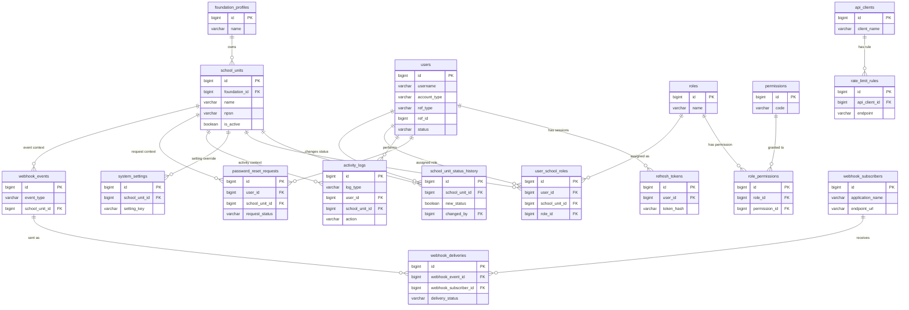

# ERD Core Service (Final) — Sistem Manajemen Sekolah Terintegrasi

> Rujukan: `ARSITEKTUR-SISTEM.md` Bagian 3 (prinsip arsitektur global) & `rancangan-coreservice.md` Core
> Service Bagian 4–5 (ruang lingkup 13 fitur & keputusan terbuka).
> Database: MariaDB 10.5. Query builder: Knex.js. PK default `id BIGINT UNSIGNED AUTO_INCREMENT`,
> semua tabel punya `created_at`/`updated_at TIMESTAMP` (tidak ditulis ulang di tiap tabel di
> bawah supaya ringkas — anggap ada di semua tabel kecuali tabel log yang disebutkan *append-only*).
> **Versi ini menggantikan draft sebelumnya** — 4 keputusan terbuka di `rancangan-coreservice.md` §5 sudah
> diputuskan (lihat Bagian 0), status: **final, siap jadi acuan migration Tahap 2**.
>
> **Revisi 2026-08-16:** File diganti nama dari `erd.md` menjadi `erd-coreservice.md` (pola
> `erd-<nama-modul>.md` untuk 13 modul lain, disimpan bersama di root proyek yang sama). Skema
> tabel di dokumen ini **tidak berubah** — database Core Service tetap sama, cuma nama filenya.

## 0. Keputusan Final atas 4 Poin Terbuka di `rancangan-coreservice.md` §5

| # | Poin Terbuka | Keputusan Final | Alasan |
|---|---|---|---|
| 1 | Referensi `users` ke entitas asli | Pakai `ref_type` + `ref_id`, tanpa FK fisik (lintas database) | Sesuai usulan awal di `rancangan-coreservice.md`; satu-satunya cara menghubungkan akun ke data induk di Akademik/Kepegawaian tanpa melanggar prinsip "1 DB per aplikasi" |
| 2 | Audit log ganda (Fitur #5 vs #13) | **Digabung jadi satu tabel `activity_logs`** dengan kolom `log_type` sebagai pembeda, kolom spesifik (`data_before`/`data_after`, `ip_address`) dibuat nullable | Kedua fitur sama-sama "catat siapa-melakukan-apa-kapan"; digabung menghindari dua sumber kebenaran untuk laporan aktivitas gabungan (dipakai bareng oleh Pengelolaan untuk dashboard agregat) dan lebih mudah di-index/di-query lintas jenis aktivitas |
| 3 | Granularitas permission | **Role bisa berbeda per Satuan Pendidikan** — lewat tabel `user_school_roles` | Mengakomodasi kasus nyata: pegawai bertugas di 2 sekolah dengan role berbeda (mis. Kepala Sekolah di satu, Guru di sekolah lain) |
| 4 | Format payload webhook | `{ event_type, timestamp, data, satuan_pendidikan_id }` sesuai `ARSITEKTUR-SISTEM.md` §4, kolom `school_unit_id` di `webhook_events` mengikuti | Sudah jadi konvensi global — semua 14 aplikasi ikut format ini |

**Penamaan:** seluruh nama tabel dan kolom di ERD ini memakai **Bahasa Inggris, `snake_case`**
secara konsisten (bukan campuran seperti draft sebelumnya), supaya jadi standar yang diikuti
13 aplikasi lain sesuai catatan di `ARSITEKTUR-SISTEM.md` §4. Istilah asli Indonesia dari PRD
dicatat sebagai referensi di kolom "Asal PRD" tiap tabel.

## 1. Daftar Entitas (17 Tabel)

| Modul (rancangan-coreservice.md §4) | Tabel | `school_unit_id`? |
|---|---|---|
| Autentikasi | `users` | Tidak langsung (lihat §2.1) |
| Autentikasi | `password_reset_requests` | Ya (nullable) |
| Autentikasi | `refresh_tokens` | Tidak |
| Autentikasi | `roles` | Tidak (global) |
| Autentikasi | `permissions` | Tidak (global) |
| Autentikasi | `role_permissions` | Tidak |
| Autentikasi | `user_school_roles` | **Ya** |
| Autentikasi + Keamanan | `activity_logs` (gabungan fitur #5 & #13) | Ya (nullable) |
| Data Master | `foundation_profiles` | Tidak (level yayasan, singleton) |
| Data Master | `school_units` | — (dia sendiri representasi satuan) |
| Data Master | `school_unit_status_history` | **Ya** |
| Data Master | `system_settings` | Ya (nullable = default yayasan-wide) |
| Integrasi | `webhook_subscribers` | Tidak (langganan di level aplikasi) |
| Integrasi | `webhook_events` | Ya (nullable) |
| Integrasi | `webhook_deliveries` | Tidak langsung (ikut `webhook_events`) |
| Integrasi | `api_clients` | Tidak |
| Integrasi | `rate_limit_rules` | Tidak |

> Fitur #11 "Dokumentasi API (OpenAPI)" tidak punya tabel — sifatnya file/artefak statis
> (`openapi.yaml`), bukan data yang disimpan di database.

## 2. Detail Tabel

### 2.1 `users`
*(Fitur #1, #3 — Login SSO, Manajemen user)*
Akun login. **Tidak diinput manual** — dibuat otomatis lewat webhook/API dari Akademik
(siswa/ortu) atau Kepegawaian (guru/pegawai), atau langsung di Core untuk `admin`.

| Kolom | Tipe | Constraint |
|---|---|---|
| id | BIGINT UNSIGNED | PK, AUTO_INCREMENT |
| username | VARCHAR(100) | UNIQUE, NOT NULL |
| password_hash | VARCHAR(255) | NOT NULL |
| full_name | VARCHAR(150) | NOT NULL |
| account_type | ENUM('admin','teacher','staff','student','parent') | NOT NULL |
| ref_type | VARCHAR(50) | NULLABLE — nama entitas asal, mis. `student`, `staff` (kosong utk `admin`) |
| ref_id | BIGINT UNSIGNED | NULLABLE — ID di database aplikasi pemilik (bukan FK fisik, lintas DB) |
| status | ENUM('active','inactive') | NOT NULL, DEFAULT 'active' |
| last_login_at | TIMESTAMP | NULLABLE |

`UNIQUE INDEX (ref_type, ref_id)` — satu entitas asal tidak boleh punya akun dobel.
*Tidak ada `school_unit_id` langsung* karena satu akun (khususnya pegawai) bisa aktif di lebih
dari satu Satuan Pendidikan — relasinya ada di `user_school_roles`.

### 2.2 `password_reset_requests`
*(Fitur #2)*

| Kolom | Tipe | Constraint |
|---|---|---|
| id | BIGINT UNSIGNED | PK, AUTO_INCREMENT |
| user_id | BIGINT UNSIGNED | FK → `users.id`, NOT NULL |
| school_unit_id | BIGINT UNSIGNED | NULLABLE — FK → `school_units.id`, konteks admin mana yang menangani |
| contact | VARCHAR(150) | NOT NULL — email/no. HP tujuan verifikasi |
| request_status | ENUM('pending','approved','rejected') | NOT NULL, DEFAULT 'pending' |
| requested_at | TIMESTAMP | NOT NULL, DEFAULT CURRENT_TIMESTAMP |
| processed_by | BIGINT UNSIGNED | NULLABLE — FK → `users.id` (admin yang memproses) |
| processed_at | TIMESTAMP | NULLABLE |

### 2.3 `refresh_tokens`
*(Pendukung Fitur #1)*

| Kolom | Tipe | Constraint |
|---|---|---|
| id | BIGINT UNSIGNED | PK, AUTO_INCREMENT |
| user_id | BIGINT UNSIGNED | FK → `users.id`, NOT NULL |
| token_hash | VARCHAR(255) | NOT NULL, UNIQUE — jangan simpan token mentah |
| user_agent | VARCHAR(255) | NULLABLE |
| ip_address | VARCHAR(45) | NULLABLE |
| expires_at | TIMESTAMP | NOT NULL |
| revoked_at | TIMESTAMP | NULLABLE |

### 2.4 `roles`
*(Fitur #4)*
Definisi peran — global per instalasi (satu Yayasan). Penetapan role ke user per Satuan
Pendidikan ada di `user_school_roles` (§2.7).

| Kolom | Tipe | Constraint |
|---|---|---|
| id | BIGINT UNSIGNED | PK, AUTO_INCREMENT |
| name | VARCHAR(100) | NOT NULL, UNIQUE |
| description | TEXT | NULLABLE |
| is_system_role | BOOLEAN | NOT NULL, DEFAULT FALSE — role bawaan sistem yang tidak boleh dihapus (mis. `super_admin`) |

### 2.5 `permissions`
*(Pendukung Fitur #4)*

| Kolom | Tipe | Constraint |
|---|---|---|
| id | BIGINT UNSIGNED | PK, AUTO_INCREMENT |
| code | VARCHAR(100) | NOT NULL, UNIQUE — mis. `akademik.nilai.edit` |
| module | VARCHAR(100) | NOT NULL — nama aplikasi/modul terkait |
| description | VARCHAR(255) | NULLABLE |

### 2.6 `role_permissions`
Pivot many-to-many `roles` ↔ `permissions`.

| Kolom | Tipe | Constraint |
|---|---|---|
| id | BIGINT UNSIGNED | PK, AUTO_INCREMENT |
| role_id | BIGINT UNSIGNED | FK → `roles.id`, NOT NULL |
| permission_id | BIGINT UNSIGNED | FK → `permissions.id`, NOT NULL |

`UNIQUE (role_id, permission_id)`.

### 2.7 `user_school_roles`
*(Pendukung Fitur #4 — Keputusan Final #3)*
Penetapan role ke user, **per Satuan Pendidikan** — inti dari prinsip multi-satuan-pendidikan
untuk modul Autentikasi.

| Kolom | Tipe | Constraint |
|---|---|---|
| id | BIGINT UNSIGNED | PK, AUTO_INCREMENT |
| user_id | BIGINT UNSIGNED | FK → `users.id`, NOT NULL |
| school_unit_id | BIGINT UNSIGNED | FK → `school_units.id`, NOT NULL |
| role_id | BIGINT UNSIGNED | FK → `roles.id`, NOT NULL |

`UNIQUE (user_id, school_unit_id, role_id)`.

### 2.8 `activity_logs`
*(Gabungan Fitur #5 "Audit log login & aktivitas" + Fitur #13 "Audit log aktivitas admin lintas
aplikasi" — Keputusan Final #2)*

| Kolom | Tipe | Constraint |
|---|---|---|
| id | BIGINT UNSIGNED | PK, AUTO_INCREMENT |
| log_type | ENUM('login','general_activity','admin_action') | NOT NULL — pembeda sumber fitur #5 vs #13 |
| user_id | BIGINT UNSIGNED | NULLABLE — FK → `users.id` (pelaku; tetap tercatat walau user dihapus) |
| school_unit_id | BIGINT UNSIGNED | NULLABLE — FK → `school_units.id` |
| application | VARCHAR(100) | NULLABLE — aplikasi asal aktivitas (dipakai `admin_action`) |
| action | VARCHAR(100) | NOT NULL — mis. `login`, `login_failed`, `create`, `update`, `delete` |
| module | VARCHAR(100) | NULLABLE |
| ip_address | VARCHAR(45) | NULLABLE — dipakai `login`/`general_activity` |
| data_before | JSON | NULLABLE — dipakai `admin_action` |
| data_after | JSON | NULLABLE — dipakai `admin_action` |
| occurred_at | TIMESTAMP | NOT NULL, DEFAULT CURRENT_TIMESTAMP |

`INDEX (log_type, occurred_at)` untuk query cepat per jenis log & rentang waktu (dipakai
Pengelolaan untuk dashboard agregat). *Append-only — tidak ada `updated_at`.*

### 2.9 `foundation_profiles`
*(Fitur #6 "Profil Yayasan")*
Singleton (satu instalasi = satu Yayasan).

| Kolom | Tipe | Constraint |
|---|---|---|
| id | BIGINT UNSIGNED | PK, AUTO_INCREMENT |
| name | VARCHAR(200) | NOT NULL |
| address | TEXT | NULLABLE |
| phone_number | VARCHAR(30) | NULLABLE |
| email | VARCHAR(150) | NULLABLE |
| chairman_name | VARCHAR(150) | NULLABLE |
| logo | VARCHAR(255) | NULLABLE — path/URL file |

### 2.10 `school_units`
*(Fitur #7 "CRUD Satuan Pendidikan")*
Entitas induk untuk konsep `school_unit_id` di seluruh 14 aplikasi.

| Kolom | Tipe | Constraint |
|---|---|---|
| id | BIGINT UNSIGNED | PK, AUTO_INCREMENT |
| foundation_id | BIGINT UNSIGNED | FK → `foundation_profiles.id`, NOT NULL |
| name | VARCHAR(200) | NOT NULL |
| level | VARCHAR(50) | NOT NULL — mis. `TK`, `SD`, `SMP`, `SMA` |
| npsn | VARCHAR(20) | UNIQUE, NULLABLE |
| address | TEXT | NULLABLE |
| principal_name | VARCHAR(150) | NULLABLE |
| phone_number | VARCHAR(30) | NULLABLE |
| website | VARCHAR(150) | NULLABLE |
| email | VARCHAR(150) | NULLABLE |
| logo | VARCHAR(255) | NULLABLE |
| operating_license | VARCHAR(150) | NULLABLE |
| is_active | BOOLEAN | NOT NULL, DEFAULT TRUE |

### 2.11 `school_unit_status_history`
*(Pendukung Fitur #7 — "aktif/nonaktif direkam riwayat & alasan")*

| Kolom | Tipe | Constraint |
|---|---|---|
| id | BIGINT UNSIGNED | PK, AUTO_INCREMENT |
| school_unit_id | BIGINT UNSIGNED | FK → `school_units.id`, NOT NULL |
| new_status | BOOLEAN | NOT NULL |
| reason | TEXT | NULLABLE |
| changed_by | BIGINT UNSIGNED | FK → `users.id`, NOT NULL |
| changed_at | TIMESTAMP | NOT NULL, DEFAULT CURRENT_TIMESTAMP |

### 2.12 `system_settings`
*(Fitur #8)*
`school_unit_id NULL` = default berlaku untuk seluruh Yayasan; diisi = override khusus satuan
tersebut.

| Kolom | Tipe | Constraint |
|---|---|---|
| id | BIGINT UNSIGNED | PK, AUTO_INCREMENT |
| school_unit_id | BIGINT UNSIGNED | NULLABLE — FK → `school_units.id` |
| setting_key | VARCHAR(150) | NOT NULL |
| setting_value | TEXT | NULLABLE |
| description | VARCHAR(255) | NULLABLE |

`UNIQUE (school_unit_id, setting_key)`.

### 2.13 `webhook_subscribers`
*(Fitur #10)*

| Kolom | Tipe | Constraint |
|---|---|---|
| id | BIGINT UNSIGNED | PK, AUTO_INCREMENT |
| application_name | VARCHAR(100) | NOT NULL — mis. `akademik`, `keuangan` |
| endpoint_url | VARCHAR(255) | NOT NULL |
| subscribed_events | JSON | NOT NULL — array kode event, mis. `["account.created","school_unit.updated"]` |
| secret_key | VARCHAR(255) | NOT NULL — untuk signature payload |
| status | ENUM('active','inactive') | NOT NULL, DEFAULT 'active' |

### 2.14 `webhook_events`
*(Fitur #9)*
Log event yang diterbitkan (payload sesuai `ARSITEKTUR-SISTEM.md` §4).

| Kolom | Tipe | Constraint |
|---|---|---|
| id | BIGINT UNSIGNED | PK, AUTO_INCREMENT |
| event_type | VARCHAR(100) | NOT NULL |
| school_unit_id | BIGINT UNSIGNED | NULLABLE — FK → `school_units.id` |
| payload | JSON | NOT NULL |
| published_at | TIMESTAMP | NOT NULL, DEFAULT CURRENT_TIMESTAMP |

### 2.15 `webhook_deliveries`
*(Pendukung Fitur #9 — status kirim & retry)*

| Kolom | Tipe | Constraint |
|---|---|---|
| id | BIGINT UNSIGNED | PK, AUTO_INCREMENT |
| webhook_event_id | BIGINT UNSIGNED | FK → `webhook_events.id`, NOT NULL |
| webhook_subscriber_id | BIGINT UNSIGNED | FK → `webhook_subscribers.id`, NOT NULL |
| delivery_status | ENUM('pending','success','failed') | NOT NULL, DEFAULT 'pending' |
| attempt_count | SMALLINT UNSIGNED | NOT NULL, DEFAULT 0 |
| response_code | SMALLINT | NULLABLE |
| delivered_at | TIMESTAMP | NULLABLE |

### 2.16 `api_clients`
*(Pendukung Fitur #12)*

| Kolom | Tipe | Constraint |
|---|---|---|
| id | BIGINT UNSIGNED | PK, AUTO_INCREMENT |
| client_name | VARCHAR(100) | NOT NULL |
| api_key_hash | VARCHAR(255) | NOT NULL, UNIQUE |
| status | ENUM('active','inactive') | NOT NULL, DEFAULT 'active' |

### 2.17 `rate_limit_rules`
*(Fitur #12)*

| Kolom | Tipe | Constraint |
|---|---|---|
| id | BIGINT UNSIGNED | PK, AUTO_INCREMENT |
| api_client_id | BIGINT UNSIGNED | NULLABLE — FK → `api_clients.id` (NULL = aturan default global) |
| endpoint | VARCHAR(150) | NOT NULL — mis. `/api/v1/*` atau path spesifik |
| limit_per_minute | INT UNSIGNED | NOT NULL |

## 3. Diagram ERD (Mermaid)

## 4. Ringkasan Relasi

| Dari | Ke | Kardinalitas | Keterangan |
|---|---|---|---|
| `foundation_profiles` | `school_units` | 1 – N | Satu Yayasan punya banyak Satuan Pendidikan |
| `school_units` | `school_unit_status_history` | 1 – N | Riwayat perubahan aktif/nonaktif |
| `school_units` | `user_school_roles` | 1 – N | Role user berbeda per satuan |
| `users` | `refresh_tokens` | 1 – N | Satu user bisa punya banyak sesi aktif |
| `users` | `user_school_roles` | 1 – N | Satu user bisa punya role di beberapa satuan |
| `roles` ↔ `permissions` | via `role_permissions` | N – N | |
| `webhook_events` ↔ `webhook_subscribers` | via `webhook_deliveries` | N – N | Satu event dikirim ke banyak subscriber, dicatat statusnya masing-masing |
| `api_clients` | `rate_limit_rules` | 1 – N | |
| `users` | `activity_logs` | 1 – N | Mencakup log login maupun aksi admin (lihat `log_type`) |

**Catatan penting:** semua relasi di atas adalah **internal Core Service saja**. Tidak ada
FK fisik dari tabel Core Service ke tabel di database aplikasi lain (Akademik, Kepegawaian,
dst) — sesuai prinsip arsitektur global #1. Kolom seperti `users.ref_id` hanya menyimpan ID
referensi tanpa constraint FK lintas database.

## 5. Siap untuk Tahap Berikutnya

Dengan 4 poin terbuka di `rancangan-coreservice.md` §5 sudah diputuskan (Bagian 0), ERD ini bisa dipakai
langsung sebagai acuan Tahap 2 (Database — migration Knex.js). Yang perlu dilakukan setelah ini:

1. `rancangan-coreservice.md` Bagian 5 & 10 (Status & Log Perubahan) diperbarui untuk mencatat 4 keputusan
   final ini, supaya tidak lagi tercatat sebagai "terbuka".
2. Konvensi penamaan Bahasa Inggris + `snake_case` di ERD ini jadi standar yang diikuti 13
   aplikasi satelit lain saat masing-masing masuk Tahap 2.
3. Setelah migration Core Service dibuat & diuji, isi
   `Registry_Teknis_AsBuilt_Sistem_Manajemen_Sekolah.xlsx` sesuai catatan di `rancangan-coreservice.md` §9.

## 6. Status & Log Perubahan

| Tanggal | Perubahan |
|---|---|
| 2026-08-16 | File diganti nama dari `erd.md` jadi `erd-coreservice.md`. Referensi ke `rancangan.md` diperbarui ke `rancangan-coreservice.md`. Isi skema tabel tidak berubah. |
| 2026-08-16 | ERD final Core Service. 4 keputusan terbuka di `rancangan-coreservice.md` §5 diputuskan (lihat Bagian 0): `ref_type`/`ref_id` dipakai, `login_activity_logs`+`admin_activity_logs` digabung jadi `activity_logs`, role per Satuan Pendidikan lewat `user_school_roles`, payload webhook standar. Seluruh nama tabel/kolom distandarkan ke Bahasa Inggris `snake_case`. Total 17 tabel (dari 18 di draft awal, berkurang 1 karena penggabungan audit log). |
| 2026-08-16 | Draft awal ERD (18 tabel, campuran bahasa, 4 poin masih terbuka) — digantikan versi ini. |

QUERY YANG SUDAH DIJALANKAN DI MARIADB HOSTINGER SAYA:

1. Pembuatan Tabel-tabel pertama kali

SET NAMES utf8mb4;
SET FOREIGN_KEY_CHECKS = 0;

-- 1. foundation_profiles
CREATE TABLE foundation_profiles (
  id BIGINT UNSIGNED AUTO_INCREMENT PRIMARY KEY,
  name VARCHAR(200) NOT NULL,
  address TEXT NULL,
  phone_number VARCHAR(30) NULL,
  email VARCHAR(150) NULL,
  chairman_name VARCHAR(150) NULL,
  logo VARCHAR(255) NULL,
  created_at TIMESTAMP NOT NULL DEFAULT CURRENT_TIMESTAMP,
  updated_at TIMESTAMP NOT NULL DEFAULT CURRENT_TIMESTAMP ON UPDATE CURRENT_TIMESTAMP
) ENGINE=InnoDB DEFAULT CHARSET=utf8mb4;

-- 2. school_units
CREATE TABLE school_units (
  id BIGINT UNSIGNED AUTO_INCREMENT PRIMARY KEY,
  foundation_id BIGINT UNSIGNED NOT NULL,
  name VARCHAR(200) NOT NULL,
  level VARCHAR(50) NOT NULL,
  npsn VARCHAR(20) NULL UNIQUE,
  address TEXT NULL,
  principal_name VARCHAR(150) NULL,
  phone_number VARCHAR(30) NULL,
  website VARCHAR(150) NULL,
  email VARCHAR(150) NULL,
  logo VARCHAR(255) NULL,
  operating_license VARCHAR(150) NULL,
  is_active BOOLEAN NOT NULL DEFAULT TRUE,
  created_at TIMESTAMP NOT NULL DEFAULT CURRENT_TIMESTAMP,
  updated_at TIMESTAMP NOT NULL DEFAULT CURRENT_TIMESTAMP ON UPDATE CURRENT_TIMESTAMP,
  CONSTRAINT fk_school_units_foundation FOREIGN KEY (foundation_id) REFERENCES foundation_profiles(id)
) ENGINE=InnoDB DEFAULT CHARSET=utf8mb4;

-- 3. users
CREATE TABLE users (
  id BIGINT UNSIGNED AUTO_INCREMENT PRIMARY KEY,
  username VARCHAR(100) NOT NULL UNIQUE,
  password_hash VARCHAR(255) NOT NULL,
  full_name VARCHAR(150) NOT NULL,
  account_type ENUM('admin','teacher','staff','student','parent') NOT NULL,
  ref_type VARCHAR(50) NULL,
  ref_id BIGINT UNSIGNED NULL,
  status ENUM('active','inactive') NOT NULL DEFAULT 'active',
  last_login_at TIMESTAMP NULL,
  created_at TIMESTAMP NOT NULL DEFAULT CURRENT_TIMESTAMP,
  updated_at TIMESTAMP NOT NULL DEFAULT CURRENT_TIMESTAMP ON UPDATE CURRENT_TIMESTAMP,
  UNIQUE KEY uq_users_ref (ref_type, ref_id)
) ENGINE=InnoDB DEFAULT CHARSET=utf8mb4;

-- 4. roles
CREATE TABLE roles (
  id BIGINT UNSIGNED AUTO_INCREMENT PRIMARY KEY,
  name VARCHAR(100) NOT NULL UNIQUE,
  description TEXT NULL,
  is_system_role BOOLEAN NOT NULL DEFAULT FALSE,
  created_at TIMESTAMP NOT NULL DEFAULT CURRENT_TIMESTAMP,
  updated_at TIMESTAMP NOT NULL DEFAULT CURRENT_TIMESTAMP ON UPDATE CURRENT_TIMESTAMP
) ENGINE=InnoDB DEFAULT CHARSET=utf8mb4;

-- 5. permissions
CREATE TABLE permissions (
  id BIGINT UNSIGNED AUTO_INCREMENT PRIMARY KEY,
  code VARCHAR(100) NOT NULL UNIQUE,
  module VARCHAR(100) NOT NULL,
  description VARCHAR(255) NULL,
  created_at TIMESTAMP NOT NULL DEFAULT CURRENT_TIMESTAMP,
  updated_at TIMESTAMP NOT NULL DEFAULT CURRENT_TIMESTAMP ON UPDATE CURRENT_TIMESTAMP
) ENGINE=InnoDB DEFAULT CHARSET=utf8mb4;

-- 6. role_permissions
CREATE TABLE role_permissions (
  id BIGINT UNSIGNED AUTO_INCREMENT PRIMARY KEY,
  role_id BIGINT UNSIGNED NOT NULL,
  permission_id BIGINT UNSIGNED NOT NULL,
  created_at TIMESTAMP NOT NULL DEFAULT CURRENT_TIMESTAMP,
  updated_at TIMESTAMP NOT NULL DEFAULT CURRENT_TIMESTAMP ON UPDATE CURRENT_TIMESTAMP,
  UNIQUE KEY uq_role_permissions (role_id, permission_id),
  CONSTRAINT fk_role_permissions_role FOREIGN KEY (role_id) REFERENCES roles(id),
  CONSTRAINT fk_role_permissions_permission FOREIGN KEY (permission_id) REFERENCES permissions(id)
) ENGINE=InnoDB DEFAULT CHARSET=utf8mb4;

-- 7. user_school_roles
CREATE TABLE user_school_roles (
  id BIGINT UNSIGNED AUTO_INCREMENT PRIMARY KEY,
  user_id BIGINT UNSIGNED NOT NULL,
  school_unit_id BIGINT UNSIGNED NOT NULL,
  role_id BIGINT UNSIGNED NOT NULL,
  created_at TIMESTAMP NOT NULL DEFAULT CURRENT_TIMESTAMP,
  updated_at TIMESTAMP NOT NULL DEFAULT CURRENT_TIMESTAMP ON UPDATE CURRENT_TIMESTAMP,
  UNIQUE KEY uq_user_school_roles (user_id, school_unit_id, role_id),
  CONSTRAINT fk_usr_user FOREIGN KEY (user_id) REFERENCES users(id),
  CONSTRAINT fk_usr_school_unit FOREIGN KEY (school_unit_id) REFERENCES school_units(id),
  CONSTRAINT fk_usr_role FOREIGN KEY (role_id) REFERENCES roles(id)
) ENGINE=InnoDB DEFAULT CHARSET=utf8mb4;

-- 8. refresh_tokens
CREATE TABLE refresh_tokens (
  id BIGINT UNSIGNED AUTO_INCREMENT PRIMARY KEY,
  user_id BIGINT UNSIGNED NOT NULL,
  token_hash VARCHAR(255) NOT NULL UNIQUE,
  user_agent VARCHAR(255) NULL,
  ip_address VARCHAR(45) NULL,
  expires_at TIMESTAMP NOT NULL,
  revoked_at TIMESTAMP NULL,
  created_at TIMESTAMP NOT NULL DEFAULT CURRENT_TIMESTAMP,
  updated_at TIMESTAMP NOT NULL DEFAULT CURRENT_TIMESTAMP ON UPDATE CURRENT_TIMESTAMP,
  CONSTRAINT fk_refresh_tokens_user FOREIGN KEY (user_id) REFERENCES users(id)
) ENGINE=InnoDB DEFAULT CHARSET=utf8mb4;

-- 9. password_reset_requests
CREATE TABLE password_reset_requests (
  id BIGINT UNSIGNED AUTO_INCREMENT PRIMARY KEY,
  user_id BIGINT UNSIGNED NOT NULL,
  school_unit_id BIGINT UNSIGNED NULL,
  contact VARCHAR(150) NOT NULL,
  request_status ENUM('pending','approved','rejected') NOT NULL DEFAULT 'pending',
  requested_at TIMESTAMP NOT NULL DEFAULT CURRENT_TIMESTAMP,
  processed_by BIGINT UNSIGNED NULL,
  processed_at TIMESTAMP NULL,
  created_at TIMESTAMP NOT NULL DEFAULT CURRENT_TIMESTAMP,
  updated_at TIMESTAMP NOT NULL DEFAULT CURRENT_TIMESTAMP ON UPDATE CURRENT_TIMESTAMP,
  CONSTRAINT fk_prr_user FOREIGN KEY (user_id) REFERENCES users(id),
  CONSTRAINT fk_prr_school_unit FOREIGN KEY (school_unit_id) REFERENCES school_units(id),
  CONSTRAINT fk_prr_processed_by FOREIGN KEY (processed_by) REFERENCES users(id)
) ENGINE=InnoDB DEFAULT CHARSET=utf8mb4;

-- 10. activity_logs
CREATE TABLE activity_logs (
  id BIGINT UNSIGNED AUTO_INCREMENT PRIMARY KEY,
  log_type ENUM('login','general_activity','admin_action') NOT NULL,
  user_id BIGINT UNSIGNED NULL,
  school_unit_id BIGINT UNSIGNED NULL,
  application VARCHAR(100) NULL,
  action VARCHAR(100) NOT NULL,
  module VARCHAR(100) NULL,
  ip_address VARCHAR(45) NULL,
  data_before JSON NULL,
  data_after JSON NULL,
  occurred_at TIMESTAMP NOT NULL DEFAULT CURRENT_TIMESTAMP,
  INDEX idx_activity_logs_type_time (log_type, occurred_at),
  CONSTRAINT fk_activity_logs_user FOREIGN KEY (user_id) REFERENCES users(id),
  CONSTRAINT fk_activity_logs_school_unit FOREIGN KEY (school_unit_id) REFERENCES school_units(id)
) ENGINE=InnoDB DEFAULT CHARSET=utf8mb4;

-- 11. school_unit_status_history
CREATE TABLE school_unit_status_history (
  id BIGINT UNSIGNED AUTO_INCREMENT PRIMARY KEY,
  school_unit_id BIGINT UNSIGNED NOT NULL,
  new_status BOOLEAN NOT NULL,
  reason TEXT NULL,
  changed_by BIGINT UNSIGNED NOT NULL,
  changed_at TIMESTAMP NOT NULL DEFAULT CURRENT_TIMESTAMP,
  CONSTRAINT fk_susth_school_unit FOREIGN KEY (school_unit_id) REFERENCES school_units(id),
  CONSTRAINT fk_susth_changed_by FOREIGN KEY (changed_by) REFERENCES users(id)
) ENGINE=InnoDB DEFAULT CHARSET=utf8mb4;

-- 12. system_settings
CREATE TABLE system_settings (
  id BIGINT UNSIGNED AUTO_INCREMENT PRIMARY KEY,
  school_unit_id BIGINT UNSIGNED NULL,
  setting_key VARCHAR(150) NOT NULL,
  setting_value TEXT NULL,
  description VARCHAR(255) NULL,
  created_at TIMESTAMP NOT NULL DEFAULT CURRENT_TIMESTAMP,
  updated_at TIMESTAMP NOT NULL DEFAULT CURRENT_TIMESTAMP ON UPDATE CURRENT_TIMESTAMP,
  UNIQUE KEY uq_system_settings (school_unit_id, setting_key),
  CONSTRAINT fk_system_settings_school_unit FOREIGN KEY (school_unit_id) REFERENCES school_units(id)
) ENGINE=InnoDB DEFAULT CHARSET=utf8mb4;

-- 13. webhook_subscribers
CREATE TABLE webhook_subscribers (
  id BIGINT UNSIGNED AUTO_INCREMENT PRIMARY KEY,
  application_name VARCHAR(100) NOT NULL,
  endpoint_url VARCHAR(255) NOT NULL,
  subscribed_events JSON NOT NULL,
  secret_key VARCHAR(255) NOT NULL,
  status ENUM('active','inactive') NOT NULL DEFAULT 'active',
  created_at TIMESTAMP NOT NULL DEFAULT CURRENT_TIMESTAMP,
  updated_at TIMESTAMP NOT NULL DEFAULT CURRENT_TIMESTAMP ON UPDATE CURRENT_TIMESTAMP
) ENGINE=InnoDB DEFAULT CHARSET=utf8mb4;

-- 14. webhook_events
CREATE TABLE webhook_events (
  id BIGINT UNSIGNED AUTO_INCREMENT PRIMARY KEY,
  event_type VARCHAR(100) NOT NULL,
  school_unit_id BIGINT UNSIGNED NULL,
  payload JSON NOT NULL,
  published_at TIMESTAMP NOT NULL DEFAULT CURRENT_TIMESTAMP,
  CONSTRAINT fk_webhook_events_school_unit FOREIGN KEY (school_unit_id) REFERENCES school_units(id)
) ENGINE=InnoDB DEFAULT CHARSET=utf8mb4;

-- 15. webhook_deliveries
CREATE TABLE webhook_deliveries (
  id BIGINT UNSIGNED AUTO_INCREMENT PRIMARY KEY,
  webhook_event_id BIGINT UNSIGNED NOT NULL,
  webhook_subscriber_id BIGINT UNSIGNED NOT NULL,
  delivery_status ENUM('pending','success','failed') NOT NULL DEFAULT 'pending',
  attempt_count SMALLINT UNSIGNED NOT NULL DEFAULT 0,
  response_code SMALLINT NULL,
  delivered_at TIMESTAMP NULL,
  created_at TIMESTAMP NOT NULL DEFAULT CURRENT_TIMESTAMP,
  updated_at TIMESTAMP NOT NULL DEFAULT CURRENT_TIMESTAMP ON UPDATE CURRENT_TIMESTAMP,
  CONSTRAINT fk_wd_event FOREIGN KEY (webhook_event_id) REFERENCES webhook_events(id),
  CONSTRAINT fk_wd_subscriber FOREIGN KEY (webhook_subscriber_id) REFERENCES webhook_subscribers(id)
) ENGINE=InnoDB DEFAULT CHARSET=utf8mb4;

-- 16. api_clients
CREATE TABLE api_clients (
  id BIGINT UNSIGNED AUTO_INCREMENT PRIMARY KEY,
  client_name VARCHAR(100) NOT NULL,
  api_key_hash VARCHAR(255) NOT NULL UNIQUE,
  status ENUM('active','inactive') NOT NULL DEFAULT 'active',
  created_at TIMESTAMP NOT NULL DEFAULT CURRENT_TIMESTAMP,
  updated_at TIMESTAMP NOT NULL DEFAULT CURRENT_TIMESTAMP ON UPDATE CURRENT_TIMESTAMP
) ENGINE=InnoDB DEFAULT CHARSET=utf8mb4;

-- 17. rate_limit_rules
CREATE TABLE rate_limit_rules (
  id BIGINT UNSIGNED AUTO_INCREMENT PRIMARY KEY,
  api_client_id BIGINT UNSIGNED NULL,
  endpoint VARCHAR(150) NOT NULL,
  limit_per_minute INT UNSIGNED NOT NULL,
  created_at TIMESTAMP NOT NULL DEFAULT CURRENT_TIMESTAMP,
  updated_at TIMESTAMP NOT NULL DEFAULT CURRENT_TIMESTAMP ON UPDATE CURRENT_TIMESTAMP,
  CONSTRAINT fk_rate_limit_rules_client FOREIGN KEY (api_client_id) REFERENCES api_clients(id)
) ENGINE=InnoDB DEFAULT CHARSET=utf8mb4;

SET FOREIGN_KEY_CHECKS = 1;

2. Seed Data Dummy

INSERT INTO foundation_profiles (name, address, phone_number, email, chairman_name)
VALUES ('Yayasan Contoh', 'Jl. Contoh No. 1', '021-1234567', 'info@yayasan-contoh.sch.id', 'Nama Ketua');

INSERT INTO school_units (foundation_id, name, level, npsn, is_active)
VALUES (1, 'SD Contoh 1', 'SD', '12345678', TRUE),
       (1, 'SMP Contoh 1', 'SMP', '87654321', TRUE);

INSERT INTO roles (name, description, is_system_role)
VALUES ('super_admin', 'Akses penuh seluruh Core Service', TRUE),
       ('admin_yayasan', 'Admin tingkat Yayasan', FALSE),
       ('admin_satuan_pendidikan', 'Admin tingkat Satuan Pendidikan', FALSE),
       ('developer', 'Akses ke integrasi & dokumentasi API', FALSE);

-- Password default untuk akun dummy: "Password123!" (hash bcrypt contoh — GANTI setelah
-- backend jalan dan hashing sungguhan dipakai; ini hanya placeholder untuk testing awal)
INSERT INTO users (username, password_hash, full_name, account_type, status)
VALUES ('superadmin', '$2b$10$replaceWithRealBcryptHashLater', 'Super Admin', 'admin', 'active');

INSERT INTO user_school_roles (user_id, school_unit_id, role_id)
VALUES (1, 1, 1), (1, 2, 1);